<table><tr><td rowspan=1 colspan=2>Pre-condition Checkist</td><td rowspan=1 colspan=1>Result/Report</td><td rowspan=1 colspan=1>Date</td><td rowspan=1 colspan=1>Resp.</td></tr><tr><td rowspan=4 colspan=1>Design</td><td rowspan=1 colspan=1>1.A Sample 3D model confirmed by customer?</td><td rowspan=1 colspan=1>0k</td><td rowspan=1 colspan=1>2024.9.4</td><td rowspan=1 colspan=1>青松</td></tr><tr><td rowspan=1 colspan=1>2.A Sample Nameplate confirmed by customer? Email or drawing confirm?</td><td rowspan=1 colspan=1>ok             2</td><td rowspan=1 colspan=1>024.9.44</td><td rowspan=1 colspan=1>情松</td></tr><tr><td rowspan=1 colspan=1>3.A Sample Single part manufacturing feasibit study nd drawing confimed by supplier?</td><td rowspan=1 colspan=1>oK</td><td rowspan=1 colspan=1>224.9.4</td><td rowspan=1 colspan=1>卢青松</td></tr><tr><td rowspan=1 colspan=1>4.A sample MAT design fixed?</td><td rowspan=1 colspan=1>0K借用R24E国产衬垫</td><td rowspan=1 colspan=1>2024.9.4</td><td rowspan=1 colspan=1>卢青松</td></tr><tr><td rowspan=3 colspan=1>PUR/MOE</td><td rowspan=1 colspan=1>1.A Sample Make and Buy confirmed?</td><td rowspan=1 colspan=1>0k</td><td rowspan=1 colspan=1>2224.9.4</td><td rowspan=1 colspan=1>本充了（确认）</td></tr><tr><td rowspan=1 colspan=1>2.A Sample DFMA welding processfinished with MOE?</td><td rowspan=1 colspan=1>0K</td><td rowspan=1 colspan=1>2024.9.4</td><td rowspan=1 colspan=1>卢青松</td></tr><tr><td rowspan=1 colspan=1>3.A Sample Canning process confirmed?</td><td rowspan=1 colspan=1>0K</td><td rowspan=1 colspan=1>2024.9.4</td><td rowspan=1 colspan=1>卢青松</td></tr><tr><td rowspan=1 colspan=1>Validation</td><td rowspan=1 colspan=1>1.ASample CFD report?</td><td rowspan=1 colspan=1>0k</td><td rowspan=1 colspan=1>2024.9.4</td><td rowspan=1 colspan=1>王笛</td></tr></table>

A Sample Drawing initial Release Checklist precondition ATS A Sample initial release

<table><tr><td rowspan=2 colspan=4>BOSCH博世Confidential</td><td rowspan=2 colspan=9>Product Development Design Change Request产品开发设计变更请求</td><td rowspan=1 colspan=4>Version 15Effectivedate:2024-09-03th</td></tr><tr><td rowspan=1 colspan=4>Design ChangeRequest No.   24_093</td></tr><tr><td rowspan=1 colspan=17>Customer project Name/客户项目名称：           JIM-493         MCR No./ MCR号:</td></tr><tr><td rowspan=1 colspan=17>Sample status / 样件状态：    √A Sample    B Sample   C Sample  D Sample</td></tr><tr><td rowspan=1 colspan=17>Change part&amp;product Name/更改零部件产品的名称(简要描述)</td></tr><tr><td rowspan=1 colspan=17>DOC+SDPF新鲜件(不可拆)：F01ZH003FU-01DOC+SDPF化件(不可拆)：F01ZH003FU-51 SCR新鲜件：F01ZH003FV-01 DOC+SDPF新鲜件(可拆)：F01ZH003G1-00 DOC+SDPF化件(可拆)：F01ZH003G1-51  SCR老化件：F01ZH003FV-51</td></tr><tr><td rowspan=1 colspan=17>Reason of changes/更改理由(简要描述)：</td></tr><tr><td rowspan=1 colspan=17>JIM493新鲜件化件（可拆+不可拆）样件首次释放；</td></tr><tr><td rowspan=1 colspan=6>Change from/变更来源：</td><td rowspan=1 colspan=11></td></tr><tr><td rowspan=1 colspan=7>Customer request /客户要求</td><td rowspan=1 colspan=10>Supplier request/供应商请求                  Design optimization/设计优化</td></tr><tr><td rowspan=1 colspan=7>Correction /更正(错误)</td><td rowspan=1 colspan=10>Other/其他</td></tr><tr><td rowspan=1 colspan=6>Change inform to/变更通知人：</td><td rowspan=1 colspan=11>Zhang Shengchang, Zhang Hanquan, Shen Weibo, Li Yicen, Fang Jiayan, Yin Kangzhuang</td></tr><tr><td rowspan=1 colspan=17>Yang Guangtuo,Jia Kebin, Luo jing, Lu Qingsong</td></tr><tr><td rowspan=1 colspan=17>Whether this change impact others component or product 此变更是否影响到其他部件和产品：      yes/是    no/否</td></tr><tr><td rowspan=1 colspan=17>Ifimpact others product， Whether others projects&amp;product change or not？如果影响，别的部件和产品是否也需要同时变更？</td></tr><tr><td rowspan=1 colspan=17></td></tr><tr><td rowspan=1 colspan=6>Design/设计工程师</td><td rowspan=2 colspan=5>卢青松</td><td rowspan=2 colspan=2>Date/日期：</td><td rowspan=2 colspan=4>2024.9.4</td></tr><tr><td rowspan=1 colspan=6>Signature/签名：</td></tr><tr><td rowspan=1 colspan=6>Check/校对工程师</td><td rowspan=2 colspan=5>杨私</td><td rowspan=2 colspan=2>Date /日期:</td><td rowspan=2 colspan=4>2024.09.04</td></tr><tr><td rowspan=1 colspan=6>Signature/签名：</td></tr><tr><td rowspan=1 colspan=17>Description of Change/更改描述：（下面空白处请列出详细的变更前后对比）</td></tr><tr><td rowspan=1 colspan=17>具体变更详见附件</td></tr><tr><td rowspan=1 colspan=2></td><td rowspan=1 colspan=8>493-弗吉亚</td><td rowspan=1 colspan=7>493-弗吉亚</td></tr><tr><td rowspan=1 colspan=2></td><td rowspan=1 colspan=5>新鲜件-可拆</td><td rowspan=1 colspan=3>老化件-可折</td><td rowspan=1 colspan=4>新鲜件</td><td rowspan=1 colspan=3>老化件</td></tr><tr><td></td><td rowspan=1 colspan=1>Catalys</td><td rowspan=1 colspan=1>总成号</td><td rowspan=1 colspan=2>分总成号</td><td rowspan=1 colspan=2>催化剂号</td><td rowspan=1 colspan=1>总成号</td><td rowspan=1 colspan=1>分总成号</td><td rowspan=1 colspan=1>催化剂号</td><td rowspan=1 colspan=2>总成号</td><td rowspan=1 colspan=2>催化剂号</td><td rowspan=1 colspan=1>总成号</td><td rowspan=1 colspan=1>催化剂号</td><td rowspan=1 colspan=1></td></tr><tr><td></td><td rowspan=1 colspan=1>Doc</td><td rowspan=1 colspan=1>F01ZH003G100</td><td rowspan=1 colspan=2>F01Z5017X9-00</td><td rowspan=1 colspan=2>F01Z50178N-00</td><td rowspan=1 colspan=1>F01ZH003G1-51</td><td rowspan=1 colspan=1>F01Z5017X9-51</td><td rowspan=1 colspan=1>F01Z50178T-00</td><td rowspan=1 colspan=2>F01ZH003FU-01</td><td rowspan=1 colspan=2>F01Z50178N-00</td><td rowspan=1 colspan=1>F01ZH00FU-51</td><td rowspan=1 colspan=1>F01Z50178T-00</td><td rowspan=1 colspan=1>(cid:)</td></tr><tr><td rowspan=1 colspan=2>DPF</td><td rowspan=1 colspan=1></td><td rowspan=1 colspan=2>F01Z5017XC-00</td><td rowspan=1 colspan=2>F01Z501890</td><td rowspan=1 colspan=1></td><td rowspan=1 colspan=1>F01Z5017XC-51</td><td rowspan=1 colspan=1>0452D318RJ</td><td rowspan=1 colspan=2></td><td rowspan=1 colspan=2>F01Z501890</td><td rowspan=1 colspan=1></td><td rowspan=1 colspan=1>0452D318RJ</td><td rowspan=1 colspan=1>(cid:)</td></tr><tr><td rowspan=1 colspan=2>SCRASC</td><td rowspan=1 colspan=3>F01ZH003FV-01</td><td rowspan=1 colspan=2>F01Z501891</td><td rowspan=1 colspan=2>F01ZH003FV-51</td><td rowspan=1 colspan=1>0452D618B</td><td rowspan=1 colspan=2>F01ZH003FV-01</td><td rowspan=1 colspan=2>F012501891</td><td rowspan=1 colspan=1>F01ZH003FV-51</td><td rowspan=1 colspan=1>0462D5518B</td><td rowspan=1 colspan=1></td></tr></table>

<table><tr><td rowspan=2 colspan=1>BOSCH博世Confidential</td><td rowspan=2 colspan=6>Design Change Review Sheet设计变更评审表</td><td rowspan=1 colspan=2>Version 13Effective date: 2024-09-03th</td></tr><tr><td rowspan=1 colspan=2>Design ChangeRequest No.        24_093</td></tr><tr><td rowspan=1 colspan=9>1.Function&amp;Performance will be influenced?/系统性能影响？     yes/是no/否</td></tr><tr><td rowspan=1 colspan=3>If Yes, System impaction evaluation?如果是，系统影响评估？(如果是初次样件放行，空白处请说明样件目的)</td><td rowspan=1 colspan=5>初次样件放行、用于标定测试</td><td rowspan=2 colspan=1>Ssrstem/签名次波</td></tr><tr><td rowspan=1 colspan=3>Whether need sample to test? Plan?是否需要样件进行验证？计划？</td><td rowspan=1 colspan=5>标定样件</td></tr><tr><td rowspan=1 colspan=3>Whether the catalyst information is confirmed?催化剂信息是否确认？（物料号、图纸、SPEC)</td><td rowspan=1 colspan=5></td><td rowspan=1 colspan=1>Catalyt/签名_</td></tr><tr><td rowspan=1 colspan=3>2. Interface&amp;boundary (internal and custom</td><td rowspan=1 colspan=5>er) wil be influenced?/接口&amp;边界(内部和客户)影响？     yes/是</td><td rowspan=1 colspan=1>no/否</td></tr><tr><td rowspan=1 colspan=3>Ifimpact custmer,whether getconfirm fromcustomer side?请说明影响和是否得到客户的确认？</td><td rowspan=1 colspan=5>客户已校核完成</td><td rowspan=1 colspan=1>Desgen1%青</td></tr><tr><td rowspan=1 colspan=8>3.Mechanical strength&amp;Durability will be influenced？/机械强度&amp;可靠性影响？                      yes/是</td><td rowspan=1 colspan=1>no/香</td></tr><tr><td rowspan=1 colspan=3>If Yes, How to evaluate？Plan?如果是，请说明影响和如何评估，计划？(例如：仿真分析等)</td><td rowspan=1 colspan=5>A样无需FEA仿真</td><td rowspan=2 colspan=1></td></tr><tr><td rowspan=1 colspan=3>Whether need sample to test? Plan?是否需要样件进行验证？计划？</td><td rowspan=1 colspan=5></td></tr><tr><td rowspan=1 colspan=3>4. Product document influenced?</td><td rowspan=1 colspan=5></td><td rowspan=1 colspan=1></td></tr><tr><td rowspan=1 colspan=3>4.1 Interface FMEA-relevant /IFMEA:</td><td rowspan=1 colspan=1>no/否</td><td rowspan=1 colspan=1>y</td><td rowspan=1 colspan=3>es/是   Note</td><td rowspan=6 colspan=1>00</td></tr><tr><td rowspan=1 colspan=3>4.2.Product FMEA-relevant/DFMEA:</td><td rowspan=1 colspan=1>no/否</td><td rowspan=1 colspan=1>y</td><td rowspan=1 colspan=3>es/是   Note</td></tr><tr><td rowspan=1 colspan=3>4.3.Special Charecteristics /PSC:(针对C Sample)</td><td rowspan=1 colspan=5>no/否    yes/是   Note</td></tr><tr><td rowspan=1 colspan=3>4.4.IMDS relevant： (针对C Sample)</td><td rowspan=1 colspan=2>√no/否</td><td rowspan=1 colspan=3>yes/是   Note</td></tr><tr><td rowspan=1 colspan=3>4.5 Offer drawing relevant(针C Sample)</td><td rowspan=1 colspan=2>no否</td><td rowspan=1 colspan=3>yes/是   Note</td></tr><tr><td rowspan=1 colspan=3>4.6. TCD relevant:</td><td rowspan=1 colspan=5>no/香   yes/是   Note</td></tr><tr><td rowspan=1 colspan=9>5.Changed parts Stock&amp; treatment/需要变更零件的库存统计和处理？                           ]NA.(新零件放行,不涉及库存）（只针对涉及到已经生产过的零件变更，新放行零件和本条不相关）                                 涉及到已经生产过的零件变更</td></tr><tr><td rowspan=1 colspan=3>RBCW RDC（外库）和RBCW仓库，是否有库存，</td><td rowspan=1 colspan=5>无库存       □有库存，库存数量</td><td rowspan=1 colspan=1></td></tr><tr><td rowspan=1 colspan=3>供应商处（已做好，未发货）是否有库存，</td><td rowspan=1 colspan=5>无库存       □有库存，库存数量</td><td rowspan=3 colspan=1>DUE</td></tr><tr><td rowspan=1 colspan=3>LPN工厂是否有库存，</td><td rowspan=1 colspan=5>无库存       □有库存，库存数量</td></tr><tr><td rowspan=1 colspan=3>在途，运输中是否有库存</td><td rowspan=1 colspan=5>无库存       □有库存，库存数量</td></tr><tr><td rowspan=2 colspan=3>被影响到的实物库存处理指示：（设计工程师组织会议讨论）</td><td rowspan=1 colspan=5>□可以继续使用完      □改制后使用    □报废</td><td rowspan=1 colspan=1>Design/签名</td></tr><tr><td rowspan=1 colspan=5>改制费用           □                  报废成本</td><td rowspan=1 colspan=1>PUE /签名</td></tr><tr><td rowspan=1 colspan=3>已装车件处理方法（发客户或标定车等）(SMP组织会议讨论）</td><td rowspan=1 colspan=5>改制                        更换其他（单独说明）：</td><td rowspan=1 colspan=1></td></tr><tr><td rowspan=1 colspan=8>6. Influence on supplier part?</td><td rowspan=1 colspan=1></td></tr><tr><td rowspan=1 colspan=8>Was this change confirmed with Purchasing (Supplier) for feasibility? Feedback from Supplier?变更后的零件，生产可行性供应商是否确认？反馈？</td><td rowspan=5 colspan=1>PUE/签名</td></tr><tr><td rowspan=1 colspan=8></td></tr><tr><td rowspan=1 colspan=8>Influence on purchasing part delivery time？对采购件交货时间的影响？</td></tr><tr><td rowspan=1 colspan=8>涉及到变更的零件，博世已出PR，供应商还未来得及生产的订单，是否已经通知供应商取消.  no/否yes/是</td></tr><tr><td rowspan=1 colspan=8>Does the change influence on purchasing cost？变更对采购成本的影响？□increase/增加，金额                         □decrease/降低，金额                   □no change/不变</td></tr><tr><td rowspan=1 colspan=8>7. DFMA &amp; Sample prodcution OPL?</td><td rowspan=1 colspan=1></td></tr><tr><td rowspan=1 colspan=8>必要时附加DFMA 文件</td><td rowspan=2 colspan=1>Desisn1s松</td></tr><tr><td rowspan=1 colspan=8>已开DFMA.答考附件</td></tr><tr><td rowspan=1 colspan=8>8. Influence on LPN manufacturing&amp;assembly process?</td><td rowspan=1 colspan=1></td></tr><tr><td rowspan=1 colspan=8>Feedback from manufacturing engineer？产制造装配是否影响，反馈？</td><td rowspan=4 colspan=1>印冰2029..</td></tr><tr><td rowspan=1 colspan=8></td></tr><tr><td rowspan=1 colspan=8>Influenceon project&amp;product delivery time？对项目&amp;产品交货时间的影响？</td></tr><tr><td rowspan=1 colspan=8>Influence on manufacturing cost/对产成本的影响？increase/增加，金额                          decrease/降低，金额                        no change/不变</td></tr><tr><td rowspan=1 colspan=8>9. PM alignment? (Infuence on project Timeline? Cost?);是否同意对项目时间和成本的影响               需求样品订单数量</td><td rowspan=1 colspan=1>PW</td></tr><tr><td rowspan=1 colspan=8>10.如果涉及以下情况需TCR3审核确认。不涉及则  na.:                                           RBC□库存报废，金额              尺购成本增加，金额                 产成本增加，金额</td><td rowspan=1 colspan=1>W/TCR3</td></tr><tr><td rowspan=1 colspan=2>Design Team Leader</td><td rowspan=1 colspan=4>System SM-ENG-CV1</td><td rowspan=1 colspan=3></td></tr><tr><td rowspan=1 colspan=2>Diigne</td><td rowspan=1 colspan=4>Ss</td><td rowspan=1 colspan=3>Signature/签名：谢支福</td></tr></table>

## ENG-CV PDECR24-093

PDECR 24-093

yetens Internal |Powerrain Solutions |RBCW/ENG-ATS2|2023-09-22   
Ltd 2023

<table><tr><td rowspan=2 colspan=1></td><td rowspan=1 colspan=1>零件号</td><td rowspan=1 colspan=1>零件名称</td><td rowspan=1 colspan=2>Project</td><td rowspan=1 colspan=1>样件阶段</td><td rowspan=1 colspan=1>变更来源</td></tr><tr><td rowspan=1 colspan=1>F01Z5102CZ-01</td><td rowspan=1 colspan=1>FLANGE</td><td rowspan=1 colspan=2>JIM-493</td><td rowspan=1 colspan=1>A</td><td rowspan=1 colspan=1>BOSCH/Customer</td></tr><tr><td rowspan=2 colspan=1>变更描述</td><td rowspan=1 colspan=3>变更前</td><td rowspan=1 colspan=3>变更后</td></tr><tr><td rowspan=1 colspan=3>0根据客户增压器出中连接法兰；</td><td rowspan=1 colspan=3>，重新设计</td></tr><tr><td rowspan=1 colspan=1>变更原因</td><td rowspan=1 colspan=6>根据客户增压器出，重新设计连接法兰;</td></tr><tr><td rowspan=1 colspan=1>风险点（影响）</td><td rowspan=1 colspan=6>法兰形状及出改变，气体流速均匀性降低;</td></tr><tr><td rowspan=1 colspan=1>验证方法</td><td rowspan=1 colspan=6>进行CFD仿真，仿真报告如附件；</td></tr></table>

PDECR 24-093

Systen.s Internal |Powertrain Solutions |RBCW/ENG-ATS2|2023-09-22 Ltd 2023 Ali ngntsreserved, also legareing any disposal, exploitation, repreduction, ecitng, distiguton, as well as in the event cf epphcations ior indusunal propery nghts stems Internal|Powerrain Solutions|RBCW/ENG-ATS2|2023-09-22 Allnghs reseved asregaring anyuisposel exploaten. reproduchon,ecitn, distibution.aswel as in theeventof appictons for indusmel propery nghs

<table><tr><td rowspan=2 colspan=1></td><td rowspan=1 colspan=1>零件号</td><td rowspan=1 colspan=1>零件名称</td><td rowspan=1 colspan=2>Project</td><td rowspan=1 colspan=1>样件阶段</td><td rowspan=1 colspan=1>变更来源</td></tr><tr><td rowspan=1 colspan=1>F01Z5102D0-01</td><td rowspan=1 colspan=1>CONE</td><td rowspan=1 colspan=2>JIM-493</td><td rowspan=1 colspan=1>A</td><td rowspan=1 colspan=1>BOSCH/Customer</td></tr><tr><td rowspan=2 colspan=1>变更描述</td><td rowspan=1 colspan=3>变更前</td><td rowspan=1 colspan=3>变更后</td></tr><tr><td rowspan=1 colspan=3>根据客户边界及法兰</td><td rowspan=1 colspan=3>重新设计端锥；</td></tr><tr><td rowspan=1 colspan=1>变更原因</td><td rowspan=1 colspan=6>根据客户边界及法兰重新设计端锥；</td></tr><tr><td rowspan=1 colspan=1>风险点（影响）</td><td rowspan=1 colspan=6>端锥形状及出大小改变，体流速均匀性降低；</td></tr><tr><td rowspan=1 colspan=1>验证方法</td><td rowspan=1 colspan=6>进行CFD仿真，仿真报告如附件；</td></tr></table>

<table><tr><td rowspan=2 colspan=1></td><td rowspan=1 colspan=1>零件号</td><td rowspan=1 colspan=1>零件名称</td><td rowspan=1 colspan=2>Project</td><td rowspan=1 colspan=1>样件阶段</td><td rowspan=1 colspan=1>变更来源</td></tr><tr><td rowspan=1 colspan=1>F01Z5017NM-00</td><td rowspan=1 colspan=1>DOC CANNING</td><td rowspan=1 colspan=2>JIM-493</td><td rowspan=1 colspan=1>A</td><td rowspan=1 colspan=1>BOSCH/Customer</td></tr><tr><td rowspan=2 colspan=1>变更描述</td><td rowspan=1 colspan=3>变更前</td><td rowspan=1 colspan=3>变更后</td></tr><tr><td rowspan=1 colspan=3>DOCCANNING:F01Z5016NADOCSLEEVE:F01Z5101BGF01Z50I6MN          DOCCATALYST：F01Z501906$xx-xx-xx-xxX×××Xxx            DOCMAT：F01Z510111×××××××x1.DOC催化剂用50g贵2.衬垫更换成国产（</td><td rowspan=1 colspan=3>DOCCANNING:F01Z5017NM-00DOCSLEEVE:F01Z5101BGDOCCATALYST:F01Z50178N-00F01Z5017NM-00DOCMAT:F01Z5101PS                            xx-xx-xx-xx×x×xx××xxxxxxxx金属催化剂；开元）衬垫；</td></tr><tr><td rowspan=3 colspan=7>降本更换催化剂及衬垫；更换衬垫催化剂有吹出风险；CanningDV实验已通过;</td></tr><tr><td rowspan=1 colspan=1>风险点(影响)</td></tr><tr><td rowspan=1 colspan=1>验证方法</td></tr></table>

PDECR 24-093 slers Internal|Powertrain Solutions|RBCW/ENG-ATS2|2023-09-22 wU. Ld 2025 Al nghis reseived.alsoregarding any disposal, exploiation, reploduction, edting, dismbuton, as wellasin the event of aphcatons icr indusnal propeny nghe

<table><tr><td rowspan=2 colspan=1></td><td rowspan=1 colspan=1>零件号</td><td rowspan=1 colspan=1>零件名称</td><td rowspan=1 colspan=2>Project</td><td rowspan=1 colspan=1>样件阶段</td><td rowspan=1 colspan=1>变更来源</td></tr><tr><td rowspan=1 colspan=1>F01Z510266-00</td><td rowspan=1 colspan=1>SLEEVE</td><td rowspan=1 colspan=2>JIM-493</td><td rowspan=1 colspan=1>A</td><td rowspan=1 colspan=1>BOSCH/Customer</td></tr><tr><td rowspan=2 colspan=1>变更描述</td><td rowspan=1 colspan=3>变更前</td><td rowspan=1 colspan=3>变更后</td></tr><tr><td rowspan=1 colspan=3>更改混合器压</td><td rowspan=1 colspan=3>差座位置；</td></tr><tr><td rowspan=1 colspan=1>变更原因</td><td rowspan=1 colspan=6>根据客户边界重新设计压差管，供应商焊接评估在原位置法焊接，因此更改压差传感器座的位置;</td></tr><tr><td rowspan=1 colspan=1>风险点（影响）</td><td rowspan=1 colspan=6>无</td></tr><tr><td rowspan=1 colspan=1>验证方法</td><td rowspan=1 colspan=6>无</td></tr></table>

PDECR24-093

Internal|Powerrain Solutions|RBCW/ENG-ATS2|2023-09-22 Allghs reseved alegarding aydisposaleploaon.epioucton,edting,stribuion,as wel as in the evenfpplcaons rndusel propery gts

<table><tr><td rowspan=2 colspan=1></td><td rowspan=1 colspan=1>零件号</td><td rowspan=1 colspan=1>零件名称</td><td rowspan=1 colspan=2>Project</td><td rowspan=1 colspan=1>样件阶段</td><td rowspan=1 colspan=1>变更来源</td></tr><tr><td rowspan=1 colspan=1>F01Z5102E0-00</td><td rowspan=1 colspan=1>DM flange</td><td rowspan=1 colspan=2>JIM-493</td><td rowspan=1 colspan=1>A</td><td rowspan=1 colspan=1>BOSCH/Customer</td></tr><tr><td rowspan=2 colspan=1>变更描述</td><td rowspan=1 colspan=3>变更前</td><td rowspan=1 colspan=3>变更后</td></tr><tr><td rowspan=1 colspan=3>更改尿素喷嘴座开孔</td><td rowspan=1 colspan=3>度（逆时针旋转20°）；</td></tr><tr><td rowspan=1 colspan=1>变更原因</td><td rowspan=1 colspan=6>原尿素喷嘴度会跟客户箱涉，尿素喷嘴更改周期长，因此修改尿素喷嘴座开槽度（逆时针旋转20°）;</td></tr><tr><td rowspan=1 colspan=1>风险点（影响）</td><td rowspan=2 colspan=6>无无</td></tr><tr><td rowspan=1 colspan=1>验证方法</td></tr></table>

PDECR 24-093
<table><tr><td rowspan=2 colspan=1></td><td rowspan=1 colspan=1>零件号</td><td rowspan=1 colspan=1>零件名称</td><td rowspan=1 colspan=2>Project</td><td rowspan=1 colspan=1>样件阶段</td><td rowspan=1 colspan=1>变更来源</td></tr><tr><td rowspan=1 colspan=1>F01Z510265-00</td><td rowspan=1 colspan=1>DP SENSOR BOSS</td><td rowspan=1 colspan=2>JIM-493</td><td rowspan=1 colspan=1>A</td><td rowspan=1 colspan=1>BOSCH/Customer</td></tr><tr><td rowspan=2 colspan=1>变更描述</td><td rowspan=1 colspan=3>变更前</td><td rowspan=1 colspan=3>变更后</td></tr><tr><td rowspan=1 colspan=3>根据客户边界重新设计</td><td rowspan=1 colspan=3>压差管座；</td></tr><tr><td rowspan=1 colspan=1>变更原因</td><td rowspan=1 colspan=6>根据客户边界重新设计压差管座;</td></tr><tr><td rowspan=1 colspan=1>风险点（影响）</td><td rowspan=1 colspan=6>无</td></tr><tr><td rowspan=1 colspan=1>验证方法</td><td rowspan=1 colspan=6>无</td></tr></table>

Ld 2023 Internal|Powertrain Solutions|RBCW/ENG-ATS2|2023-09-22 Allnghs reseve,alsoiegardng any uisposal,expioiaton,reproaucionedting.disibuton,aswelasintheevent oi aplcaons iorndusnal properyugs

PDECR 24-093

WUXDC Internal|Powertrain Solutions|RBCW/ENG-ATS2|2023-09-22 All nghts reselved.

<table><tr><td rowspan=2 colspan=1></td><td rowspan=1 colspan=1>零件号</td><td rowspan=1 colspan=1>零件名称</td><td rowspan=1 colspan=2>Project</td><td rowspan=1 colspan=1>样件阶段</td><td rowspan=1 colspan=1>变更来源</td></tr><tr><td rowspan=1 colspan=1>F01Z5017W6-00</td><td rowspan=1 colspan=1>MIXER UNIT</td><td rowspan=1 colspan=2>JIM-493</td><td rowspan=1 colspan=1>A</td><td rowspan=1 colspan=1>BOSCH/Customer</td></tr><tr><td rowspan=2 colspan=1>变更描述</td><td rowspan=1 colspan=3>变更前</td><td rowspan=1 colspan=3>变更后</td></tr><tr><td rowspan=1 colspan=3>二Q</td><td rowspan=1 colspan=3>Q</td></tr><tr><td rowspan=3 colspan=7>上述混合器零件更改后，混合器组件随之更改;无无</td></tr><tr><td rowspan=1 colspan=1>风险点(影响)</td></tr><tr><td rowspan=1 colspan=1>验证方法</td></tr></table>

Ld 2023 explotation, reprouuchon, editing, disututcn, as wellas m the event of applicatcns ror inausutal property ights

Internal |Powertrain Solutions |RBCW/ENG-ATS2|2023-09-22

<table><tr><td rowspan=2 colspan=1></td><td rowspan=1 colspan=1>零件号</td><td rowspan=1 colspan=1>零件名称</td><td rowspan=1 colspan=2>Project</td><td rowspan=1 colspan=2>样件阶段</td><td rowspan=1 colspan=1>变更来源</td></tr><tr><td rowspan=1 colspan=1>F01Z5017X1-00</td><td rowspan=1 colspan=1>DP TUBE BRACKETWITH NUT</td><td rowspan=1 colspan=2>JIM-493</td><td rowspan=1 colspan=2>A</td><td rowspan=1 colspan=1>BOSCH/Customer</td></tr><tr><td rowspan=2 colspan=1>变更描述</td><td rowspan=1 colspan=3>变更前</td><td rowspan=1 colspan=4>变更后</td></tr><tr><td rowspan=1 colspan=3>DPTUBEBRACKE:F01Z5016MRDPTUBEBRACKET:F01Z5101BTWELDINGNUT：F01Z500068                客户要求新增传感器</td><td rowspan=1 colspan=4>DPTUBEBRACKE:F01Z5017X1-00DPTUBEBRACKET:F01Z5101BTDPTUBEBRACKET:F01Z5102D2-00线束固定抱箍WELDINGNUT:F01Z500068</td></tr><tr><td rowspan=1 colspan=1>变更原因</td><td rowspan=1 colspan=7>客户要求新增传感器线束固定抱箍；</td></tr><tr><td rowspan=2 colspan=8>无验证方法                                                                                               无</td></tr><tr><td rowspan=1 colspan=1>验证方法</td></tr></table>

PDECR 24-093
<table><tr><td rowspan=2 colspan=1></td><td rowspan=1 colspan=1>零件号</td><td rowspan=1 colspan=1>零件名称</td><td rowspan=1 colspan=2>Project</td><td rowspan=1 colspan=1>样件阶段</td><td rowspan=1 colspan=1>变更来源</td></tr><tr><td rowspan=1 colspan=1>F01Z5102DH-00</td><td rowspan=1 colspan=1>SENSOR BRACKET</td><td rowspan=1 colspan=2>JIM-493</td><td rowspan=1 colspan=1>A</td><td rowspan=1 colspan=1>BOSCH/Customer</td></tr><tr><td rowspan=1 colspan=1>变更描述</td><td rowspan=1 colspan=3>变更前</td><td rowspan=1 colspan=3>变更后</td></tr><tr><td rowspan=1 colspan=1>变更原因</td><td rowspan=1 colspan=6>客户要求取消管架，新增传感器线束固定架;</td></tr><tr><td rowspan=1 colspan=1>风险点（影响）</td><td rowspan=1 colspan=6>无</td></tr><tr><td rowspan=1 colspan=1>验证方法</td><td rowspan=1 colspan=6>无</td></tr></table>

Internal|Powerrain Solutions|RBCW/ENG-ATS2|2023-09-22 All nghts teseived also regarding any uisposal, exploitaton,

PDECR 24-093
<table><tr><td rowspan=2 colspan=1></td><td rowspan=1 colspan=1>零件号</td><td rowspan=1 colspan=1>零件名称</td><td rowspan=1 colspan=2>Project</td><td rowspan=1 colspan=1>样件阶段</td><td rowspan=1 colspan=1>变更来源</td></tr><tr><td rowspan=1 colspan=1>F01Z5102DL-00</td><td rowspan=1 colspan=1>NOxSENSOR BOSS</td><td rowspan=1 colspan=2>JIM-493</td><td rowspan=1 colspan=1>A</td><td rowspan=1 colspan=1>BOSCH/Customer</td></tr><tr><td rowspan=1 colspan=1>变更描述</td><td rowspan=1 colspan=3>变更前</td><td rowspan=1 colspan=3>变更后</td></tr><tr><td rowspan=1 colspan=1>变更原因</td><td rowspan=1 colspan=6>为便定位，NOX座新增定位台阶；</td></tr><tr><td rowspan=1 colspan=1>风险点（影响）</td><td rowspan=1 colspan=6>无</td></tr><tr><td rowspan=1 colspan=1>验证方法</td><td rowspan=1 colspan=6>无</td></tr></table>

stems Internal|Powertrain Solutions|RBCW/ENG-ATS2|2023-09-22 Ltd 2023 All nghts reserved. alsoregaiding any disposal.

PDECR 24-093
<table><tr><td rowspan=2 colspan=1></td><td rowspan=1 colspan=1>零件号</td><td rowspan=1 colspan=1>零件名称</td><td rowspan=1 colspan=2>Project</td><td rowspan=1 colspan=1>样件阶段</td><td rowspan=1 colspan=1>变更来源</td></tr><tr><td rowspan=1 colspan=1>F01Z5101BS</td><td rowspan=1 colspan=1>TEMP-SENSOR BOSS</td><td rowspan=1 colspan=2>JIM-493</td><td rowspan=1 colspan=1>A</td><td rowspan=1 colspan=1>BOSCH/Customer</td></tr><tr><td rowspan=2 colspan=1>变更描述</td><td rowspan=1 colspan=3>变更前</td><td rowspan=1 colspan=3>变更后</td></tr><tr><td rowspan=1 colspan=3>供应商请求，T4T5T温度传感器座；</td><td rowspan=1 colspan=3>6统一用一个</td></tr><tr><td rowspan=1 colspan=1>变更原因</td><td rowspan=1 colspan=6>统温度传感器座，T4T5T6统个温度传感器座；</td></tr><tr><td rowspan=1 colspan=1>风险点（影响）</td><td rowspan=1 colspan=6>无</td></tr><tr><td rowspan=1 colspan=1>验证方法</td><td rowspan=1 colspan=6>无</td></tr></table>

ten3 Internal |Powertrain Solutions |RBCW/ENG-ATS2|2023-09-22 reproduction, editng, aisiicuncn. eveni or eppicatons forindusutal propety ights

PDECR 24-093 stenis Internal |Powerrain Solutions|RBCW/ENG-ATS2|2023-09-22 as wel as tn lhe event ot appticauons ror inousial property nghls

<table><tr><td rowspan="2"></td><td>零件号</td><td>零件名称</td><td colspan="2">Project</td><td>样件阶段</td><td rowspan="2">变更来源</td></tr><tr><td>F01Z5017NP-00</td><td>DPF CANNING</td><td>JIM-493</td><td>A</td><td>BOSCH/Customer</td></tr><tr><td rowspan="2">变更描述</td><td colspan="3">变更前</td><td colspan="2">变更后</td></tr><tr><td colspan="3">F0125018XT DPFCANNING:F01Z5016MT DPFSLEEVE：F01Z5101BY DPFCATALYST：F01Z501890</td><td>F01250174P-00 xx DPFCANNING:F01Z5017NP-00</td></tr><tr><td></td><td colspan="2">DPFMAT：F01Z5101BZ</td><td>衬垫更换成国产（开元）衬垫； DPFMAT:F01Z5101VW-00</td><td>DPFCATALYST:F01Z501890</td></tr><tr><td>变更原因</td><td colspan="5">降本更换催化剂衬垫;</td></tr><tr><td>风险点（影响）</td><td colspan="5">更换衬垫催化剂有吹出风险；</td></tr></table>

PDECR 24-093
<table><tr><td rowspan=2 colspan=1></td><td rowspan=1 colspan=1>零件号</td><td rowspan=1 colspan=1>零件名称</td><td rowspan=1 colspan=2>Project</td><td rowspan=1 colspan=1>样件阶段</td><td rowspan=1 colspan=1>变更来源</td></tr><tr><td rowspan=1 colspan=1>F01Z5017XR-00</td><td rowspan=1 colspan=1>DPF BRACKET1</td><td rowspan=1 colspan=2>JIM-493</td><td rowspan=1 colspan=1>A</td><td rowspan=1 colspan=1>BOSCH/Customer</td></tr><tr><td rowspan=2 colspan=1>变更描述</td><td rowspan=1 colspan=3>变更前</td><td rowspan=1 colspan=3>变更后</td></tr><tr><td rowspan=1 colspan=3>DPFBRACKET1：F01Z5016MUDPFBRACKET:F01Z5101C0重新设计DPF安装WELDINGNUT：F01Z500753</td><td rowspan=1 colspan=3>DPFBRACKET1:F01Z5017XR-00DPFBRACKET:F01Z5102DJ-00支架；     DPFBRACKET:F01Z5102DK-00</td></tr><tr><td rowspan=1 colspan=1>变更原因</td><td rowspan=1 colspan=6>根据客户边界重新设计DPF安装支架;</td></tr><tr><td rowspan=1 colspan=1>风险点（影响）</td><td rowspan=1 colspan=6>支架更改强度不满设计要求;</td></tr><tr><td rowspan=1 colspan=1>验证方法</td><td rowspan=1 colspan=6>B样放前进FEA仿真;</td></tr></table>

rsteas Internal|Powerrain Solutions|RBCW/ENG-ATS2|2023-09-22 Ltd 2023 All ngns reseved,alsoregarding any uisposalxploiatonreproductin,edtng,dishibuten,aswel as in theevent ol pplcanons irindsualproperynghs

PDECR 24-093
<table><tr><td rowspan=2 colspan=1></td><td rowspan=1 colspan=1>零件号</td><td rowspan=1 colspan=1>零件名称</td><td rowspan=1 colspan=2>Project</td><td rowspan=1 colspan=1>样件阶段</td><td rowspan=1 colspan=1>变更来源</td></tr><tr><td rowspan=1 colspan=1>F01Z51025W-00</td><td rowspan=1 colspan=1>CONE</td><td rowspan=1 colspan=2>JIM-493</td><td rowspan=1 colspan=1>A</td><td rowspan=1 colspan=1>BOSCH/Customer</td></tr><tr><td rowspan=2 colspan=1>变更描述</td><td rowspan=1 colspan=3>变更前</td><td rowspan=1 colspan=3>变更后</td></tr><tr><td rowspan=1 colspan=3>重新设计DPF出</td><td rowspan=1 colspan=3>端锥；</td></tr><tr><td rowspan=1 colspan=1>变更原因</td><td rowspan=1 colspan=6>根据客户边界重新设计DPF出端锥;</td></tr><tr><td rowspan=1 colspan=1>风险点（影响）</td><td rowspan=1 colspan=6>端锥形状及出改变，体流速均匀性降低;</td></tr><tr><td rowspan=1 colspan=7>进行CFD仿真，仿真报告如附件；</td></tr></table>

Systems wux Ce. Internal |Powertrain Solutions|RBCW/ENG-ATS2|2023-09-22 Ld 2s3 All ngnts reseved, also regarding any disposel, expioitanon, reproducion, edting, cistnbutin,aswellasin the event ot aplicatons ior industiel propeny nghte

PDECR 24-093
<table><tr><td rowspan=2 colspan=1></td><td rowspan=1 colspan=1>零件号</td><td rowspan=1 colspan=1>零件名称</td><td rowspan=1 colspan=2>Project</td><td rowspan=1 colspan=1>样件阶段</td><td rowspan=1 colspan=1>变更来源</td></tr><tr><td rowspan=1 colspan=1>F01Z51025X-00</td><td rowspan=1 colspan=1>DP SENSOR BOSS</td><td rowspan=1 colspan=2>JIM-493</td><td rowspan=1 colspan=1>A</td><td rowspan=1 colspan=1>BOSCH/Customer</td></tr><tr><td rowspan=2 colspan=1>变更描述</td><td rowspan=1 colspan=3>变更前</td><td rowspan=1 colspan=3>变更后</td></tr><tr><td rowspan=1 colspan=3>根据客户边界重新设计</td><td rowspan=1 colspan=3>压差管座；</td></tr><tr><td rowspan=1 colspan=1>变更原因</td><td rowspan=1 colspan=6>根据客户边界重新设计压差管座;</td></tr><tr><td rowspan=1 colspan=1>风险点(影响）</td><td rowspan=1 colspan=6>无；</td></tr><tr><td rowspan=1 colspan=1>验证方法</td><td rowspan=1 colspan=6>无；</td></tr></table>

stens Internal |Powertrain Solutions|RBCW/ENG-ATS2|2023-09-22 WUXI Ltd 2023 Allnghts reseed.alsoregardingany disposal,explotaton eproduction, edting,dstibutin,as wells inche eventof appications for indusial propenyighs

PDECR 24-093

Cystenis Internal |Powerrain Solutions |RBCW/ENG-ATS2|2023-09-22 WUZD Ltd 2023 Alf nights resered, dso regarding any disposal, exploitaton, reproducdion, eding, disbutin,as wellas in ihe event of aplications tor industral plopery nghis.

<table><tr><td rowspan=2 colspan=1></td><td rowspan=1 colspan=1>零件号</td><td rowspan=1 colspan=1>零件名称</td><td rowspan=1 colspan=2>Project</td><td rowspan=1 colspan=1>样件阶段</td><td rowspan=1 colspan=1>变更来源</td></tr><tr><td rowspan=1 colspan=1>F01Z5102D3-00</td><td rowspan=1 colspan=1>CONNECTION PIPE</td><td rowspan=1 colspan=2>JIM-493</td><td rowspan=1 colspan=1>A</td><td rowspan=1 colspan=1>BOSCH/Customer</td></tr><tr><td rowspan=2 colspan=1>变更描述</td><td rowspan=1 colspan=3>变更前</td><td rowspan=1 colspan=3>变更后</td></tr><tr><td rowspan=1 colspan=3> 根据客户边界重新设</td><td rowspan=1 colspan=3>计DPF出管；</td></tr><tr><td rowspan=1 colspan=1>变更原因</td><td rowspan=1 colspan=6>根据客户边界重新设计DPF出气管;</td></tr><tr><td rowspan=1 colspan=1>风险点（(影响）</td><td rowspan=1 colspan=6>管向改变，体流速均匀性随之更改;</td></tr><tr><td rowspan=1 colspan=1>验证方法</td><td rowspan=1 colspan=6>进行CFD仿真，仿真报告如附件；</td></tr></table>

PDECR 24-093
<table><tr><td rowspan=2 colspan=1></td><td rowspan=1 colspan=1>零件号</td><td rowspan=1 colspan=2>零件名称</td><td rowspan=1 colspan=3>Project</td><td rowspan=1 colspan=1>样件阶段</td><td rowspan=1 colspan=1>变更来源</td></tr><tr><td rowspan=1 colspan=1>F01Z5102D3-00</td><td rowspan=1 colspan=2>CONNECTION PIPE</td><td rowspan=1 colspan=3>JIM-493</td><td rowspan=1 colspan=1>A</td><td rowspan=1 colspan=1>BOSCH/Customer</td></tr><tr><td rowspan=2 colspan=1>变更描述</td><td rowspan=1 colspan=5>变更前</td><td rowspan=1 colspan=3>变更后</td></tr><tr><td rowspan=1 colspan=5>O与4JJ法兰保持致，</td><td rowspan=1 colspan=3>借4JJ法兰；</td></tr><tr><td rowspan=3 colspan=9>与4JJ法兰保持一致，借用4JJ法兰；无；无；</td></tr><tr><td rowspan=1 colspan=1>风险点(影响)</td></tr><tr><td rowspan=1 colspan=1>验证方法</td><td rowspan=1 colspan=2></td></tr></table>

ystems WUZ) Internal |Powerrain Solutions|RBCW/ENG-ATS2|2023-09-22 Ltd 2023 Allnght reseved.aisregardingaiy disposal,exploitaion reptouction,edting, dstbuton,as wellas in ne even of applictons iornausuial prepeny ghs

Internal |Powertrain Solutions |RBCW/ENG-ATS2 |2023-09-22

PDECR 24-093 steins Ltd 2023 All nghts reserved. also regarding aiy uisposal. expiotation, reproouction, edting, istributon as wel as in the event wof applicetions ter industnial propenty uights

<table><tr><td rowspan=2 colspan=1></td><td rowspan=1 colspan=1>零件号</td><td rowspan=1 colspan=1>零件名称</td><td rowspan=1 colspan=2>Project</td><td rowspan=1 colspan=3>样件阶段</td><td rowspan=1 colspan=1>变更来源</td></tr><tr><td rowspan=1 colspan=1>F01Z5017W5-00</td><td rowspan=1 colspan=1>DOC+SDPF WELDING</td><td rowspan=1 colspan=2>JIM-493</td><td rowspan=1 colspan=3>A</td><td rowspan=1 colspan=1>BOSCH/Customer</td></tr><tr><td rowspan=2 colspan=1>变更描述</td><td rowspan=1 colspan=3>变更前</td><td rowspan=1 colspan=5>变更后</td></tr><tr><td rowspan=1 colspan=3>R8</td><td rowspan=1 colspan=5>4O    国□    Roo</td></tr><tr><td rowspan=3 colspan=9>上述变更后，焊接组件随之更改；无无</td></tr><tr><td rowspan=1 colspan=1>风险点(影响)</td></tr><tr><td rowspan=1 colspan=1>验证方法</td><td rowspan=1 colspan=2></td><td rowspan=1 colspan=2></td></tr></table>

PDECR 24-093  
systems Internal|Powertrain Solutions|RBCW/ENG-ATS2|2023-09-22 Lid 2023 All nghis reserved,asoregarding any disposalxpiouaton,reproducion,dting, dismbuton,aswel asin theevent of applcauons trndusel propeygh
<table><tr><td rowspan=2 colspan=1></td><td rowspan=1 colspan=1>零件号</td><td rowspan=1 colspan=1>零件名称</td><td rowspan=1 colspan=2>Project</td><td rowspan=1 colspan=1>样件阶段</td><td rowspan=1 colspan=1>变更来源</td></tr><tr><td rowspan=1 colspan=1>See below</td><td rowspan=1 colspan=1>DP tube inlet</td><td rowspan=1 colspan=2>JIM-493</td><td rowspan=1 colspan=1>A</td><td rowspan=1 colspan=1>BOSCH/Customer</td></tr><tr><td rowspan=1 colspan=1>变更描述</td><td rowspan=1 colspan=3>变更前</td><td rowspan=1 colspan=3>变更后</td></tr><tr><td rowspan=1 colspan=1>变更原因</td><td rowspan=1 colspan=6>根据客户边界更改压差管向；</td></tr><tr><td rowspan=1 colspan=1>风险点（影响）</td><td rowspan=1 colspan=6>无</td></tr><tr><td rowspan=1 colspan=1>验证方法</td><td rowspan=1 colspan=6>无</td></tr></table>

PDECR 24-093  
Lid2023 Internal |Powerrain Solutions |RBCW/ENG-ATS2 |2023-09-22 Al ngns reerved,also regardinany uiposalexploiaton reprouucion, edting,distibunor.as wel as in ihe evemt u appicaons ior indusal propeny nght.
<table><tr><td rowspan=2 colspan=1></td><td rowspan=1 colspan=1>零件号</td><td rowspan=1 colspan=1>零件名称</td><td rowspan=1 colspan=2>Project</td><td rowspan=1 colspan=1>样件阶段</td><td rowspan=1 colspan=1>变更来源</td></tr><tr><td rowspan=1 colspan=1>See below</td><td rowspan=1 colspan=1>DP tube OUTlet</td><td rowspan=1 colspan=2>JIM-493</td><td rowspan=1 colspan=1>A</td><td rowspan=1 colspan=1>BOSCH/Customer</td></tr><tr><td rowspan=2 colspan=1>变更描述</td><td rowspan=1 colspan=3>变更前</td><td rowspan=1 colspan=3>变更后</td></tr><tr><td rowspan=1 colspan=3>ooCDPtubeOUTIet：F01Z5016MYDPtubeOUTIet：F01Z5101C8</td><td rowspan=1 colspan=3>9DPtubeOUTlet：F01Z5017W7-00DPtubeOUTlet：F01Z5102D4-00</td></tr><tr><td rowspan=1 colspan=1>变更原因</td><td rowspan=1 colspan=6>根据客户边界更改压差管向；</td></tr><tr><td rowspan=1 colspan=1>风险点（影响）</td><td rowspan=1 colspan=6>无</td></tr><tr><td rowspan=1 colspan=1>验证方法</td><td rowspan=1 colspan=6>无</td></tr></table>

PDECR24-093
<table><tr><td rowspan=2 colspan=1></td><td rowspan=1 colspan=1>零件号</td><td rowspan=1 colspan=1>零件名称</td><td rowspan=1 colspan=2>Project</td><td rowspan=1 colspan=1>样件阶段</td><td rowspan=1 colspan=1>变更来源</td></tr><tr><td rowspan=1 colspan=1>F01Z5017XS-00</td><td rowspan=1 colspan=1>DPF BRACKET</td><td rowspan=1 colspan=2>JIM-493</td><td rowspan=1 colspan=1>A</td><td rowspan=1 colspan=1>BOSCH/Customer</td></tr><tr><td rowspan=2 colspan=1>变更描述</td><td rowspan=1 colspan=3>变更前</td><td rowspan=1 colspan=3>变更后</td></tr><tr><td rowspan=1 colspan=3>无</td><td rowspan=1 colspan=3>9DPFBRACKET:F01Z5017XS-00DPFBRACKET:F01Z51025B-00NUT：F01Z560017</td></tr><tr><td rowspan=1 colspan=1>变更原因</td><td rowspan=2 colspan=6>根据客户边界重新设计DPF转接架;支架更改强度不满足设计要求；</td></tr><tr><td rowspan=1 colspan=1>风险点（影响)</td></tr><tr><td rowspan=1 colspan=1>验证方法</td><td rowspan=1 colspan=6>B样放行前进行FEA仿真；</td></tr><tr><td rowspan=1 colspan=7></td></tr></table>

Internal |Powerrain Solutions|RBCW/ENG-ATS2|2023-09-22 edting, distibuton,aswellasn ihe event of aplcanons irindusmel propery nghs

PDECR 24-093

Internal |Powerrain Solutions|RBCW/ENG-ATS2|2023-09-22 cisinibution, aswell as in ihe event of aplicatons ior indusral property nghes

<table><tr><td rowspan=2 colspan=1></td><td rowspan=1 colspan=1>零件号</td><td rowspan=1 colspan=1>零件名称</td><td rowspan=1 colspan=2>Project</td><td rowspan=1 colspan=1>样件阶段</td><td rowspan=1 colspan=1>变更来源</td></tr><tr><td rowspan=1 colspan=1>F01Z5017XT-00</td><td rowspan=1 colspan=1>DPF BRACKET</td><td rowspan=1 colspan=2>JIM-493</td><td rowspan=1 colspan=1>A</td><td rowspan=1 colspan=1>BOSCH/Customer</td></tr><tr><td rowspan=1 colspan=1>变更描述</td><td rowspan=1 colspan=3>变更前</td><td rowspan=1 colspan=3>变更后</td></tr><tr><td rowspan=1 colspan=1>变更原因</td><td rowspan=2 colspan=6>根据客户边界重新设计DPF转接支架;支架更改强度不满足设计要求；</td></tr><tr><td rowspan=1 colspan=1>风险点（影响）</td></tr><tr><td rowspan=1 colspan=7>B样放行前进行FEA仿真;</td></tr></table>

PDECR 24-093 ysterns Internal|Powerrain SolutionsRBCW/ENG-ATS2|2023-09-22 Ltd 2023 Alinghts reserved.alsoregaiding any disposalexplaianon,reproducion,editng,isnbuen,aswll as n theevenoiapplicatons io industmalpiopey nghis

<table><tr><td rowspan=2 colspan=1></td><td rowspan=1 colspan=1>零件号</td><td rowspan=1 colspan=1>零件名称</td><td rowspan=1 colspan=2>Project</td><td rowspan=1 colspan=1>样件阶段</td><td rowspan=1 colspan=1>变更来源</td></tr><tr><td rowspan=1 colspan=1>See below</td><td rowspan=1 colspan=1>DOC+SDPF UNIT</td><td rowspan=1 colspan=2>JIM-493</td><td rowspan=1 colspan=1>A</td><td rowspan=1 colspan=1>BOSCH/Customer</td></tr><tr><td rowspan=2 colspan=1>变更描述</td><td rowspan=1 colspan=3>变更前</td><td rowspan=1 colspan=3>变更后</td></tr><tr><td rowspan=1 colspan=3></td><td rowspan=1 colspan=3>O</td></tr><tr><td rowspan=1 colspan=1>变更原因</td><td rowspan=1 colspan=6>上述更改后后处理总成随之更改，保温用工保温;</td></tr><tr><td rowspan=1 colspan=1>风险点（影响）</td><td rowspan=1 colspan=6>无</td></tr><tr><td rowspan=1 colspan=1>验证方法</td><td rowspan=1 colspan=6>无</td></tr></table>

PDECR 24-093  
ystans Internal |Powertrain Solutions |RBCW/ENG-ATS2|2023-09-22 VUXI Ld2023 Allights reseived.asoregarding any disposal explotaton,repioducton,ecting,distibuten,aswel asn theeven or appietons iorindusnal ropeny nghs
<table><tr><td rowspan=2 colspan=1></td><td rowspan=1 colspan=1>零件号</td><td rowspan=1 colspan=1>零件名称</td><td rowspan=1 colspan=2>Project</td><td rowspan=1 colspan=1>样件阶段</td><td rowspan=1 colspan=1>变更来源</td></tr><tr><td rowspan=1 colspan=1>See below</td><td rowspan=1 colspan=1>DOC+SDPF UNIT</td><td rowspan=1 colspan=2>JIM-493</td><td rowspan=1 colspan=1>A</td><td rowspan=1 colspan=1>BOSCH/Customer</td></tr><tr><td rowspan=2 colspan=1>变更描述</td><td rowspan=1 colspan=3>变更前</td><td rowspan=1 colspan=3>变更后</td></tr><tr><td rowspan=1 colspan=3>DOC+SDPFUNIT：F01ZH003FU-01DOC+SDPFWELDING：F01Z5017W5-00DOCCANNING:F01Z5017NM-00DOCCATALYST：F01Z50178N-00DPFCANNING:F01Z5017NP-00DPFCATALYST：F01Z501890</td><td rowspan=1 colspan=3>0DOC+SDPFUNIT:F01ZH003FU-51DOC+SDPFWELDING:F01Z5017W5-51DOCCANNING:F01Z5017NM-51DOCCATALYST:F01Z50178T-00DPFCANNING:F01Z5017NP-51DPFCATALYST:0452D318RJ</td></tr><tr><td rowspan=1 colspan=1>变更原因</td><td rowspan=1 colspan=6>释放JIM493DOC+DPF化件;</td></tr><tr><td rowspan=1 colspan=1>风险点（影响）</td><td rowspan=1 colspan=6>无</td></tr><tr><td rowspan=1 colspan=1>验证方法</td><td rowspan=1 colspan=6>无</td></tr></table>

PDECR 24-093
<table><tr><td rowspan=2 colspan=1></td><td rowspan=1 colspan=1>零件号</td><td rowspan=1 colspan=1>零件名称</td><td rowspan=1 colspan=2>Project</td><td rowspan=1 colspan=1>样件阶段</td><td rowspan=1 colspan=1>变更来源</td></tr><tr><td rowspan=1 colspan=1>See below</td><td rowspan=1 colspan=1>DOC+SDPF UNIT</td><td rowspan=1 colspan=2>JIM-493</td><td rowspan=1 colspan=1>A</td><td rowspan=1 colspan=1>BOSCH/Customer</td></tr><tr><td rowspan=2 colspan=1>变更描述</td><td rowspan=1 colspan=3>变更前</td><td rowspan=1 colspan=3>变更后</td></tr><tr><td rowspan=1 colspan=3>DOC+SDPFUNIT：F01ZH003FU-01DOC+SDPFWELDING:F01Z5017W5-00DOCCANNING:F01Z5017NM-00DOCCATALYST：F01Z50178N-00DPFCANNING:F01Z5017NP-00DPFCATALYST:F01Z501890</td><td rowspan=1 colspan=3>1DOC+SDPFUNIT：F01ZH003G1-00DOCUNIT：F01Z5017X9-00                     0DOCWELDING:F01Z5017XA-00DOCCATALYST：F01Z50178N-00             ODPFUNIT：F01Z5017XC-00DPFWELDING：F01Z5017XD-00DOCCATALYST：F01Z501890PIPEUNIT：F01Z5017XF-00PIPEWELDING：F01Z5017XG-00            </td></tr><tr><td rowspan=1 colspan=1>变更原因</td><td rowspan=1 colspan=6>释放JIM493DOC+DPF可拆新鲜件（增加法兰及密封垫）</td></tr><tr><td rowspan=1 colspan=1>风险点（影响）</td><td rowspan=1 colspan=6>无</td></tr><tr><td rowspan=1 colspan=1>验证方法</td><td rowspan=1 colspan=6>无</td></tr></table>

Internal |Powerrain Solutions |RBCW/ENG-ATS2|2023-09-22

PDECR 24-093

Internal|Powertrain Solutions|RBCW/ENG-ATS2|2023-09-22 exploltadon. reproducton, eduing, distribution, as well as in the event ot applicuons Torindusnal propery ughis

<table><tr><td rowspan=2 colspan=1></td><td rowspan=1 colspan=1>零件号</td><td rowspan=1 colspan=1>零件名称</td><td rowspan=1 colspan=2>Project</td><td rowspan=1 colspan=1>样件阶段</td><td rowspan=1 colspan=1>变更来源</td></tr><tr><td rowspan=1 colspan=1>See below</td><td rowspan=1 colspan=1>DOC+SDPF UNIT</td><td rowspan=1 colspan=2>JIM-493</td><td rowspan=1 colspan=1>A</td><td rowspan=1 colspan=1>BOSCH/Customer</td></tr><tr><td rowspan=2 colspan=1>变更描述</td><td rowspan=1 colspan=3>变更前</td><td rowspan=1 colspan=3>变更后</td></tr><tr><td rowspan=1 colspan=3>0O0DOC+SDPFUNIT:F01ZH003FU-51DOC+SDPFWELDING:F01Z5017W5-51DOCCANNING:F01Z5017NM-51DOCCATALYST:F01Z50178T-00DPFCANNING: F01Z5017NP-51DPFCATALYST:0452D318RJ</td><td rowspan=1 colspan=3>DOC+SDPFUNIT:F01ZH003G1-51GianDOCUNIT:F01Z5017X9-51DOCWELDING:F01Z5017XA-51DOCCATALYST:F01Z50178T-00DPFUNIT：F01Z5017XC-51DPFWELDING：F01Z5017XD-51DOCCATALYST：0452D318RJPIPEUNIT:F01Z5017XF-00PIPEWELDING:F01Z5017XG-00</td></tr><tr><td rowspan=1 colspan=1>变更原因</td><td rowspan=1 colspan=6>释放JIM493DOC+DPF可拆化件（增加法兰及密封垫)</td></tr><tr><td rowspan=1 colspan=1>风险点(影响)</td><td rowspan=1 colspan=6>无</td></tr><tr><td rowspan=1 colspan=1>验证方法</td><td rowspan=1 colspan=6>无</td></tr></table>

PDECR 24-093

Systems (WUX) Internal |Powertrain Solutions |RBCW/ENG-ATS2|2023-09-22 LId2023 aAllnghs reseve.asregaing atyisposalexpioiaonreproduconedting.distiuun,aswll asin heevenot applicatons forindusial properygs

<table><tr><td rowspan=2 colspan=1></td><td rowspan=1 colspan=1>零件号</td><td rowspan=1 colspan=1>零件名称</td><td rowspan=1 colspan=2>Project</td><td rowspan=1 colspan=1>样件阶段</td><td rowspan=1 colspan=1>变更来源</td></tr><tr><td rowspan=1 colspan=1>F01Z51023K-00</td><td rowspan=1 colspan=1>FLEX ELEMENT</td><td rowspan=1 colspan=2>JIM-493</td><td rowspan=1 colspan=1>A</td><td rowspan=1 colspan=1>BOSCH/Customer</td></tr><tr><td rowspan=2 colspan=1>变更描述</td><td rowspan=1 colspan=3>变更前</td><td rowspan=1 colspan=3>变更后</td></tr><tr><td rowspan=1 colspan=3>降本，波纹管换成腾</td><td rowspan=1 colspan=3>龙的波纹管；</td></tr><tr><td rowspan=1 colspan=1>变更原因</td><td rowspan=1 colspan=6>降本，波纹管换成腾龙的波纹管；</td></tr><tr><td rowspan=1 colspan=1>风险点（影响）</td><td rowspan=1 colspan=6>波纹管强度不足；</td></tr><tr><td rowspan=1 colspan=1>验证方法</td><td rowspan=1 colspan=6>后续做实验验证;</td></tr></table>

PDECR 24-093 we Systems (WUxl) Co. Ltd 2023. Internal|Powertrain Solutions|RBCW/ENG-ATS2|2023-09-22 Allrights reseedas regarding any liposalexploiaton.eproducton, eding, ismibutionas ell as in theeventof applicatons orindusinal propety gh

<table><tr><td rowspan=2 colspan=1></td><td rowspan=1 colspan=1>零件号</td><td rowspan=1 colspan=1>零件名称</td><td rowspan=1 colspan=2>Project</td><td rowspan=1 colspan=1>样件阶段</td><td rowspan=1 colspan=1>变更来源</td></tr><tr><td rowspan=1 colspan=1>F01Z51020H-00</td><td rowspan=1 colspan=1>SCR INLAT PLATE</td><td rowspan=1 colspan=2>JIM-493</td><td rowspan=1 colspan=1>A</td><td rowspan=1 colspan=1>BOSCH/Customer</td></tr><tr><td rowspan=2 colspan=1>变更描述</td><td rowspan=1 colspan=3>变更前</td><td rowspan=1 colspan=3>变更后</td></tr><tr><td rowspan=1 colspan=3>借用JP560现有</td><td rowspan=1 colspan=3>..     •扰流板；</td></tr><tr><td rowspan=1 colspan=1>变更原因</td><td rowspan=1 colspan=6>借用JP560现有扰流板;</td></tr><tr><td rowspan=1 colspan=1>风险点（影响）</td><td rowspan=1 colspan=6>扰流板更改会影响气体流速均匀性；</td></tr><tr><td rowspan=1 colspan=1>验证方法</td><td rowspan=1 colspan=6>进行CFD仿真，仿真报告如附件；</td></tr></table>

PDECR 24-093
<table><tr><td rowspan=2 colspan=1></td><td rowspan=1 colspan=1>零件号</td><td rowspan=1 colspan=1>零件名称</td><td rowspan=1 colspan=2>Project</td><td rowspan=1 colspan=1>样件阶段</td><td rowspan=1 colspan=1>变更来源</td></tr><tr><td rowspan=1 colspan=1>F01Z5017NP-00</td><td rowspan=1 colspan=1>DPF CANNING</td><td rowspan=1 colspan=2>JIM-493</td><td rowspan=1 colspan=1>A</td><td rowspan=1 colspan=1>BOSCH/Customer</td></tr><tr><td rowspan=2 colspan=1>变更描述</td><td rowspan=1 colspan=3>变更前</td><td rowspan=1 colspan=3>变更后</td></tr><tr><td rowspan=1 colspan=3>F0125016XTSCRCANNING:F01Z5016NASCRSLEEVE:F01Z5101D2SCRCATALYST:F01Z501891SCRMAT:F01Z5101D3                  衬垫更换成国产（开</td><td rowspan=1 colspan=3>F01230174P-00xXxXSCRCANNING:F01Z5017WA-00SCRSLEEVE:F01Z5101D2SCRCATALYST:F01Z501891元）衬垫；SCRMAT:F01Z5101PU-02</td></tr><tr><td rowspan=1 colspan=1>变更原因</td><td rowspan=1 colspan=6>降本更换催化剂衬垫;</td></tr><tr><td rowspan=1 colspan=1>风险点(影响)</td><td rowspan=3 colspan=6>更换衬垫催化剂有吹出风险；CanningDV实验已通过;</td></tr><tr><td rowspan=2 colspan=1>验证方法</td><td rowspan=2 colspan=1></td></tr><tr><td rowspan=1 colspan=1></td></tr></table>

Internal|Powertrain Solutions|RBCW/ENG-ATS2|2023-09-22 Allngnts reseved leregatmg aiy disposal expliaion,reproaucion,eding.disibuton.aswel as n he evenof applicatons rrmdusalpropeny ngnts

PDECR 24-093
<table><tr><td rowspan=2 colspan=1></td><td rowspan=1 colspan=1>零件号</td><td rowspan=1 colspan=1>零件名称</td><td rowspan=1 colspan=2>Project</td><td rowspan=1 colspan=1>样件阶段</td><td rowspan=1 colspan=1>变更来源</td></tr><tr><td rowspan=1 colspan=1>F01Z51025J-00</td><td rowspan=1 colspan=1>OUTLET PIPE</td><td rowspan=1 colspan=2>JIM-493</td><td rowspan=1 colspan=1>A</td><td rowspan=1 colspan=1>BOSCH/Customer</td></tr><tr><td rowspan=1 colspan=1>变更描述</td><td rowspan=1 colspan=3>变更前</td><td rowspan=1 colspan=3>变更后</td></tr><tr><td rowspan=1 colspan=1>变更原因</td><td rowspan=1 colspan=6>根据客户边界缩短尾管长度；</td></tr><tr><td rowspan=1 colspan=1>风险点（影响）</td><td rowspan=1 colspan=6>无</td></tr><tr><td rowspan=1 colspan=1>验证方法</td><td rowspan=1 colspan=6>无</td></tr></table>

Systea Internal |Powerain Solutions|RBCW/ENG-ATS2|2023-09-22 Ltd2023 All nghts reeveu.alsiegaring any cisposalexpicaton, reproducion edting, distibutien.aswellas n heevenl of aplicatons ormdusal pipery ghis

<table><tr><td rowspan=2 colspan=1></td><td rowspan=1 colspan=1>零件号</td><td rowspan=1 colspan=1>零件名称</td><td rowspan=1 colspan=1>Project</td><td rowspan=1 colspan=1>样件阶段</td><td rowspan=1 colspan=1>变更来源</td></tr><tr><td rowspan=1 colspan=1>F01Z5017W9-00</td><td rowspan=1 colspan=1>SCR WELDING</td><td rowspan=1 colspan=1>JIM-493</td><td rowspan=1 colspan=1>A</td><td rowspan=1 colspan=1>BOSCH/Customer</td></tr><tr><td rowspan=1 colspan=1>变更描述</td><td></td><td></td><td></td><td></td><td></td></tr><tr><td rowspan=1 colspan=1>变更原因</td><td rowspan=1 colspan=5>根据客户边界调整SCR数模;</td></tr><tr><td rowspan=1 colspan=1>风险点 (影响)</td><td rowspan=1 colspan=5>取消一组吊钩，强度不足；</td></tr><tr><td rowspan=1 colspan=1>验证方法</td><td rowspan=1 colspan=5>B样放前进FEA仿真;</td></tr></table>

Systers Internal |Powerrain Solutions|RBCW/ENG-ATS2|2023-09-22 AWUZD Lid 2023 All nignts reserved. also regarding any disposal, expleitaion, reproduction, editing, distibution. as well as in the even of applcations tor incusinial property nghs

PDECR 24-093
<table><tr><td rowspan=2 colspan=1></td><td rowspan=1 colspan=1>零件号</td><td rowspan=1 colspan=1>零件名称</td><td rowspan=1 colspan=2>Project</td><td rowspan=1 colspan=1>样件阶段</td><td rowspan=1 colspan=1>变更来源</td></tr><tr><td rowspan=1 colspan=1>F01ZH003FV-01</td><td rowspan=1 colspan=1>SCR UNIT</td><td rowspan=1 colspan=2>JIM-493</td><td rowspan=1 colspan=1>A</td><td rowspan=1 colspan=1>BOSCH/Customer</td></tr><tr><td rowspan=1 colspan=1>变更描述</td><td rowspan=1 colspan=3>变更前</td><td rowspan=1 colspan=3>变更后</td></tr><tr><td rowspan=1 colspan=1>变更原因</td><td rowspan=1 colspan=6>借用JP560弗吉亚开模保温;</td></tr><tr><td rowspan=1 colspan=1>风险点（影响）</td><td rowspan=1 colspan=6>无</td></tr><tr><td rowspan=1 colspan=1>验证方法</td><td rowspan=1 colspan=6>无</td></tr></table>

Systems iWUxi Co, Lid 2zAll ignts reseved,alsregarding any disposal,exploiaton, reproaucion, edting, dismbution,as vellas in the event of applcations iorindusal property ghis Internal|Powertrain Solutions|RBCW/ENG-ATS2|2023-09-22

PDECR 24-093
<table><tr><td rowspan=2 colspan=1></td><td rowspan=1 colspan=1>零件号</td><td rowspan=1 colspan=1>零件名称</td><td rowspan=1 colspan=2>Project</td><td rowspan=1 colspan=1>样件阶段</td><td rowspan=1 colspan=1>变更来源</td></tr><tr><td rowspan=1 colspan=1>See below</td><td rowspan=1 colspan=1>SCR UNIT</td><td rowspan=1 colspan=2>JIM-493</td><td rowspan=1 colspan=1>A</td><td rowspan=1 colspan=1>BOSCH/Customer</td></tr><tr><td rowspan=1 colspan=1>变更描述</td><td rowspan=1 colspan=3>变更前</td><td rowspan=1 colspan=3>变更后</td></tr><tr><td rowspan=1 colspan=1>变更原因</td><td></td><td></td><td></td><td></td><td></td><td></td></tr><tr><td rowspan=1 colspan=1>风险点（影响）</td><td></td><td></td><td></td><td></td><td></td><td></td></tr><tr><td rowspan=1 colspan=1>验证方法</td><td></td><td></td><td></td><td></td><td></td><td></td></tr><tr><td rowspan=1 colspan=1>—</td><td></td><td></td><td></td><td></td><td></td><td></td></tr></table>

Systenis WUXl) Internal |Powertrain Solutions |RBCW/ENG-ATS2|2023-09-22 Co. Ltd2023 All nghts reserved, alsoregarding any disposal, exploifatioi, reprocuction, edung, distibution,as wel as in the even ot applicatons tor indusunal piopeny nghs

# The JMC493 CFD simulation report

## Spray parameters

Spray Data ETI-3.6 (0280158708) @5 bar

Geometrical & functional data of nozzle holes

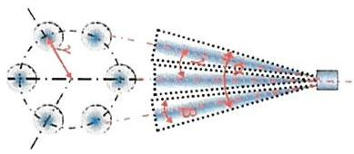

Remarks: Only for simulation purpose, deviations in senes producton not considered Total spraynge()candifertovisual sprayanglebecauseof gemericalproec different measurement techniques.

eireincystems Internal |Power Solutions |RBCW/TCR3 |2024-07-21 2024 Allnghis ieserved, also regarding any disposal, exploitaton, repreducuon, editng, distmibuion, as wel as in tne event oi applicalicns tor ndustial prepeny uzhts.

<table><tr><td rowspan=1 colspan=1></td><td rowspan=1 colspan=1>RZ4E</td><td rowspan=1 colspan=1>493_previous</td><td rowspan=1 colspan=1>493</td><td rowspan=1 colspan=1>493_0813</td></tr><tr><td rowspan=1 colspan=1>Inlet to</td><td rowspan=1 colspan=1>38</td><td rowspan=1 colspan=1>13</td><td rowspan=2 colspan=1>45</td><td rowspan=2 colspan=1>32</td></tr><tr><td rowspan=1 colspan=1>DOC</td><td rowspan=1 colspan=1></td><td rowspan=1 colspan=1></td></tr><tr><td rowspan=1 colspan=1>DOC</td><td rowspan=1 colspan=1>34</td><td rowspan=1 colspan=1>34</td><td rowspan=1 colspan=1>34</td><td rowspan=1 colspan=1>34</td></tr><tr><td rowspan=1 colspan=1>DOC to</td><td rowspan=1 colspan=1>198</td><td rowspan=1 colspan=1>198</td><td rowspan=1 colspan=1>198</td><td rowspan=1 colspan=1>198</td></tr><tr><td rowspan=1 colspan=1>DPF</td><td rowspan=1 colspan=1></td><td rowspan=1 colspan=1></td><td rowspan=1 colspan=1></td><td rowspan=1 colspan=1></td></tr><tr><td rowspan=1 colspan=1>DPF</td><td rowspan=1 colspan=1>150</td><td rowspan=1 colspan=1>150</td><td rowspan=1 colspan=1>150</td><td rowspan=1 colspan=1>150</td></tr><tr><td rowspan=1 colspan=1>DPF to</td><td rowspan=1 colspan=1>58</td><td rowspan=1 colspan=1>58</td><td rowspan=1 colspan=1>69</td><td rowspan=1 colspan=1>60</td></tr><tr><td rowspan=1 colspan=1>SCR</td><td rowspan=1 colspan=1></td><td rowspan=1 colspan=1></td><td rowspan=1 colspan=1></td><td rowspan=1 colspan=1></td></tr><tr><td rowspan=1 colspan=1>SCR</td><td rowspan=1 colspan=1>39</td><td rowspan=1 colspan=1>39</td><td rowspan=1 colspan=1>39</td><td rowspan=1 colspan=1>39</td></tr><tr><td rowspan=1 colspan=1>SCRto</td><td rowspan=1 colspan=1>12</td><td rowspan=1 colspan=1>12</td><td rowspan=1 colspan=1>12</td><td rowspan=2 colspan=1>11</td></tr><tr><td rowspan=1 colspan=1>out</td><td rowspan=1 colspan=1></td><td rowspan=1 colspan=1></td><td rowspan=1 colspan=1></td></tr><tr><td rowspan=1 colspan=1>Total</td><td rowspan=1 colspan=1>529</td><td rowspan=1 colspan=1>504</td><td></td><td></td></tr></table>

The pressure distribution The JMC493 CFD simulation report

Internal |Power Solutions |RBCW/TCR3 |2024-07-21 Velocity uniformity index at the DOC inlet, SDPF inlet, SCR inlet al can meet the design target (UI ≥ 0.95) BOSCH

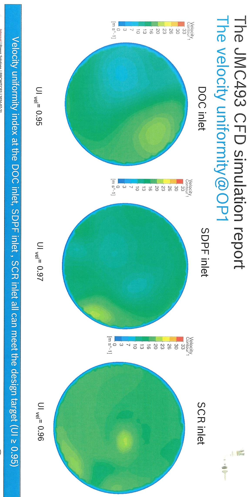

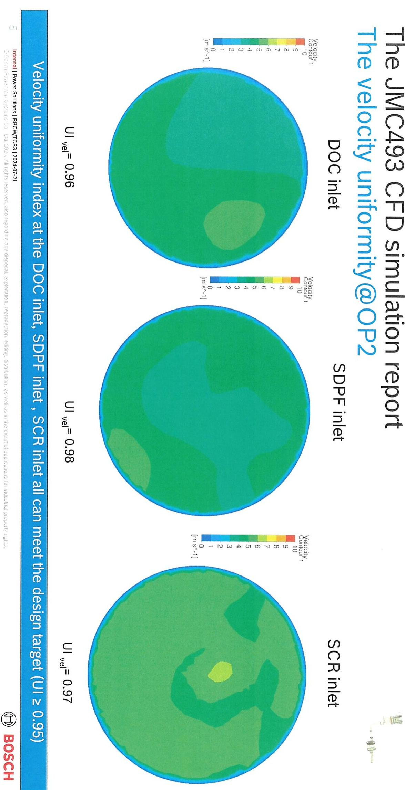

The spray visualization & impingement The JMC493 CFD simulation report  
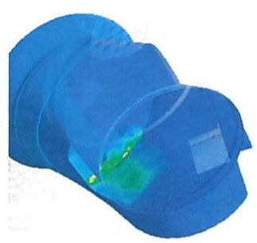

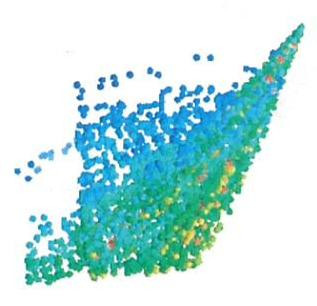

The spray droplet wil not knock on DOC or flow through mix plate to SDPF directly, the spray load index value lower than the experience value(130), which means the crystallzation risk is not too high. Internal Power Solutions| RBCW/TCR3|2024-07-21 BOSCH

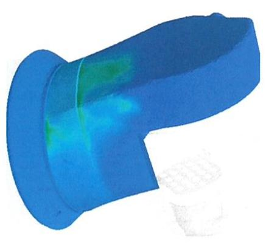

Internal |Power Solutions|RBCW/TCR3|2024-07-21 The ammonia equivalent massfraction uniformity at the SDPF above the target index value 0.95 at both OP BOSCH

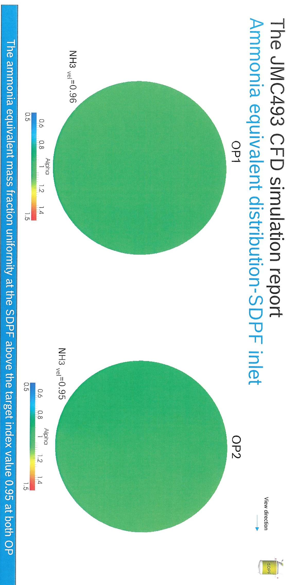

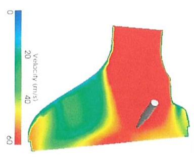  
0  
area) mainstream (At the sensor tip around the distribution The velocity  
Powerain Internal |PowerSolutions |RBCW/TCR3|2024-07-21 Lta. 2024.Al ights reseived, alse regarding any disposal, expiotaton, reproducton, ediung, distibuhon, as wel as in the event or applicalions torindustial prepeny nzhs  
(<80mm) catalyst center sensor tip to Distance from

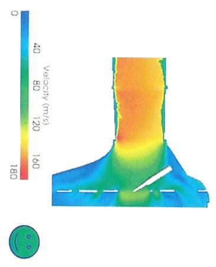

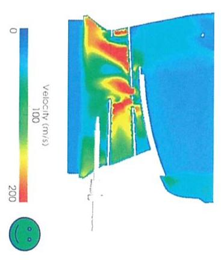

Temperature sensor position The JMC493 CFD simulation report  
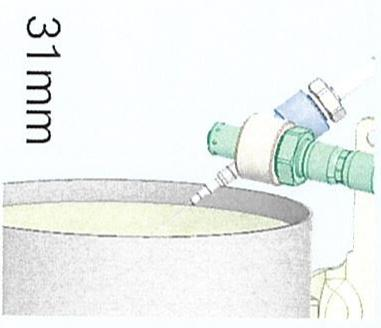

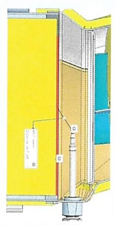

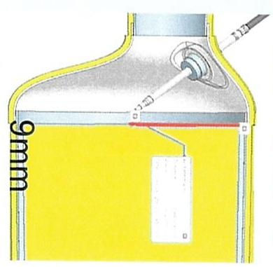

vsielns Internal |Power Solutions |RBCW/TCR3 |2024-07-21 Lta.2024. .Al ughts eseived aiso regerding any disposal, explotaion, reproducton, eding, distribunon, as vel as m the evemt ci applicalons tor incustnal prepeny ughts.

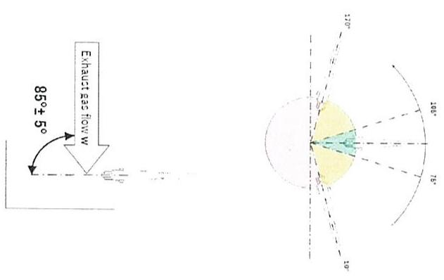

# Sensor mounting position accuracy-PM sensor The JMC493 CFD simulation report

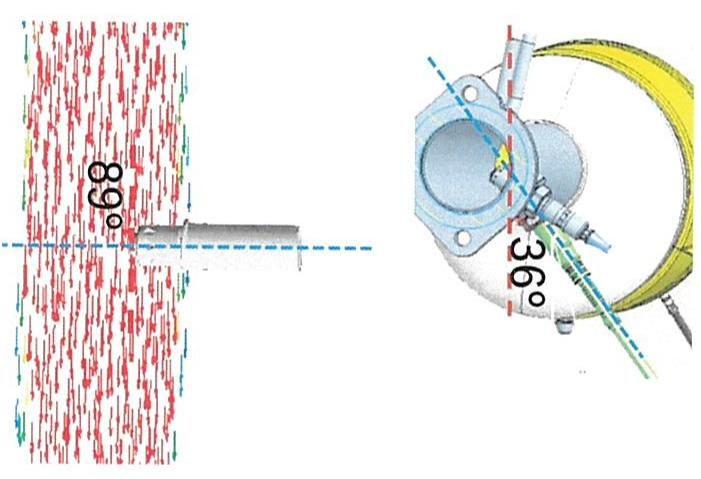

Background One PM sensor planned mounted on the backpipe

Objectives Using CFD simulation to analyze the position for the PM sensor by using the criteria according to the "Exhaust gas sensor layout requirement"

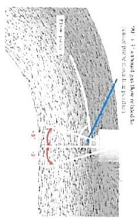

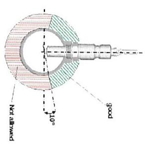  
Sensor mounting position accuracy-Nox sensor The JMC493 CFD simulation report

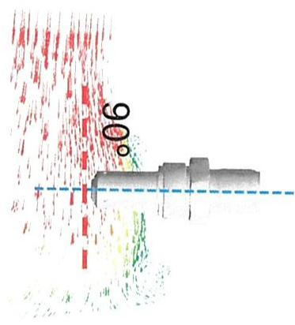  
Lied Internal |Power Solutions |RBCW/TCR3|2024-07-21 2024. Al nghis reseived also regarding any cisposal, explontaton, reproducton,edung, distibunon. as wellas in the event of applicatons tor indusuial ropeny ughts

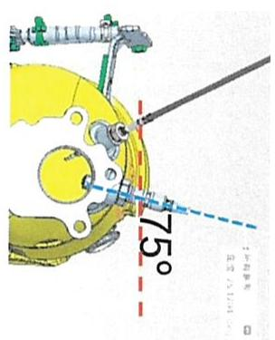

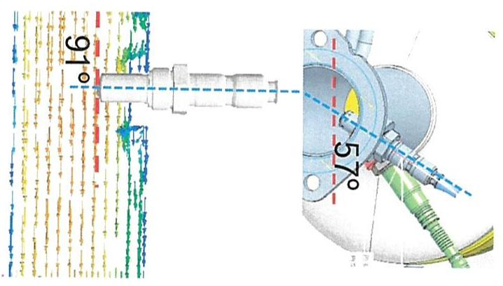

Background / Two NOxsensors are planned (one upstream the DOC and one downstream the SCR catalyst).

Objectives Using CFD simulation to analyze the position for the NOxsensor by using the criteria according to the "Exhaust gas sensor layout requirement'

enan Internal |Power Solutions |RBCW/TCR3|2024-07-21 Sys Lid. c024.Al nghis leserved,aleo regarding any disposa, explotation, reproducton,ediing, distrbunon, as wel as in the event of applicatens for industnal propenty ngts

<table><tr><td rowspan=2 colspan=1>Basie information基本信息</td><td rowspan=2 colspan=2>JIM493</td><td rowspan=2 colspan=1>Meeting information会议信息</td><td rowspan=2 colspan=1>DFMA</td><td></td><td></td><td></td><td></td><td></td></tr><tr><td rowspan=7 colspan=5></td></tr><tr><td rowspan=1 colspan=1>Project name项目名称</td><td rowspan=1 colspan=1>Sample phase样件阶段</td><td rowspan=1 colspan=1>Plant/Supplier工厂/供应商</td><td rowspan=1 colspan=1>Meeting time会议时间</td><td rowspan=1 colspan=1>Participants参会人</td></tr><tr><td rowspan=1 colspan=1>JIM493</td><td rowspan=1 colspan=1>A-sample</td><td rowspan=1 colspan=1>弗吉亚</td><td rowspan=1 colspan=1>2024.08.1514:00-16:00</td><td rowspan=1 colspan=1>Chen Maojin;LiYang;Zhu Wenwu；Lu Qingsong;FangJiyan;Yin KanghuangYang Guangtuo Zhang Bo</td></tr><tr><td rowspan=1 colspan=1>Cheek point检查项</td><td rowspan=1 colspan=4></td></tr><tr><td rowspan=1 colspan=1>Welding fesibiity焊接可行性</td><td rowspan=1 colspan=1>Assembly feasibility装配可行性</td><td rowspan=1 colspan=1>Measure feasibility测量可行性</td><td rowspan=1 colspan=1>Parts feasibility零件生产可行性</td><td rowspan=1 colspan=1></td></tr><tr><td rowspan=1 colspan=1></td><td rowspan=1 colspan=1></td><td rowspan=1 colspan=1></td><td rowspan=1 colspan=1></td><td rowspan=1 colspan=1></td></tr><tr><td rowspan=1 colspan=1>Open Topic会议讨论点</td><td rowspan=1 colspan=4></td></tr><tr><td rowspan=1 colspan=1>Description文字描述</td><td rowspan=1 colspan=3>Picture图片</td><td rowspan=1 colspan=1>Action下一步计划</td><td rowspan=1 colspan=1>Responsibility责任人</td><td rowspan=1 colspan=1>Due date节点</td><td rowspan=1 colspan=1>类别</td><td rowspan=1 colspan=1>状态</td><td rowspan=1 colspan=1>note</td></tr><tr><td rowspan=1 colspan=1>DOC进气端锥NOX座焊接干涉；</td><td rowspan=1 colspan=3>1店</td><td rowspan=1 colspan=1>1.调整位置，看下能否修改数模；2.弗吉亚评估能否通过调整工艺尽量不修改模型；</td><td rowspan=1 colspan=1>卢青松/Jin Wei</td><td rowspan=1 colspan=1>8.15</td><td rowspan=1 colspan=1>焊接可行性</td><td rowspan=1 colspan=1>ongoing</td><td rowspan=1 colspan=1></td></tr><tr><td rowspan=1 colspan=1>混合器隔板不好焊接</td><td rowspan=1 colspan=3></td><td rowspan=1 colspan=1>评估能否把混合器隔板从内插改为翻遍；</td><td rowspan=1 colspan=1>卢青松/</td><td rowspan=1 colspan=1>7月30</td><td rowspan=1 colspan=1>装配可行性</td><td rowspan=1 colspan=1>ongoing</td><td rowspan=1 colspan=1></td></tr><tr><td rowspan=1 colspan=1>混合器压差管角度太小无法焊接：</td><td rowspan=1 colspan=3></td><td rowspan=1 colspan=1>弗吉亚评估内焊可行性；</td><td rowspan=1 colspan=1>Jin Wei</td><td rowspan=1 colspan=1>6月30</td><td rowspan=1 colspan=1>装配可行性</td><td rowspan=1 colspan=1>ongoing</td><td rowspan=1 colspan=1></td></tr></table>