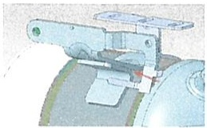
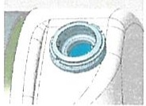
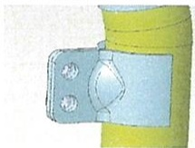
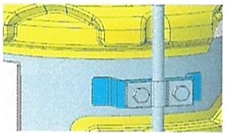
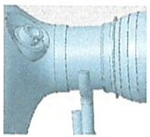
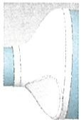

# DFMA Meeting Minutes DFMA会议纪要

## 会议信息

| 字段 | 内容 |
|---|---|
| Project name / 项目名称 | JIM493 |
| Sample phase / 样件阶段 | C-sample |
| Plant/Supplier / 工厂/供应商 | 弗吉亚 |
| Meeting time / 会议时间 | 2024.12.26 15:00-16:15 |
| Attendees / 参会人员 | Jin Wei; Li Yicen; Lu Qingsong; Rong Yiping; Yang Guangtuo; Yin Kangzhuang; Fang Jiayan |

---

## 检查项 / Check Points

- Welding feasibility / 焊接可行性
- Assembly feasibility / 装配可行性
- Measure feasibility / 测量可行性

---

## 讨论点详情 / Open Topics Detail

| 序号 | 描述 | 图片 | 措施 | 责任人 | 节点 | 类别 | 状态 |
|---|---|---|---|---|---|---|---|
| 1 | 压差支架增加一道焊缝 |  | 弗吉亚参考威孚RZ4E设计焊接工艺，评估生产可行性 | Jin Wei | 1月3日 | 焊接可行性 | ongoing |
| 2 | 尿素喷嘴座不好焊接 |  | 弗吉亚参考威孚RZ4E设计焊接工艺，评估生产可行性 | Jin Wei | 1月3日 | 焊接可行性 | ongoing |
| 3 | 支架减短到一半 |  | 仿真评估下支架减短到一半的强度；仿真分析结果显示有风险，不修改保持原设计 | 卢青松 | 1月3日 | 生产可行性 | done |
| 4 | 保温壳翻边焊接留10-12mm |  |  | 卢青松 | 1月3日 | 焊接可行性 | done |
| 5 | 吊钩焊接直线段太短 |  | 弗吉亚参考威孚RZ4E设计焊接工艺，评估生产可行性 | Jin Wei | 1月3日 | 焊接可行性 | ongoing |
| 6 | 端锥拍平后，零件直线段失圆 |  | 弗吉亚找供应商评估下端锥零件的生产可行性 | Rong Yiping | 1月3日 | 零件生产可行性 | ongoing |
