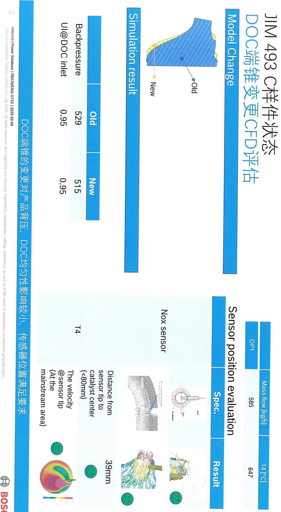

<table><tr><td rowspan=2 colspan=2>C Sample Drawing Release Pre-condition Checkist</td><td></td><td rowspan=1 colspan=2></td><td rowspan=1 colspan=1></td></tr><tr><td rowspan=1 colspan=1>Result/Report</td><td rowspan=1 colspan=1>Status</td><td rowspan=1 colspan=1>Resp.</td><td rowspan=1 colspan=1>Date</td></tr><tr><td rowspan=7 colspan=1>Design</td><td rowspan=1 colspan=1>1.C Sample 3D model confirmed by customer?</td><td rowspan=1 colspan=1></td><td rowspan=1 colspan=1>ok</td><td rowspan=1 colspan=1>卢青坛</td><td rowspan=1 colspan=1>2024.1.8</td></tr><tr><td rowspan=1 colspan=1>2.C Sample offer drawing check with manufacturing drawing?</td><td rowspan=1 colspan=1></td><td rowspan=1 colspan=1>ongoingD:2025.0..10</td><td rowspan=1 colspan=1>情松</td><td rowspan=1 colspan=1>20281.8</td></tr><tr><td rowspan=1 colspan=1>3.C Sample Nameplate confirmed by customer? Email or drawing confirm?</td><td rowspan=1 colspan=1></td><td rowspan=1 colspan=1>ok</td><td rowspan=1 colspan=1>卢青松</td><td rowspan=1 colspan=1>2025.1.8</td></tr><tr><td rowspan=1 colspan=1>4.D-FMEA first version finished?</td><td rowspan=1 colspan=1></td><td rowspan=1 colspan=1>已完成.比准中7：2075.01.24</td><td rowspan=1 colspan=1></td><td rowspan=1 colspan=1></td></tr><tr><td rowspan=1 colspan=1>5.I-FMEAfirst version finished?</td><td rowspan=1 colspan=1></td><td rowspan=1 colspan=1>ongoing   0:2075.01.24</td><td rowspan=1 colspan=1>7)</td><td rowspan=1 colspan=1></td></tr><tr><td rowspan=1 colspan=1>6.Installation uidelinefinished?</td><td rowspan=1 colspan=1></td><td rowspan=1 colspan=1>onyoins  D：2025.01.24</td><td rowspan=1 colspan=1></td><td rowspan=1 colspan=1></td></tr><tr><td rowspan=1 colspan=1>7.PSC/CC list finished for CMK summary?</td><td rowspan=1 colspan=1></td><td rowspan=1 colspan=1>已有初版</td><td rowspan=1 colspan=1></td><td rowspan=1 colspan=1></td></tr><tr><td rowspan=3 colspan=1>PUR/MOE</td><td rowspan=1 colspan=1>1.C Sample Make and Buy confirmed?</td><td rowspan=1 colspan=1></td><td rowspan=1 colspan=1>ok.only cakls+ATS=B</td><td rowspan=1 colspan=1>李。</td><td rowspan=1 colspan=1>2025.18</td></tr><tr><td rowspan=1 colspan=1>2.C sample DFMA welding process confirmed with MOE?Flow char?</td><td rowspan=1 colspan=1></td><td rowspan=1 colspan=1>ou goy</td><td rowspan=1 colspan=1>.</td><td rowspan=1 colspan=1>18</td></tr><tr><td rowspan=1 colspan=1>3.P-FMEA first version plan?</td><td rowspan=1 colspan=1></td><td rowspan=1 colspan=1>ongoiy</td><td rowspan=1 colspan=1>品</td><td rowspan=1 colspan=1>1.8</td></tr><tr><td rowspan=2 colspan=1>DVValidation</td><td rowspan=1 colspan=1>1.Canning validatio finished?report</td><td rowspan=1 colspan=1></td><td rowspan=1 colspan=1>Gveved Dy patform</td><td rowspan=1 colspan=1>162.5</td><td rowspan=1 colspan=1>2025.18</td></tr><tr><td rowspan=1 colspan=1>2.ATSDVvalidation finished?report?</td><td rowspan=1 colspan=1></td><td rowspan=1 colspan=1>Test result: pays</td><td rowspan=1 colspan=1></td><td rowspan=1 colspan=1></td></tr><tr><td rowspan=2 colspan=1>System</td><td rowspan=1 colspan=1>1.TCD status?</td><td rowspan=1 colspan=1></td><td rowspan=1 colspan=1>0K</td><td rowspan=1 colspan=1></td><td rowspan=1 colspan=1>2020÷1.9</td></tr><tr><td rowspan=1 colspan=1>2.POC result &amp; report?</td><td rowspan=1 colspan=1></td><td rowspan=1 colspan=1>On qoing</td><td rowspan=1 colspan=1></td><td rowspan=1 colspan=1></td></tr></table>

<table><tr><td rowspan=2 colspan=1>BOSCH博世Confidential</td><td rowspan=2 colspan=5>Product Development Design Change Request产品开发设计变更请求</td><td rowspan=1 colspan=1>Version 15Effective date:2024-1-09th</td></tr><tr><td rowspan=1 colspan=1>24_146</td></tr><tr><td rowspan=1 colspan=4>Customer project Name/客户项目名称：              JIM-493</td><td rowspan=1 colspan=3>MCR No./ MCR号:</td></tr><tr><td rowspan=1 colspan=7>Sample status / 样件状态：      A Sample     ]B Sample  C Sample    D Sample</td></tr><tr><td rowspan=1 colspan=7>Change part&amp;product Name/更改零部件产品的名称(简要描述)</td></tr><tr><td rowspan=1 colspan=7>DOC-DPF:F01ZH003FU-05SCR:F01ZH003FV-05</td></tr><tr><td rowspan=1 colspan=7>Reason of changes/更改理由(简要描述):</td></tr><tr><td rowspan=1 colspan=7>C样件放行</td></tr><tr><td rowspan=1 colspan=2>Change from/变更来源：</td><td rowspan=1 colspan=5></td></tr><tr><td rowspan=1 colspan=3>Customer request/客户要求□</td><td rowspan=1 colspan=4>Supplier request/供应商请求                     Design optimization /设计优化</td></tr><tr><td rowspan=1 colspan=3>Correction/更正(错误)</td><td rowspan=1 colspan=4>Other /其他</td></tr><tr><td rowspan=1 colspan=2>Change inform to/变更通知人：</td><td rowspan=1 colspan=5>Zhang Shengchang,Zhang Hanquan,Shen Weibo, Li Yicen, Fang Jiayan, Yin Kangzhuang</td></tr><tr><td rowspan=1 colspan=7>Yang Guangtuo,Jia Kebin, Luo jing, Lu Qingsong</td></tr><tr><td rowspan=1 colspan=7>Whether this change impact others component or product 此变更是否影响到其他部件和产品：       yes/是   no/否</td></tr><tr><td rowspan=1 colspan=7>Ifimpact others product， Whether others projects&amp;product change or not？如果影响，别的部件和产品是否也需要同时变更？</td></tr><tr><td rowspan=1 colspan=7></td></tr><tr><td rowspan=1 colspan=2>Design /设计工程师</td><td rowspan=2 colspan=3>卢青松</td><td rowspan=2 colspan=1>Date /日期：</td><td rowspan=2 colspan=1>2025.1.7</td></tr><tr><td rowspan=1 colspan=2>Signature /签名：</td></tr><tr><td rowspan=1 colspan=2>Check/校对工程师</td><td rowspan=2 colspan=1>is</td><td rowspan=2 colspan=2>对$</td><td rowspan=2 colspan=1>Date /日期：</td><td rowspan=2 colspan=1>205.1.8</td></tr><tr><td rowspan=1 colspan=2>Signature/签名：</td></tr><tr><td rowspan=1 colspan=7>Description of Change/更改描述：（下面空白处请列出详细的变更前后对比）</td></tr></table>

<table><tr><td rowspan=2 colspan=1>BOSCH博世Confidential</td><td rowspan=2 colspan=4>Design Change Review Sheet设计变更评审表</td><td rowspan=1 colspan=3>Version 13Effective date: 2024-11-09th</td></tr><tr><td rowspan=1 colspan=3>Design Change    24_146Request No.</td></tr><tr><td rowspan=1 colspan=8>1.Function&amp;Performance wil be influenced?/系统性能影响？     yes/是no/否</td></tr><tr><td rowspan=1 colspan=3>If Yes, System impaction evaluation?如果是，系统影响评估？(如果是初次样件放行，空白处请说明样件目的)</td><td rowspan=1 colspan=4>俗化方来可的有变更，封装无影</td><td rowspan=2 colspan=1>Ssystem/签名坡</td></tr><tr><td rowspan=1 colspan=3>Whether need sample to test? Plan?是否需要样件进行验证？计划？</td><td rowspan=1 colspan=4></td></tr><tr><td rowspan=1 colspan=3>Whether the catalyst informationisconfirmed?催化剂信息是否确认？（物料号、图纸、SPEC)</td><td rowspan=1 colspan=4>催化察可能有变更，经系统测试确认</td><td rowspan=1 colspan=1>catalst/签名张汉泉</td></tr><tr><td rowspan=1 colspan=3>2.Interface&amp;boundary (internal and custom</td><td rowspan=1 colspan=4>er) wil be infuenced?/接口&amp;边界(内部和客户)影响？     yes/是</td><td rowspan=1 colspan=1>no/否</td></tr><tr><td rowspan=1 colspan=3>if impact custmer,whethergetconfirm fromcustomer side?请说明影响和是否得到客户的确认？</td><td rowspan=1 colspan=4>客户已核类完成边界</td><td rowspan=1 colspan=1>Desien/然名卢青松</td></tr><tr><td rowspan=1 colspan=3>3. Mechanical strength&amp;Durability wil be in</td><td rowspan=1 colspan=4>fluenced?/机械强度&amp;可靠性影响？                        yes/是</td><td rowspan=1 colspan=1>□n0/否</td></tr><tr><td rowspan=1 colspan=3>IfYes， How to evaluate？Plan?如果是，请说明影响和如何评估，计划？（例如：仿真分析等)</td><td rowspan=1 colspan=4>D验证过、架和吊约评化结构强</td><td rowspan=2 colspan=1>诗年$variati</td></tr><tr><td rowspan=1 colspan=3>Whether need sample to test? Plan?是否需要样件进行验证？计划？</td><td rowspan=1 colspan=4>DU马金江通过(发动在而、总成热振动)</td></tr><tr><td rowspan=1 colspan=3>4.Product document infuenced?</td><td rowspan=1 colspan=4></td><td rowspan=1 colspan=1></td></tr><tr><td rowspan=1 colspan=3>4.1 Interface FMEA-relevant/IFMEA:</td><td rowspan=1 colspan=4>no/否  yes/是   Note_</td><td rowspan=6 colspan=1>0</td></tr><tr><td rowspan=1 colspan=3>4.2.Product FMEA-relevant /DFMEA:</td><td rowspan=1 colspan=4>no/否  yes/是  Note</td></tr><tr><td rowspan=1 colspan=3>4.3.Special Charecteristics /PSC: (针对C Sample)</td><td rowspan=1 colspan=4>no/否   yes/是   Note</td></tr><tr><td rowspan=1 colspan=3>4.4.IMDS relevant：(针对C Sample)</td><td rowspan=1 colspan=4>no/否  yes是  Note</td></tr><tr><td rowspan=1 colspan=3>4.5 Offer drawing relevant(针对C Sample)</td><td rowspan=1 colspan=4>no/否  yes是   Note</td></tr><tr><td rowspan=1 colspan=3>4.6.TCD relevant:</td><td rowspan=1 colspan=4>no/否  yes/是   Note</td></tr><tr><td rowspan=1 colspan=8>5.Changed parts Stock&amp; treatment/需要变更零件的库存统计和处理？（只针对涉及到已经生产过的零件变更，新放行零件和本条不相关）                               NA.(新零件放行，不涉及库存）涉及到已经生产过的零件变更</td></tr><tr><td rowspan=1 colspan=3>RBCWRDC（外库)和RBCW仓库，是否有库存，</td><td rowspan=1 colspan=4>□无库存     □有库存，库存数量</td><td rowspan=1 colspan=1></td></tr><tr><td rowspan=1 colspan=3>供应商处（已做好，未发货）是否有库存，</td><td rowspan=1 colspan=4>□无库存     □有库存，库存数量</td><td rowspan=3 colspan=1>PUE/签名</td></tr><tr><td rowspan=1 colspan=3>LPN工厂是否有库存，</td><td rowspan=1 colspan=4>□无库存     □有库存，库存数量</td></tr><tr><td rowspan=1 colspan=3>在途，运输中是否有库存</td><td rowspan=1 colspan=4> 无库存      □有库存，库存数量</td></tr><tr><td rowspan=2 colspan=3>被影响到的实物库存处理指示：（设计工程师组织会议讨论）</td><td rowspan=1 colspan=4>□可以继续使用完      □改制后使用   □报废</td><td rowspan=1 colspan=1>Design/签名</td></tr><tr><td rowspan=1 colspan=4>改制费用                                报废成□</td><td rowspan=1 colspan=1>PUE /签名</td></tr><tr><td rowspan=1 colspan=3>已装车件处理方法（发客户或标定车等）(SMP组织会议讨论）</td><td rowspan=1 colspan=4>改制                       更换其（单独说明)：</td><td rowspan=1 colspan=1></td></tr><tr><td rowspan=1 colspan=7>6. Influence on supplier part?</td><td rowspan=1 colspan=1></td></tr><tr><td rowspan=1 colspan=3>Was this change confirmed with Purchasing (Su变更后的零件，生产可行性供应商是否确认？</td><td rowspan=1 colspan=4>pplier) for feasibility? Feedback from Supplier?反馈？</td><td rowspan=5 colspan=1></td></tr><tr><td rowspan=1 colspan=7></td></tr><tr><td rowspan=1 colspan=7>Influence on purchasing part delivery time？对采购件交货时间的影响？</td></tr><tr><td rowspan=1 colspan=7>涉及到变更的零件，博世已出PR，供应商还未来得及生产的订单，是否已经通知供应商取消.   □no/查yes/是</td></tr><tr><td rowspan=1 colspan=7>保過，5)increase/增加，金额 decrease/降低，金额nd change/不变</td></tr><tr><td rowspan=1 colspan=7>7. DFMA &amp; Sample prodcution OPL?</td><td rowspan=1 colspan=1></td></tr><tr><td rowspan=1 colspan=7>必要时附加DFMA文件</td><td rowspan=2 colspan=1>Desien 松</td></tr><tr><td rowspan=1 colspan=7>已开 DFMA 会议纪要详见付件</td></tr><tr><td rowspan=1 colspan=5>8. Influence on LPN manufacturing&amp;assembly process?</td><td rowspan=1 colspan=2></td><td rowspan=1 colspan=1></td></tr><tr><td rowspan=1 colspan=6>Feedback from manufacturing engineer?产制造装配是否影响，反馈？</td><td rowspan=1 colspan=1></td><td rowspan=5 colspan=1>PE</td></tr><tr><td rowspan=2 colspan=6></td><td></td></tr><tr><td rowspan=1 colspan=1></td></tr><tr><td rowspan=1 colspan=7>Infuence on project&amp;product deliver time？对项&amp;产品交货时间的影响？</td></tr><tr><td rowspan=1 colspan=7>低，金其也Dincrease/增加金额</td></tr><tr><td rowspan=2 colspan=7>9. PM alignment? (influence on project Timeline? Cost?);是否同意对项目时间和成本的影响              ；需求样品订单数量</td><td></td></tr><tr><td rowspan=1 colspan=1>PM/签名</td></tr><tr><td rowspan=2 colspan=7>10.如果涉及以下情况需TCR3审核确认。不涉及则NA.                                      RBCW□库存报废，金额            采购成本增加，金额               牛产成本增加，金额</td><td></td></tr><tr><td rowspan=1 colspan=1>7TCR3</td></tr><tr><td rowspan=1 colspan=2>Design Team Leader</td><td rowspan=1 colspan=2>ENG-CV1</td><td rowspan=1 colspan=1>PUR</td><td rowspan=1 colspan=3>TCR3025-03X7</td></tr><tr><td rowspan=3 colspan=2>Signature/签名：杨抓</td><td></td><td></td><td></td><td></td><td></td><td></td></tr><tr><td></td><td></td><td></td><td></td><td></td><td></td></tr><tr><td rowspan=1 colspan=2>Sgnature签</td><td rowspan=1 colspan=1>Signature</td><td rowspan=1 colspan=3>Signature/签名：友庙</td></tr></table>

##

<table><tr><td rowspan=2 colspan=1></td><td rowspan=1 colspan=1>零件号</td><td rowspan=1 colspan=1>零件名称</td><td rowspan=1 colspan=2>Project</td><td rowspan=1 colspan=1>样件阶段</td><td rowspan=1 colspan=1>变更来源</td></tr><tr><td rowspan=1 colspan=1>F01Z5102CZ-02</td><td rowspan=1 colspan=1>INLET FLANGE</td><td rowspan=1 colspan=2>JIM-493</td><td rowspan=1 colspan=1>C</td><td rowspan=1 colspan=1>BOSCH/Customer</td></tr><tr><td rowspan=2 colspan=1>变更描述</td><td rowspan=1 colspan=3>变更前</td><td rowspan=1 colspan=3>变更后</td></tr><tr><td rowspan=1 colspan=3>1+        四0.24. .2习F01Z5102CZ-02</td><td rowspan=1 colspan=3>A-A20002002+       因5.020.5.0210÷0.5F01Z5102CZ-02</td></tr><tr><td rowspan=1 colspan=1>变更原因</td><td rowspan=1 colspan=6>供应商请求放宽法兰厚度公差，由公差±0.2改为±0.5;</td></tr><tr><td rowspan=1 colspan=1>风险点（影响）</td><td rowspan=1 colspan=6>无</td></tr><tr><td rowspan=1 colspan=1>验证方法</td><td rowspan=1 colspan=6>无</td></tr></table>

<table><tr><td rowspan=2 colspan=1></td><td rowspan=1 colspan=1>零件号</td><td rowspan=1 colspan=1>零件名称</td><td rowspan=1 colspan=2>Project</td><td rowspan=1 colspan=1>样件阶段</td><td rowspan=1 colspan=1>变更来源</td></tr><tr><td rowspan=1 colspan=1>F01Z5102D0-03</td><td rowspan=1 colspan=1>CONE</td><td rowspan=1 colspan=2>JIM-493</td><td rowspan=1 colspan=1>C</td><td rowspan=1 colspan=1>BOSCH/Customer</td></tr><tr><td rowspan=2 colspan=1>变更描述</td><td rowspan=1 colspan=3>变更前</td><td rowspan=1 colspan=3>变更后</td></tr><tr><td rowspan=1 colspan=3>F01Z5102D0-02</td><td rowspan=1 colspan=3>F01Z5102D0-03</td></tr><tr><td rowspan=1 colspan=1>变更原因</td><td rowspan=1 colspan=6>供应商反馈原端锥成型困难，报废率，端锥整体减短15mm;</td></tr><tr><td rowspan=1 colspan=1>风险点（影响）</td><td rowspan=1 colspan=6>1.端锥形状改变后，体流速均匀性及传感器位置不合格；2.结构强度变，差有断裂风险；</td></tr><tr><td rowspan=1 colspan=1>验证方法</td><td rowspan=1 colspan=6>FEA及CFD仿真合格，仿真报告如附件;</td></tr></table>

<table><tr><td rowspan=2 colspan=1></td><td rowspan=1 colspan=1>零件号</td><td rowspan=1 colspan=1>零件名称</td><td rowspan=1 colspan=2>Project</td><td rowspan=1 colspan=1>样件阶段</td><td rowspan=1 colspan=1>变更来源</td></tr><tr><td rowspan=1 colspan=1>F01Z5101V1</td><td rowspan=1 colspan=1>TEMP-SENSOR BOSS</td><td rowspan=1 colspan=2>JIM-493</td><td rowspan=1 colspan=1>C</td><td rowspan=1 colspan=1>BOSCH/Customer</td></tr><tr><td rowspan=1 colspan=1>变更描述</td><td rowspan=1 colspan=3>变更前</td><td rowspan=1 colspan=3>变更后</td></tr><tr><td rowspan=1 colspan=1>变更原因</td><td rowspan=3 colspan=6>端锥更改后，为保证T4位置不变座改用JP560量产传感器座;无无</td></tr><tr><td rowspan=1 colspan=1>风险点(影响)</td></tr><tr><td rowspan=1 colspan=1>验证方法</td></tr></table>

<table><tr><td rowspan=2 colspan=1></td><td rowspan=1 colspan=1>零件号</td><td rowspan=1 colspan=1>零件名称</td><td rowspan=1 colspan=2>Project</td><td rowspan=1 colspan=1>样件阶段</td><td rowspan=1 colspan=1>变更来源</td></tr><tr><td rowspan=1 colspan=1>F01Z5102DH-04</td><td rowspan=1 colspan=1>DP TUBE BRACKET</td><td rowspan=1 colspan=2>JIM-493</td><td rowspan=1 colspan=1>C</td><td rowspan=1 colspan=1>BOSCH/Customer</td></tr><tr><td rowspan=1 colspan=1>变更描述</td><td rowspan=1 colspan=3>变更前</td><td rowspan=1 colspan=3>变更后</td></tr><tr><td rowspan=1 colspan=1>变更原因</td><td rowspan=1 colspan=6>1.为便安装，线束架与筒体安装外扩0.3mm；2.为防卡安装困难，客户要求去除传感器架倒圆；3.供应商请求更改架安装位置，便焊接;</td></tr><tr><td rowspan=1 colspan=1>风险点(影响)</td><td rowspan=2 colspan=6>无无</td></tr><tr><td rowspan=1 colspan=1>验证方法</td></tr></table>

8
<table><tr><td rowspan=2 colspan=1></td><td rowspan=1 colspan=1>零件号</td><td rowspan=1 colspan=1>零件名称</td><td rowspan=1 colspan=2>Project</td><td rowspan=1 colspan=1>样件阶段</td><td rowspan=1 colspan=1>变更来源</td></tr><tr><td rowspan=1 colspan=1>F01Z5017X1-04</td><td rowspan=1 colspan=1>DP TUBE BRACKET</td><td rowspan=1 colspan=2>JIM-493</td><td rowspan=1 colspan=1>C</td><td rowspan=1 colspan=1>BOSCH/Customer</td></tr><tr><td rowspan=1 colspan=1>变更描述</td><td rowspan=1 colspan=3>变更前</td><td rowspan=1 colspan=3>变更后</td></tr><tr><td rowspan=1 colspan=1>变更原因</td><td rowspan=1 colspan=6>根据客户边界及仿真分析结果，更改压差支架形状;</td></tr><tr><td rowspan=1 colspan=1>风险点（影响）</td><td rowspan=1 colspan=6>强度不足，有断裂风险；</td></tr><tr><td rowspan=1 colspan=1>验证方法</td><td rowspan=1 colspan=6>进行FEA仿真，仿真报告详见附件</td></tr></table>

<table><tr><td colspan="1" rowspan="2"></td><td colspan="1" rowspan="1">零件号</td><td colspan="1" rowspan="1">零件名称</td><td colspan="2" rowspan="1">Project</td><td colspan="1" rowspan="1">样件阶段</td><td colspan="1" rowspan="1">变更来源</td></tr><tr><td colspan="1" rowspan="1">F01Z51026F-01</td><td colspan="1" rowspan="1">DP TUBE BRACKET</td><td colspan="2" rowspan="1">JIM-493</td><td colspan="1" rowspan="1">C</td><td colspan="1" rowspan="1">BOSCH/Customer</td></tr><tr><td colspan="1" rowspan="2">变更描述</td><td colspan="3" rowspan="1">变更前</td><td colspan="3" rowspan="1">变更后</td></tr><tr><td colspan="3" rowspan="1">F01Z51026F-00            1.压差侧架按压差架更</td><td colspan="3" rowspan="1">改后随之更改；    F01Z51026F-01</td></tr><tr><td colspan="1" rowspan="1">变更原因</td><td colspan="6" rowspan="1">压差侧架按压差支架更改后随之更改;</td></tr><tr><td colspan="1" rowspan="1">风险点(影响)</td><td colspan="6" rowspan="2">强度不足，有断裂风险；进行FEA仿真，仿真报告详见附件</td></tr><tr><td colspan="1" rowspan="1">验证方法</td></tr><tr><td colspan="1" rowspan="2">变更描述</td><td colspan="3" rowspan="1">变更前</td><td colspan="3" rowspan="1">变更后</td></tr><tr><td colspan="3" rowspan="1">$0102F0IZ5017NM-0x××××xx×DOCCANNING:F01Z5017NM-01DOCCANNINGSLEEVE:F01Z5102ED-001．DOC筒增加箭头及DOCCATALYST:F01Z50178N-00DOCMAT：F01Z5102E9-00                  2.DOC筒子随端锥减短3.DOC canning随之更</td><td colspan="3" rowspan="1">F01Z5017NM-08$xx-xx-xx-xx×××××××xx×××xx×DOCCANNING:F01Z5017NM-03DOCCANNINGSLEEVE:F01Z5102ED-02防错维码；DOCCATALYST:F01Z50178N-00后随之加长13mm；  DOCMAT:F01Z5102E9-00改；</td></tr><tr><td colspan="1" rowspan="1">变更原因</td><td colspan="6" rowspan="1">供应商请求在筒子上增加放错二维码及箭头及加长13mm;</td></tr><tr><td colspan="1" rowspan="1">风险点(影响)</td><td colspan="6" rowspan="2">无无</td></tr><tr><td colspan="1" rowspan="1">验证方法</td></tr></table>

##

<table><tr><td rowspan=2 colspan=1></td><td rowspan=1 colspan=1>零件号</td><td rowspan=1 colspan=1>零件名称</td><td rowspan=1 colspan=2>Project</td><td rowspan=1 colspan=1>样件阶段</td><td rowspan=1 colspan=1>变更来源</td></tr><tr><td rowspan=1 colspan=1>F01Z5017NP-02</td><td rowspan=1 colspan=1>DPF CANNING</td><td rowspan=1 colspan=2>JIM-493</td><td rowspan=1 colspan=1>C</td><td rowspan=1 colspan=1>BOSCH/Customer</td></tr><tr><td rowspan=2 colspan=1>变更描述</td><td rowspan=1 colspan=3>变更前</td><td rowspan=1 colspan=3>变更后</td></tr><tr><td rowspan=1 colspan=3>F01Z5017NP-01$xxxxxxxDPFCANNING:F01Z5017NP-01DPFCANNINGSLEEVE:F01Z5102EE-00DPFCATALYST：F01Z5017WM-00    1．衬垫按照背压结果DPFMAT:F01Z5102EA-00             2.DPF筒增加箭头</td><td rowspan=1 colspan=3>F01Z5017NP-02IXXXEXXDPFCANNING:F01Z5017NP-02DPFCANNINGSLEEVE: F01Z5102EE-01重新设计；           DPFCATALYST：F01Z5017WM-00及防错维码      DPFMAT:F01Z5102EA-01</td></tr><tr><td rowspan=1 colspan=1>变更原因</td><td rowspan=1 colspan=6>衬垫按背压重新设计，图纸升级，canning根据衬垫更改后随之更改；供应商请求在筒上增加放错维码及箭头；</td></tr><tr><td rowspan=1 colspan=1>风险点（影响）</td><td rowspan=1 colspan=6>衬垫预紧力不，载体有吹出风险；</td></tr><tr><td rowspan=1 colspan=1>验证方法</td><td rowspan=1 colspan=6>验证方法                                                                                 已进行canning DV实验；</td></tr></table>

##

<table><tr><td rowspan=2 colspan=1></td><td rowspan=1 colspan=1>零件号</td><td rowspan=1 colspan=1>零件名称</td><td rowspan=1 colspan=2>Project</td><td rowspan=1 colspan=1>样件阶段</td><td rowspan=1 colspan=1>变更来源</td></tr><tr><td rowspan=1 colspan=1>F01Z51025W-02</td><td rowspan=1 colspan=1>DPF OUTLET CONE</td><td rowspan=1 colspan=2>JIM-493</td><td rowspan=1 colspan=1>C</td><td rowspan=1 colspan=1>BOSCH/Customer</td></tr><tr><td rowspan=1 colspan=1>变更描述</td><td rowspan=1 colspan=3>变更前</td><td rowspan=1 colspan=3>变更后</td></tr><tr><td rowspan=3 colspan=7>为防DPF出端锥碰碎载体，供应商请求DPF出端锥由内插改为外套;外径变大，边界不满足；验证方法                                                                                     客户校核满足需求</td></tr><tr><td rowspan=1 colspan=1>风险点(影响)</td></tr><tr><td rowspan=1 colspan=1>验证方法</td></tr></table>

020
<table><tr><td rowspan=2 colspan=1></td><td rowspan=1 colspan=1>零件号</td><td rowspan=1 colspan=1>零件名称</td><td rowspan=1 colspan=2>Project</td><td rowspan=1 colspan=1>样件阶段</td><td rowspan=1 colspan=1>变更来源</td></tr><tr><td rowspan=1 colspan=1>F01Z51025X-01</td><td rowspan=1 colspan=1>DP SENSOR BOSS</td><td rowspan=1 colspan=2>JIM-493</td><td rowspan=1 colspan=1>C</td><td rowspan=1 colspan=1>BOSCH/Customer</td></tr><tr><td rowspan=2 colspan=1>变更描述</td><td rowspan=1 colspan=3>变更前</td><td rowspan=1 colspan=3>变更后</td></tr><tr><td rowspan=1 colspan=3>1.压差座高度更改；F01Z51025X-00</td><td rowspan=1 colspan=3>F01Z51025X-01</td></tr><tr><td rowspan=3 colspan=7>压差座在端锥更改后随之更改；无验证方法                                                                                               无</td></tr><tr><td rowspan=1 colspan=1>风险点(影响)</td></tr><tr><td rowspan=1 colspan=1>验证方法</td></tr></table>

2
<table><tr><td rowspan=2 colspan=1></td><td rowspan=1 colspan=1>零件号</td><td rowspan=1 colspan=1>零件名称</td><td rowspan=1 colspan=2>Project</td><td rowspan=1 colspan=1>样件阶段</td><td rowspan=1 colspan=1>变更来源</td></tr><tr><td rowspan=1 colspan=1>F01Z5017W5-04</td><td rowspan=1 colspan=1>DOC+SDPF WELDING</td><td rowspan=1 colspan=2>JIM-493</td><td rowspan=1 colspan=1>C</td><td rowspan=1 colspan=1>BOSCH/Customer</td></tr><tr><td rowspan=2 colspan=1>变更描述</td><td rowspan=1 colspan=3>变更前</td><td rowspan=1 colspan=3>变更后</td></tr><tr><td rowspan=1 colspan=3>日</td><td rowspan=1 colspan=3></td></tr><tr><td rowspan=3 colspan=7>1.上述变更后焊接组件随之更改；2.按供应商工艺要求修改图纸;无无</td></tr><tr><td rowspan=1 colspan=1>风险点(影响)</td></tr><tr><td rowspan=1 colspan=1>验证方法</td></tr></table>

<table><tr><td rowspan=2 colspan=1></td><td rowspan=1 colspan=1>零件号</td><td rowspan=1 colspan=1>零件名称</td><td rowspan=1 colspan=2>Project</td><td rowspan=1 colspan=1>样件阶段</td><td rowspan=1 colspan=1>变更来源</td></tr><tr><td rowspan=1 colspan=1>F01Z5017W8-02</td><td rowspan=1 colspan=1>DP tube inlet</td><td rowspan=1 colspan=2>JIM-493</td><td rowspan=1 colspan=1>C</td><td rowspan=1 colspan=1>BOSCH/Customer</td></tr><tr><td rowspan=2 colspan=1>变更描述</td><td rowspan=1 colspan=3>变更前</td><td rowspan=1 colspan=3>变更后</td></tr><tr><td rowspan=1 colspan=3>at do9DPtubeinlet：F01Z5017W8-01DPtubeinlet:F01Z5017YK-01RUBBERHOSEINLET：F01Z5101CB 1.压差软管增长；DPTUBECLAMP：F01Z501598        2.压差管组件随之</td><td rowspan=1 colspan=3>9                                 4DPtubeinlet:F01Z5017W8-02DPtubeinlet:F01Z5017YK-01RUBBERHOSEINLET:F01Z5102SV-00更改；            DPTUBECLAMP：F01Z501598</td></tr><tr><td rowspan=1 colspan=1>变更原因</td><td rowspan=1 colspan=6>压差架更改后，压差软管随之增长，压差软管更新后，压差管组件随之更改；</td></tr><tr><td rowspan=1 colspan=1>风险点（影响）</td><td rowspan=1 colspan=6>无</td></tr><tr><td rowspan=1 colspan=1>验证方法</td><td rowspan=1 colspan=6>无</td></tr></table>

<table><tr><td></td><td></td><td></td><td></td><td></td><td rowspan=1 colspan=7></td><td rowspan=2 colspan=1></td><td rowspan=1 colspan=1>零件号</td><td rowspan=1 colspan=1>零件名称</td><td rowspan=1 colspan=1>Project</td><td rowspan=1 colspan=1>样件阶段</td></tr><tr><td></td><td></td><td></td><td></td><td></td><td></td><td></td><td rowspan=1 colspan=1>F01Z5017W7-02</td><td rowspan=1 colspan=1>DP tube OUTlet</td><td rowspan=1 colspan=1>JIM-493</td><td rowspan=1 colspan=1>C</td><td rowspan=1 colspan=1>BOSCH/Customer</td></tr><tr><td rowspan=2 colspan=1>变更描述</td><td></td><td></td><td></td><td rowspan=1 colspan=8>变更后</td></tr><tr><td rowspan=1 colspan=3>oa9DPtubeOUTIet:F01Z5017W7-01DPtubeOUTIet:F01Z5017YJ-01RUBBERHOSEINLET:F01Z5101CA1.压差软管增长；DPTUBECLAMP:F01Z501603DPTUBECLAMP:F01Z501598        2.压差管组件随之</td><td rowspan=1 colspan=8>9                                                        DPtubeOUTlet:F01Z5017W7-02DPtubeOUTlet:F01Z5017YJ-01RUBBERHOSEINLET:F01Z5102SW-00DPTUBECLAMP:F01Z501603更改；                DPTUBECLAMP:F01Z501598</td></tr><tr><td rowspan=1 colspan=1>变更原因</td><td rowspan=1 colspan=11>压差架更改后，压差软管随之增长，压差软管更新后，压差管组件随之更改;</td></tr><tr><td rowspan=1 colspan=1>风险点(影响）</td><td rowspan=1 colspan=11>无</td></tr><tr><td rowspan=1 colspan=1>验证方法</td><td rowspan=1 colspan=11>无</td></tr><tr><td rowspan=1 colspan=1>——</td><td rowspan=1 colspan=11></td></tr></table>

<table><tr><td rowspan=2 colspan=1></td><td rowspan=1 colspan=1>零件号</td><td rowspan=1 colspan=1>零件名称</td><td rowspan=1 colspan=2>Project</td><td rowspan=1 colspan=1>样件阶段</td><td rowspan=1 colspan=1>变更来源</td></tr><tr><td rowspan=1 colspan=1></td><td rowspan=1 colspan=1>INSULATION</td><td rowspan=1 colspan=2>JIM-493</td><td rowspan=1 colspan=1>C</td><td rowspan=1 colspan=1>BOSCH/Customer</td></tr><tr><td rowspan=1 colspan=1>变更描述</td><td rowspan=1 colspan=3>变更前</td><td rowspan=1 colspan=3>变更后</td></tr><tr><td rowspan=1 colspan=1>变更原因</td><td rowspan=1 colspan=6>保温壳按照开模模型细化;</td></tr><tr><td rowspan=1 colspan=1>风险点（影响）</td><td rowspan=1 colspan=6>无</td></tr><tr><td rowspan=1 colspan=1>验证方法</td><td rowspan=1 colspan=6>无</td></tr></table>

<table><tr><td rowspan=2 colspan=1></td><td rowspan=1 colspan=1>零件号</td><td rowspan=1 colspan=1>零件名称</td><td rowspan=1 colspan=2>Project</td><td rowspan=1 colspan=1>样件阶段</td><td rowspan=1 colspan=1>变更来源</td></tr><tr><td rowspan=1 colspan=1>F01ZH003FU-04</td><td rowspan=1 colspan=1>DOC+SDPF UNIT</td><td rowspan=1 colspan=2>JIM-493</td><td rowspan=1 colspan=1>C</td><td rowspan=1 colspan=1>BOSCH/Customer</td></tr><tr><td rowspan=2 colspan=1>变更描述</td><td rowspan=1 colspan=3>变更前</td><td rowspan=1 colspan=3>变更后</td></tr><tr><td rowspan=1 colspan=3></td><td rowspan=1 colspan=3>X×X×-X×0</td></tr><tr><td rowspan=1 colspan=1>变更原因</td><td rowspan=1 colspan=6>1.上述变更后DOC+DPF总成随之更改；2.按供应商艺要求修改图纸；3.在出法兰上打刻产期及批次；4.取消尾管上的两保温</td></tr><tr><td rowspan=1 colspan=1>风险点 （影响）</td><td rowspan=1 colspan=6>取消尾管两片保温，温损加大，标定有误；</td></tr><tr><td rowspan=1 colspan=1>验证方法</td><td rowspan=1 colspan=6>实验验证温损可接受，实验结果见附件；</td></tr></table>

<table><tr><td rowspan=2 colspan=1></td><td rowspan=1 colspan=1>零件号</td><td rowspan=1 colspan=1>零件名称</td><td rowspan=1 colspan=2>Project</td><td rowspan=1 colspan=1>样件阶段</td><td rowspan=1 colspan=1>变更来源</td></tr><tr><td rowspan=1 colspan=1>F01Z5017WA-02</td><td rowspan=1 colspan=1>SCR CANNING</td><td rowspan=1 colspan=2>JIM-493</td><td rowspan=1 colspan=1>C</td><td rowspan=1 colspan=1>BOSCH/Customer</td></tr><tr><td rowspan=2 colspan=1>变更描述</td><td rowspan=1 colspan=3>变更前</td><td rowspan=1 colspan=3>变更后</td></tr><tr><td rowspan=1 colspan=3>    行SCR CANNING:F01Z5017WA-01SCRCANNING SLEEVE: F01Z5101P3SCRCATALYST:F01Z501891SCRMAT:F01Z5102EB-00</td><td rowspan=1 colspan=3>SCRCANNING:F01Z5017WA-02SCRCANNINGSLEEVE:F01Z5101P3SCRCATALYST：F01Z5018CM-00SCRMAT:F01Z5102EB-00</td></tr><tr><td rowspan=3 colspan=7>催化剂将本，系统工程师要求催化剂改用新方案催化剂;无验证方法                                                                                               无</td></tr><tr><td rowspan=1 colspan=1>风险点(影响)</td></tr><tr><td rowspan=1 colspan=1>验证方法</td></tr></table>

##

<table><tr><td rowspan=2 colspan=1></td><td rowspan=1 colspan=1>零件号</td><td rowspan=1 colspan=1>零件名称</td><td rowspan=1 colspan=2>Project</td><td rowspan=1 colspan=1>样件阶段</td><td rowspan=1 colspan=1>变更来源</td></tr><tr><td rowspan=1 colspan=1>F01Z5017WB-02</td><td rowspan=1 colspan=1>PIPE FOR PIN 01</td><td rowspan=1 colspan=2>JIM-493</td><td rowspan=1 colspan=1>C</td><td rowspan=1 colspan=1>BOSCH/Customer</td></tr><tr><td rowspan=2 colspan=1>变更描述</td><td rowspan=1 colspan=3>变更前</td><td rowspan=1 colspan=3>变更后</td></tr><tr><td rowspan=1 colspan=3>011.15PA11.04                   中FA11.07fT1_PIPEFORPIN01：F01Z5017WB-011．吊钩墩头直径减PIPEFORPIN01：F01Z5102D6-012．吊钩组件图纸增加</td><td rowspan=1 colspan=3>-11.07大Fh；                    PIPEFORPIN01：F01Z5017WB-02焊缝长度；        PIPEFORPIN01：F01Z5102D6-02</td></tr><tr><td rowspan=1 colspan=1>变更原因</td><td rowspan=1 colspan=6>1.供应商反馈原墩头直径16制作困难，请求把吊钩墩头直径改为14;2.供应商请求在吊钩组件图纸上增加焊缝度;</td></tr><tr><td rowspan=1 colspan=1>风险点（影响）</td><td rowspan=1 colspan=6>无</td></tr><tr><td rowspan=1 colspan=1>验证方法</td><td rowspan=1 colspan=6>无</td></tr></table>

<table><tr><td rowspan="2"></td><td>零件号</td><td>零件名称</td><td></td><td colspan="2">Project</td><td colspan="2">样件阶段</td></tr><tr><td>F01Z5017WC-01</td><td>PIPE FOR PIN 01</td><td>JIM-493</td><td></td><td>C</td><td>变更来源 BOSCH/Customer</td></tr><tr><td>变更描述</td><td colspan="3">变更前 </td><td>20=01$ PKT1_00- y</td><td colspan="2">变更后 </td></tr><tr><td></td><td colspan="3">因 回 回 广 110@ A 户 PKT1.02-</td><td colspan="2">回 11A 中 PKT1.02-</td></tr><tr><td></td><td colspan="3">PIPEFORPIN02：F01Z5017WC-01 吊钩组件图纸增加焊缝长度； PIPEFORPIN02：F01Z5017WC-0</td><td colspan="3"></td></tr><tr><td>变更原因</td><td colspan="7">供应商请求在吊钩组件图纸上增加焊缝长度;</td></tr><tr><td>风险点（影响）</td><td colspan="7"></td></tr><tr><td>验证方法</td><td colspan="7">无</td></tr></table>

##

<table><tr><td rowspan=2 colspan=1></td><td></td><td></td><td></td><td></td><td rowspan=1 colspan=6></td><td rowspan=1 colspan=1>零件号</td><td rowspan=1 colspan=1>零件名称</td><td rowspan=1 colspan=1>Project</td><td rowspan=1 colspan=1>样件阶段</td></tr><tr><td></td><td></td><td></td><td></td><td rowspan=1 colspan=5>C</td><td rowspan=1 colspan=1>BOSCH/Customer</td></tr><tr><td rowspan=1 colspan=1>变更描述</td><td></td><td></td><td></td><td rowspan=1 colspan=7>变更后</td></tr><tr><td rowspan=1 colspan=1>变更原因</td><td rowspan=1 colspan=10>1.上述更改后SCR组件随之更改；2.按供应商艺要求修改图纸;</td></tr><tr><td rowspan=1 colspan=1>风险点（影响）</td><td rowspan=1 colspan=10>无</td></tr><tr><td rowspan=1 colspan=1>验证方法</td><td rowspan=1 colspan=10>无</td></tr><tr><td rowspan=1 colspan=11></td></tr></table>

03 2

<table><tr><td rowspan=2 colspan=1></td><td rowspan=1 colspan=1>零件号</td><td rowspan=1 colspan=1>零件名称</td><td rowspan=1 colspan=2>Project</td><td rowspan=1 colspan=1>样件阶段</td><td rowspan=1 colspan=1>变更来源</td></tr><tr><td rowspan=1 colspan=1>F01Z5018BZ-00</td><td rowspan=1 colspan=1>SCR UNIT</td><td rowspan=1 colspan=2>JIM-493</td><td rowspan=1 colspan=1>C</td><td rowspan=1 colspan=1>BOSCH/Customer</td></tr><tr><td rowspan=1 colspan=1>变更描述</td><td rowspan=1 colspan=3>变更前</td><td rowspan=1 colspan=3>变更后</td></tr><tr><td rowspan=1 colspan=1>变更原因</td><td rowspan=3 colspan=6>按客户要求，保温壳铭牌信息位置更改到车架下方;无无</td></tr><tr><td rowspan=1 colspan=1>风险点(影响)</td></tr><tr><td rowspan=1 colspan=1>验证方法</td></tr></table>

2
<table><tr><td rowspan="2"></td><td>零件号</td><td>零件名称</td><td>Project</td><td>样件阶段</td><td></td><td>变更来源</td></tr><tr><td>F01Z5018C0-00</td><td>INSULATION WITH MAT 变更前</td><td>JIM-493</td><td colspan="3">C</td></tr><tr><td rowspan="2">变更描述</td><td colspan="3"></td><td colspan="3">变更后 BOSCH CSO SCR（含ASC1期：汽事（城）公 SCRLASC)件:NGK（苏N]公司 SCR(会ASC）业：（上）先工 E415 CA100271870 F012ZH003FV-05 Mode in Chins</td></tr><tr><td colspan="4">INSULATIONWITHMAT：F01Z5016EK INSULATIONWITHMAT:F01Z5018C0-01 INSULATIONFOIL：F01Z5102T8-00 INSULATIONFOIL：F01Z51018C INSUALTIONMAT：F01Z51018D INSUALTIONMAT：F01Z51018D 变更原因 1.按客户要求，保温壳铭牌信息位置更改到架下；2.供应商请求把产期和产批次号改到法兰上;</td></tr></table>

<table><tr><td rowspan=2 colspan=2></td><td rowspan=1 colspan=1>零件号</td><td></td><td></td><td></td><td></td><td rowspan=1 colspan=5></td><td rowspan=1 colspan=1>零件名称</td><td rowspan=1 colspan=1>Project</td><td rowspan=1 colspan=1>样件阶段</td><td rowspan=1 colspan=1>变更来源</td></tr><tr><td rowspan=1 colspan=1>F01ZH003FV-04</td><td></td><td></td><td></td><td></td><td></td><td rowspan=1 colspan=1>SCR UNIT</td><td rowspan=1 colspan=1>JIM-493</td><td rowspan=1 colspan=1>C</td><td rowspan=1 colspan=1>BOSCH/Customer</td></tr><tr><td></td><td></td><td rowspan=1 colspan=3>变更前</td><td rowspan=1 colspan=7>变更后</td></tr><tr><td rowspan=1 colspan=1>变更原因</td><td rowspan=1 colspan=11>1.上述变更后SCR总成随之更改；2.按供应商艺要求修改图纸;3.供应商请求把SCR的产批次号和产期改到法兰上;</td></tr><tr><td rowspan=1 colspan=1>风险点(影响)</td><td rowspan=2 colspan=11>无无</td></tr><tr><td rowspan=1 colspan=1>验证方法</td></tr></table>

L696T 00+3L9E+ = T = anTeA :IEA N

  
pueas/snbeay 1998T =antEA epnatubey :T

  
-（（）

28 72 6 3 3 \$ STT 00 8 5 4 30 OTT 2 30 dual 0 00 00 0

##

(X) ()

()292 ()08

(Z) (X)29981928 (Z)

(Z)99

pueas/enbea TT'S6T 0O+0TOEB+ =anteA apnatubew IEA KIEUTI

  
pueas/enbeay 00+35992+ apnatubew U

28 72 6 33 SZT 8 30 60 OTT 2 30 dual 0 0 000

##

() (X)Z88

() (Z)

() (Z)6 (Z)

## -（）

##

(Z) (

2

<table><tr><td>Hook Responsibility</td><td colspan="2">RB Hooks</td><td colspan="4">Customer Hooks</td><td rowspan="2"></td></tr><tr><td>Point</td><td>1</td><td>2</td><td>3</td><td>4</td><td>5</td><td>6</td></tr><tr><td>Reaction force [N]-Z</td><td>16.4</td><td>39.9</td><td>12.8</td><td>19.1</td><td>35.7</td><td>13.0</td><td>OK</td></tr><tr><td>Displacement [mm]</td><td>1.23</td><td>3.00</td><td>0.96</td><td>1.43</td><td>2.68</td><td>0.97</td><td>OK</td></tr></table>

  
apow

  
apnubew'n  
apow

  
apnubew'n

L

<table><tr><td>Mode</td><td>Freq. (Hz)</td><td></td><td>Mode</td><td>Freq. (Hz)</td><td></td><td colspan="2">Engine Info1</td><td>2nd order</td></tr><tr><td>1</td><td>9.6</td><td>Y向摆动</td><td>10</td><td>43.0</td><td>x向一阶扭摆</td><td>Engine</td><td>4 cylinders</td><td></td></tr><tr><td>2</td><td>10.2</td><td>x向摆动</td><td>11</td><td>53.8</td><td>z向三阶扭摆</td><td>ldle</td><td>750±50 rpm</td><td>25.5±1.7Hz</td></tr><tr><td>3</td><td>13.1</td><td>Y向一阶扭摆</td><td>12</td><td>77.9</td><td>Z向四阶扭摆+前吊钩局 部模态</td><td></td><td></td><td></td></tr><tr><td>4</td><td>14.0</td><td>Z向弯曲</td><td>13</td><td>82.8</td><td>波纹管局部模态</td><td></td><td></td><td></td></tr><tr><td>5</td><td>16.4</td><td>z向一阶扭摆</td><td>14</td><td>84.6</td><td>波纹管局部模态</td><td></td><td></td><td></td></tr><tr><td>6</td><td>19.2</td><td>Y向弯曲</td><td>15</td><td>108.7</td><td>前吊钩局部模态</td><td></td><td></td><td>3</td></tr><tr><td>7</td><td>20.6</td><td>Z向弯曲+尾管局部模态</td><td>16</td><td>123.9</td><td>波纹管局部模态</td><td></td><td>01</td><td></td></tr><tr><td>8</td><td>34.2</td><td>z向二阶扭摆</td><td>17</td><td>124.5</td><td>SCR前吊钩+波纹管局 部模态</td><td></td><td></td><td></td></tr><tr><td>9</td><td>35.7</td><td>Y向二阶扭摆</td><td>18</td><td>125.6</td><td>SCR前吊钩+波纹管局 部模态</td><td></td><td></td><td>5</td></tr></table>

<table><tr><td rowspan=1 colspan=2>Hook location</td><td rowspan=1 colspan=1>Conclusion</td></tr><tr><td rowspan=1 colspan=1>Model</td><td rowspan=1 colspan=1>Hook#1                 Hook#3Hook#4光Hook#2                                                                      Hook#6Hook#5</td><td rowspan=2 colspan=1>经分析，吊钩位置分布较合理；另外，SCR出气端锥处有1处适合布置吊钩的位置。</td></tr><tr><td rowspan=1 colspan=1>Modal nodes(20~150Hz)</td><td rowspan=1 colspan=1>Modes: Modes:Modes:  Modes:                           Modes:3,81,2,3Modes:5,7,8    4,11         5,7             1,2,7Modes:                                 Modes:                             Modes:4,5,7,11                                 1,2,3,8          Modes:     3,7,8,113,8,11</td></tr></table>

<table><tr><td rowspan=1 colspan=1></td><td rowspan=1 colspan=1>PEEQ</td></tr><tr><td rowspan=1 colspan=1>Step2</td><td rowspan=1 colspan=1>1.39%</td></tr><tr><td rowspan=1 colspan=1>Step4</td><td rowspan=1 colspan=1>2.24%</td></tr><tr><td rowspan=1 colspan=1>Delta PEEQ</td><td rowspan=1 colspan=1>0.425%</td></tr></table>

<table><tr><td rowspan=1 colspan=1></td><td rowspan=1 colspan=1>PEEQ</td></tr><tr><td rowspan=1 colspan=1>Step2</td><td rowspan=1 colspan=1>1.34%</td></tr><tr><td rowspan=1 colspan=1>Step4</td><td rowspan=1 colspan=1>1.35%</td></tr><tr><td rowspan=1 colspan=1>Delta PEEQ</td><td rowspan=1 colspan=1>0.005%</td></tr></table>

## EXTERNAL Lu Qingsong (WABT, RBCW/ENG-CV2)

<table><tr><td>From:</td><td>zhu.xiangyu@jiangxi-isuzu.cn</td></tr><tr><td>Sent:</td><td>2025年18星期三9:57</td></tr><tr><td>To:</td><td>EXTERNALLu Qingsong (WABT, RBCW/ENG-CV2);liu.yu</td></tr><tr><td>CC:</td><td>dai.shiqing; ZHANG Shengchang (RBCW/SMP-ATS1);YANG Guangtuo (RBCW/ENG- CV1)</td></tr><tr><td>Subject:</td><td>Re:PA506项目后处理数据优化</td></tr></table>

卢工：

经布置校核，保温壳28工况的间隙及压差支架抬高校核已经ok，铭牌位置也在可视范围内，可以按此版数据冻结；

祝您工作愉快

江西五十铃汽车有限公司

产品开发技术中心动力传动科 朱祥禹

地址：江西省南昌市望城新区江铃大道666号

TEL：15720942977

E-mail:zhu.xiangyu@jiangxi-isuzu.cn

发件人：EXTERNALLu Qingsong (WABT，RBCW/ENG-CV2)

发送时间：2025-01-0613:16

收件人：zhu.xiangyu@jiangxi-isuzu.cn;liu.yu

抄送：ZHANG Shengchang (RBCW/SMP-ATS1);YANG Guangtuo (RBCW/ENG-CV1)

主题：PA506项目后处理数据优化

Hello朱工，

JIM493根据要求调整了保温壳数模，铭牌的位置也做了更新，压差架做了优化，请评估下此版数模能否符合边界要求，谢谢！

数模下封邮件单独发送；

<table><tr><td rowspan=1 colspan=1>Basic intormation基本信息</td><td rowspan=1 colspan=2>JIM493</td><td rowspan=1 colspan=1>Meeting ntormation会议信息</td><td rowspan=1 colspan=1>DFMA</td><td rowspan=7 colspan=5></td></tr><tr><td rowspan=1 colspan=1>Project name项目名称</td><td rowspan=1 colspan=1>Sample phase样件阶段</td><td rowspan=1 colspan=1>PlanVSupplier工厂/供应商</td><td rowspan=1 colspan=1>Meeting time会议时间</td><td rowspan=1 colspan=1></td></tr><tr><td rowspan=1 colspan=1>JIM493</td><td rowspan=1 colspan=1>C-sample</td><td rowspan=1 colspan=1>弗吉亚</td><td rowspan=1 colspan=1>2024.12.2615:00-16:15</td><td rowspan=1 colspan=1>in Wei; LiYicenLuQingong;RongYiingYangGuangtuo; Yin KangZhuang: Fang Jiayan</td></tr><tr><td rowspan=1 colspan=1>Check point检查项</td><td rowspan=1 colspan=1></td><td rowspan=1 colspan=1></td><td rowspan=1 colspan=1></td><td rowspan=1 colspan=1></td></tr><tr><td rowspan=1 colspan=1>Welding feasibiliy焊接可行性</td><td rowspan=1 colspan=1>Assembly feasibiity装配可行性</td><td rowspan=1 colspan=1>Measure feasibility测量可行性</td><td rowspan=1 colspan=1></td><td rowspan=1 colspan=1></td></tr><tr><td rowspan=1 colspan=1></td><td rowspan=1 colspan=1></td><td rowspan=1 colspan=1></td><td rowspan=1 colspan=1></td><td rowspan=1 colspan=1></td></tr><tr><td rowspan=1 colspan=1>Open Topic会议讨论点</td><td rowspan=1 colspan=3></td><td rowspan=1 colspan=1></td></tr><tr><td rowspan=1 colspan=1>Description文字描述</td><td rowspan=1 colspan=3>$P$</td><td rowspan=1 colspan=1>$下_计</td><td rowspan=1 colspan=1>Responsibility责任人</td><td rowspan=1 colspan=1>Due date节点</td><td rowspan=1 colspan=1>类别</td><td rowspan=1 colspan=1>状态</td><td rowspan=1 colspan=1>note</td></tr><tr><td rowspan=1 colspan=1>压差支架增加一道焊缝；</td><td rowspan=1 colspan=3></td><td rowspan=1 colspan=1>弗吉亚参考威孚RZ4E设计焊接工艺，评估生产可行性；</td><td rowspan=1 colspan=1>Jin Wei</td><td rowspan=1 colspan=1>1月3</td><td rowspan=1 colspan=1>焊接可行性</td><td rowspan=1 colspan=1>ongoing</td><td rowspan=1 colspan=1></td></tr><tr><td rowspan=1 colspan=1>尿素喷嘴座不好焊接；</td><td rowspan=1 colspan=3></td><td rowspan=1 colspan=1>弗吉亚参考威孚RZ4E设计焊接工艺，评估生产可行性；</td><td rowspan=1 colspan=1>Jin Wei</td><td rowspan=1 colspan=1>1月3</td><td rowspan=1 colspan=1>焊接可行性</td><td rowspan=1 colspan=1>ongoing</td><td rowspan=1 colspan=1></td></tr><tr><td rowspan=1 colspan=1>支架减短到一半</td><td rowspan=1 colspan=3></td><td rowspan=1 colspan=1>仿真评估下支架减短到一半的强度；仿真分析结果显示有风险，不修改保持原设计：</td><td rowspan=1 colspan=1>卢青松</td><td rowspan=1 colspan=1>1月3</td><td rowspan=1 colspan=1>生产可行性</td><td rowspan=1 colspan=1>done</td><td rowspan=1 colspan=1></td></tr><tr><td rowspan=1 colspan=1>保温壳翻边焊接留10-12mm</td><td rowspan=1 colspan=3></td><td rowspan=1 colspan=1></td><td rowspan=1 colspan=1>卢青松</td><td rowspan=1 colspan=1>1月3</td><td rowspan=1 colspan=1>焊接可行性</td><td rowspan=1 colspan=1>done</td><td rowspan=1 colspan=1></td></tr><tr><td rowspan=1 colspan=1>吊钩焊接直线段太短</td><td rowspan=1 colspan=3></td><td rowspan=1 colspan=1>弗吉亚参考威孚RZ4E设计焊接工艺，评估生产可行性；</td><td rowspan=1 colspan=1>Jin wei</td><td rowspan=1 colspan=1>1月3</td><td rowspan=1 colspan=1>焊接可行性</td><td rowspan=1 colspan=1>ongoing</td><td rowspan=1 colspan=1></td></tr><tr><td rowspan=1 colspan=1>端维拍平后.零件直线段失国</td><td rowspan=1 colspan=3></td><td rowspan=1 colspan=1>弗吉亚找供应商评估下端维零件的生产可行性；</td><td rowspan=1 colspan=1>Rong Yiping</td><td rowspan=1 colspan=1>1月3</td><td rowspan=1 colspan=1>零件生产可行性</td><td rowspan=1 colspan=1>ongoing</td><td rowspan=1 colspan=1></td></tr></table>

# 零部件状态说明 JIM 493 C样件状态

# 焊接和测量说明 JIM 493 C样件状态

  
将来量产采用模具件，机器人焊接工艺更稳定，此轮耐久可以覆盖将来量产状态 基于以往项目经验，弗吉亚手工焊接有较丰富经验，前期手工焊接件台架耐久未出现焊缝失效，此轮整车耐久风险较低 由于量产工装检具未及时到位，此次OTS期望用手工焊接+部分机器人焊接支持整车耐久

# DOC端锥变更FEA评估 JIM 493 C样件状态

1阶模态频率170.12Hz， 变更前为169.2Hz

U, Magnitude

Scale Factor: +0.00

ODB:ANALYSIS\_JIM\_493\_HEND\_HMA\_20250306\_C.odt Ytep:MA Mode 1:Value=1.14260E+06Freq=170.12 Prmary Var: U, Magnitude Daformed\lar. Meformation Crale Fartor. IA Menn

  
（变更前：42.3Mpa) 41MPa@150Hz(X)

  
（变更前：34.5Mpa） 32.7MPa@ 150Hz(X)

T6温度及温损验证\_RDE95 JIE 493 ATS POC test  

