<table><tr><td rowspan=2 colspan=1>BOSCH博世Confidential</td><td rowspan=2 colspan=4>Product Development Design Change Request产品开发设计变更请求</td><td rowspan=1 colspan=1>Version 15Effective date: 2025-12-01th</td></tr><tr><td rowspan=1 colspan=1>25128</td></tr><tr><td rowspan=1 colspan=6>Customer project Name/客户项目名称：              JIM-4JJ          MCR No./ MCR号:</td></tr><tr><td rowspan=1 colspan=6> B Sample     C Sample    D Sample</td></tr><tr><td rowspan=1 colspan=6></td></tr><tr><td rowspan=1 colspan=6>SCR:F01ZH003EB-00DPFBRACKET:F01Z5017P5-05</td></tr><tr><td rowspan=1 colspan=6></td></tr><tr><td rowspan=1 colspan=6>DPF出气法兰，客户装上双头螺柱后，有密封垫，安装不上的风险，需要增加对出法兰螺的位置检测SCR客户要求在尾管处增加纸质标签侧支架客户要求更改客户料号</td></tr><tr><td rowspan=1 colspan=2>Change from/变更来源：</td><td rowspan=1 colspan=4> </td></tr><tr><td rowspan=1 colspan=2>Customer request/客户要求</td><td rowspan=1 colspan=1></td><td rowspan=1 colspan=3>Design optimization /设计优化</td></tr><tr><td rowspan=1 colspan=2>Correction/更正(错误)</td><td rowspan=1 colspan=1></td><td rowspan=1 colspan=3></td></tr><tr><td rowspan=1 colspan=2>Change inform to/变更通知人：</td><td rowspan=1 colspan=4>Zhang Shengchang,Zhang Hanquan, Shen Weibo,Li Yicen, Fang Jiayan, Yin Kangzhuang</td></tr><tr><td rowspan=1 colspan=6>Yang Guangtuo,Jia Kebin, Luo jing, Lu Qingsong,Xie Youfu</td></tr><tr><td rowspan=1 colspan=6>yes/是   no/否</td></tr><tr><td rowspan=1 colspan=6>ifimpact others product， Whether others projects&amp;product change or not？如果影响，别的部件和产品是否也需要同时变更？</td></tr><tr><td rowspan=1 colspan=6></td></tr><tr><td rowspan=1 colspan=2>Design/设计工程师</td><td rowspan=2 colspan=2>马阳</td><td rowspan=2 colspan=1>Date /日期：</td><td rowspan=2 colspan=1>2025.1201</td></tr><tr><td rowspan=1 colspan=2>Signature/签名:</td></tr><tr><td rowspan=1 colspan=2>Check/校对工程师</td><td rowspan=2 colspan=2>杨广扣</td><td rowspan=2 colspan=1>Date /日期:</td><td rowspan=2 colspan=1>2025.12.02</td></tr><tr><td rowspan=1 colspan=2>Signature /签名：</td></tr><tr><td rowspan=1 colspan=6>Description of Change/更改描述：（下面空白处请列出详细的变更前后对比）</td></tr></table>

<table><tr><td rowspan=38 colspan=1></td><td rowspan=3 colspan=2>BOSCH博世Confidential</td><td rowspan=1 colspan=1></td><td rowspan=1 colspan=7></td></tr><tr><td rowspan=2 colspan=7>Design Change Review Sheet设计变更评审表</td><td rowspan=24 colspan=1></td></tr><tr><td rowspan=1 colspan=1></td></tr><tr><td rowspan=1 colspan=10>1.Function&amp;Performance wil be influenced?/系统性能影响？      yes/是no/否</td></tr><tr><td rowspan=1 colspan=4>如果是，系统影响评估？(如果是初次样件放行，空白处请说明样件目的）</td><td rowspan=1 colspan=5>评对系绝无影句.</td><td rowspan=2 colspan=1>vstm伟</td></tr><tr><td rowspan=1 colspan=4>Whether need sample to test Plan?是否需要样件进行验证？计划？</td><td rowspan=1 colspan=5>NA</td></tr><tr><td rowspan=1 colspan=4>Whether thecatalystinformation isconfirmed?催化剂信息是否确认？（物料号、图纸、SPEC)</td><td rowspan=1 colspan=5></td><td rowspan=1 colspan=1>catas</td></tr><tr><td rowspan=1 colspan=4>2.Interface&amp;boundary (internal nd custome</td><td rowspan=1 colspan=5>r) wil be infuenced?/接口&amp;边界(内部和客户)影响？      yes/是</td><td rowspan=1 colspan=1>no/否</td></tr><tr><td rowspan=1 colspan=4>ifimpact custmer,whethergetconfirm fromcustomer side?请说明影响和是否得到客户的确认？</td><td rowspan=1 colspan=5>模型无更改</td><td rowspan=1 colspan=1>Desisn</td></tr><tr><td rowspan=1 colspan=4>3. Mechanical strength&amp;Durability wil b influenced?/机械强度&amp;可靠性影响？</td><td rowspan=1 colspan=5>yes/是</td><td rowspan=1 colspan=1>no/香</td></tr><tr><td rowspan=1 colspan=4>If Yes, Howto evaluate? Plan?如果是，请说明影响和如何评估，计划？（例如：仿真分析等)</td><td rowspan=1 colspan=5></td><td rowspan=2 colspan=1>ardat阅</td></tr><tr><td rowspan=1 colspan=4>Whether need sample to test? Plan?是否需要样件进行验证？计划？</td><td rowspan=1 colspan=5>设计无变更</td></tr><tr><td rowspan=1 colspan=4>4.Product document influenced?</td><td rowspan=1 colspan=5></td><td rowspan=1 colspan=1></td></tr><tr><td rowspan=1 colspan=4>4.1Interface FMEA-relevant/IFMEA:</td><td rowspan=1 colspan=5>no/否   yes/是   Note_</td><td rowspan=6 colspan=1>DS</td></tr><tr><td rowspan=1 colspan=4>4.2.Product FMEA-relevant /DFMEA:</td><td rowspan=1 colspan=1>no/否</td><td rowspan=1 colspan=4>yes/是   Note</td></tr><tr><td rowspan=1 colspan=4>4.3.Special Charecteristics /PSC:(针对C Sample)</td><td rowspan=1 colspan=1>no/否</td><td rowspan=1 colspan=4>yes/是PNote</td></tr><tr><td rowspan=1 colspan=4>4.4.IMDS relevant： (针对C Sample)</td><td rowspan=1 colspan=1>no/否</td><td rowspan=1 colspan=2>yes/是</td><td rowspan=1 colspan=2>Note</td></tr><tr><td rowspan=1 colspan=4>4.5 Offer rawing relevant:(针对c Sample)</td><td rowspan=1 colspan=1>no/否</td><td rowspan=1 colspan=2>yes/是</td><td rowspan=2 colspan=2>NoteNote_</td></tr><tr><td rowspan=1 colspan=4>4.6. TCD relevant:</td><td rowspan=1 colspan=3>□no/否</td></tr><tr><td rowspan=1 colspan=10>5. Changed parts Stock&amp; treatment/需要变更零件的库存统计和处理？（只针对涉及到已经生产过的零件变更，新放行零件和本条不相关）                              NA.(新零件放行，不涉及库存）涉及到已经生产过的零件变更</td></tr><tr><td rowspan=1 colspan=4>RBCWRDC(外库)和RBCW 仓库，是否有库存，</td><td rowspan=1 colspan=2>□ 无库存</td><td rowspan=1 colspan=3>□有库存，库存数量</td><td rowspan=1 colspan=1></td></tr><tr><td rowspan=1 colspan=4>供应商处(已做好，未发货）是否有库存，</td><td rowspan=1 colspan=2>□无库存</td><td rowspan=1 colspan=3>□有库存，库存数量</td><td rowspan=3 colspan=1>u</td></tr><tr><td rowspan=1 colspan=4>LPN工厂是否有库存，</td><td rowspan=1 colspan=2>□无库存</td><td rowspan=1 colspan=3>□]有库存，库存数量</td></tr><tr><td rowspan=1 colspan=4>在途，运输中是否有库存</td><td rowspan=1 colspan=2>无库存</td><td rowspan=1 colspan=3>□有库存，库存数量</td></tr><tr><td rowspan=2 colspan=4>被影响到的实物库存处理指示：（设计工程师组织会议讨论）</td><td rowspan=1 colspan=5>可以继续使用完      □改制后使用   □报废</td><td rowspan=1 colspan=1>Design/签名阳</td></tr><tr><td rowspan=1 colspan=5>□制费用               报废成□        ;</td><td rowspan=20 colspan=1></td></tr><tr><td rowspan=1 colspan=4>已装车件处理方法（发客户或标定车等）(SMP组织会议讨论）</td><td rowspan=1 colspan=5>制           更换其他（单独说明）</td><td rowspan=1 colspan=1></td></tr><tr><td rowspan=1 colspan=9>6. Influence on supplier part?</td><td rowspan=1 colspan=1></td></tr><tr><td rowspan=1 colspan=9></td><td rowspan=5 colspan=1>李岑</td></tr><tr><td rowspan=1 colspan=9>大及更。检则法新增术</td></tr><tr><td rowspan=1 colspan=9></td></tr><tr><td rowspan=1 colspan=9>涉及到变更的零件，博世已出PR，供应商还未来得及生产的订单，是否已经通知供应商取消.</td></tr><tr><td rowspan=1 colspan=9>□ increase/增加，金额□decrease/降低，金额                 □ngchange/不变</td></tr><tr><td rowspan=1 colspan=10>必要时附加DFMA文件</td></tr><tr><td rowspan=1 colspan=9>必要时附加DFMA 文件</td><td rowspan=2 colspan=1>D0esign1申阳</td></tr><tr><td rowspan=1 colspan=9>无opL</td></tr><tr><td rowspan=1 colspan=9></td><td rowspan=1 colspan=1></td></tr><tr><td rowspan=1 colspan=9>Feedbac fomanuacurngengner造配是否影响，？</td><td rowspan=4 colspan=1></td></tr><tr><td rowspan=1 colspan=1></td><td rowspan=1 colspan=9></td></tr><tr><td rowspan=1 colspan=1></td><td rowspan=1 colspan=9>沿用(样技所</td></tr><tr><td rowspan=1 colspan=1></td><td rowspan=1 colspan=9>□increase/增加，金额                       □decrease/降低，金额                   po change/不变</td></tr><tr><td rowspan=1 colspan=1></td><td rowspan=1 colspan=9>是否同意对项目时间和成本的影响              ；需求样品订单数量</td><td rowspan=1 colspan=1>PM$3RA</td></tr><tr><td rowspan=1 colspan=1></td><td rowspan=2 colspan=9>10.如果涉及以下情况需TCR3审核确认。 不涉及则 NA.□库存报废，金额           购成本增加，金额               生□成本增加，金额Design Team Leader         ENG-CV1                    PUR                        TCR3</td><td rowspan=1 colspan=1>RBCW/TCR</td></tr><tr><td></td><td rowspan=1 colspan=2>PUR ②</td><td rowspan=1 colspan=1>2026-1283</td></tr><tr><td rowspan=1 colspan=4>杨广拓</td><td rowspan=1 colspan=4>7</td><td rowspan=1 colspan=1>Signature/签名</td><td rowspan=1 colspan=1></td><td rowspan=1 colspan=1>Signature/签名：友福.</td></tr></table>

<table><tr><td rowspan=1 colspan=2>Release Points</td><td rowspan=1 colspan=4>Result/Status</td><td rowspan=1 colspan=1>Deadline</td><td rowspan=1 colspan=1>Resp.</td></tr><tr><td rowspan=7 colspan=1>sa</td><td rowspan=1 colspan=1>1.Final 3D model and offer drawing officially confirmed by customer?</td><td rowspan=1 colspan=4></td><td rowspan=1 colspan=1></td><td rowspan=1 colspan=1></td></tr><tr><td rowspan=1 colspan=1>2.Final nameplate confirmed by customer?</td><td rowspan=1 colspan=2></td><td rowspan=1 colspan=2></td><td rowspan=1 colspan=1></td><td rowspan=1 colspan=1></td></tr><tr><td rowspan=1 colspan=1>3.IMDS or CAMDS finished?</td><td rowspan=1 colspan=4></td><td rowspan=1 colspan=1></td><td rowspan=1 colspan=1></td></tr><tr><td rowspan=1 colspan=1>4. D-FMEA closed and signed ? Sign?</td><td rowspan=1 colspan=4></td><td rowspan=1 colspan=1></td><td rowspan=1 colspan=1></td></tr><tr><td rowspan=1 colspan=1>5. -FMEA signed with customer? Sign?</td><td rowspan=1 colspan=4>4</td><td rowspan=1 colspan=1></td><td rowspan=1 colspan=1></td></tr><tr><td rowspan=1 colspan=1>6.Installation instruction finished?</td><td rowspan=1 colspan=4>lovprePHA.</td><td rowspan=1 colspan=1></td><td rowspan=1 colspan=1></td></tr><tr><td rowspan=1 colspan=1>7.Finial SC/CC finished by EGT5/MOE/QMM/PUR?Sign?</td><td rowspan=1 colspan=4>dome</td><td rowspan=1 colspan=1></td><td rowspan=1 colspan=1></td></tr><tr><td rowspan=3 colspan=1>30W</td><td rowspan=1 colspan=1>1.Final welding process flow chart finished by MOE?</td><td rowspan=1 colspan=4></td><td rowspan=1 colspan=1></td><td rowspan=1 colspan=1>本元e</td></tr><tr><td rowspan=1 colspan=1>2. Welding and assembly trial run finished?</td><td rowspan=1 colspan=1></td><td rowspan=1 colspan=3></td><td rowspan=1 colspan=1></td><td rowspan=1 colspan=1></td></tr><tr><td rowspan=1 colspan=1>3. P-FMEA signed?</td><td rowspan=1 colspan=1></td><td rowspan=1 colspan=3></td><td rowspan=1 colspan=1></td><td rowspan=1 colspan=1></td></tr><tr><td rowspan=2 colspan=1>Validation</td><td rowspan=1 colspan=1>1.9000 Km bad road Vehicle validation status?</td><td rowspan=1 colspan=4>OK(见附件1</td><td rowspan=1 colspan=1></td><td rowspan=1 colspan=1></td></tr><tr><td rowspan=1 colspan=1></td><td rowspan=1 colspan=4>Coveved by 9oookn</td><td rowspan=1 colspan=1></td><td rowspan=1 colspan=1>年阅</td></tr><tr><td rowspan=3 colspan=1>a</td><td rowspan=1 colspan=1>(If customer take responsible the calibration, take as reference)</td><td rowspan=1 colspan=4>OK</td><td rowspan=1 colspan=1></td><td rowspan=1 colspan=1></td></tr><tr><td rowspan=1 colspan=1>2.TCD is available?</td><td rowspan=1 colspan=4>0K</td><td rowspan=1 colspan=1></td><td rowspan=1 colspan=1></td></tr><tr><td rowspan=1 colspan=1>3. PD is available?</td><td rowspan=1 colspan=4>0k</td><td rowspan=1 colspan=1></td><td rowspan=1 colspan=1></td></tr><tr><td rowspan=1 colspan=1>Flow</td><td rowspan=1 colspan=1>1. QG0 and QG1 passed? QGC2 plan?Finished w/o open points; RACE can be proceeded.</td><td rowspan=1 colspan=3>N118</td><td rowspan=1 colspan=1></td><td rowspan=1 colspan=1></td><td rowspan=1 colspan=1></td></tr></table>

<table><tr><td rowspan="2"></td><td colspan="2">零件号</td><td colspan="2">零件名称 Project</td><td>样件阶段</td><td colspan="2">变更来源</td></tr><tr><td>F01Z5017NL-05</td><td colspan="3">DOC+SDPF WELDING 变更前</td><td colspan="2">D</td><td>BOSCH/Customer</td></tr><tr><td rowspan="9">变更描述</td><td colspan="5">JIE-4JJ F01Z5017NL-03</td><td colspan="3">变更后</td></tr><tr><td colspan="5">M-M PKT1_18 YIN.</td><td colspan="3">□ 中</td></tr><tr><td>0 6 </td><td colspan="5">④</td><td colspan="2">4A80□ 人想经石（超验长度民客户爆拉） 著100%客户片</td></tr><tr><td></td><td colspan="5"></td><td colspan="3">增加新的检测方法： 拧入螺栓后（螺栓长度同客户螺栓）， 需100%过客户垫片</td></tr><tr><td>变更原因 风险点（影响)</td><td colspan="9">增加新的检测方法;</td></tr><tr><td>验证方法</td><td colspan="9">无</td></tr><tr><td>Internal |Powerrain Soluions|RBCW/ENG-ATS2|2023-09-22</td><td colspan="7">无</td></tr></table>

<table><tr><td rowspan=1 colspan=1></td><td rowspan=1 colspan=5></td></tr><tr><td rowspan=2 colspan=1></td><td rowspan=1 colspan=1>零件号</td><td rowspan=1 colspan=1>零件名称</td><td rowspan=1 colspan=1>Project</td><td rowspan=1 colspan=1>样件阶段</td><td rowspan=1 colspan=1>变更来源</td></tr><tr><td rowspan=1 colspan=1>F01ZH003EA-00</td><td rowspan=1 colspan=1>DOC+SDPF UNIT</td><td rowspan=1 colspan=1>JIE-4JJ</td><td rowspan=1 colspan=1>D</td><td rowspan=1 colspan=1>BOSCH/Customer</td></tr><tr><td rowspan=2 colspan=1>变更描述</td><td rowspan=1 colspan=2>变更前</td><td rowspan=1 colspan=3>变更后</td></tr><tr><td rowspan=1 colspan=2></td><td rowspan=1 colspan=3>料号更改，模型无变更由F01ZH003EA-03改为F01ZH003EA-00O</td></tr><tr><td rowspan=1 colspan=1>变更原因</td><td rowspan=1 colspan=5>料号更改</td></tr><tr><td rowspan=1 colspan=1>风险点（影响）</td><td rowspan=1 colspan=5>无</td></tr><tr><td rowspan=1 colspan=1>验证方法</td><td rowspan=1 colspan=5>无</td></tr><tr><td rowspan=1 colspan=6>Internal |Powertrain Solutions |RBCW/ENG-ATS2|2023-09-22</td></tr></table>

HOsoa

<table><tr><td rowspan="2"></td><td colspan="2">零件号</td><td>零件名称</td><td colspan="2">Project</td><td>样件阶段</td><td></td></tr><tr><td colspan="2">F01Z5017P5-05 变更前</td><td>BRACKET</td><td colspan="2">Jle-4JJ</td><td>D</td><td>变更来源 BOSCH/Customer</td></tr><tr><td colspan="3">F01Z5017P5-05</td><td></td><td colspan="4">变更后</td></tr><tr><td>变更描述</td><td colspan="2"></td><td>BOSCH PN- USTIOMR PAN MANGATIE OAT BCSCHP √</td><td colspan="2">747514121 xx-×x×xX$ F0Z5017P5-05 7475142970 X</td><td colspan="2">客户料号更新为</td></tr><tr><td>变更原因</td><td colspan="2"></td><td colspan="2">MAVFETE</td><td colspan="3">7475142970</td></tr><tr><td>风险点(影响)</td><td colspan="9">客户要求</td></tr><tr><td rowspan="2">验证方法</td><td colspan="2"></td><td colspan="5">无</td></tr><tr><td colspan="2">Internal|Powertrain Solutions|RBCW/ENG-ATS2|2023-09-22</td><td colspan="2">无</td><td colspan="4"></td></tr></table>

HOsoa

<table><tr><td></td><td>零件号</td><td>零件名称</td><td>Project</td><td>样件阶段</td><td></td><td></td></tr><tr><td rowspan="2"></td><td>F01ZH003EB-00 变更前</td><td>SCR</td><td>JIe-4JJ</td><td></td><td>D</td><td>变更来源 BOSCH/Customer</td></tr><tr><td colspan="3">F01ZH003EB-05</td><td colspan="3">变更后</td></tr><tr><td>变更描述</td><td colspan="2"></td><td colspan="4">QR NAME PLATE PKT1_00 二维码位置置于遇明盟料装内部，正扎番图定在尾管上 PKT1-01 码期：CR 内容同标参明码一袋 CUSTOMER PN SUPPLIER CODE (24] BOSCHPN (60) CA100274701+E415 *747514122+F01ZH- VANUFACTURE DATE 003EB*XXXXXXXX- (YYVYMVDD) XX×XX SERIAL NUMBER 生产口期和序列号为派动参数 (80)</td></tr><tr><td>变更原因</td><td colspan="2"></td><td colspan="4"></td></tr><tr><td>风险点（影响）</td><td colspan="7">SCR客户要求在尾管处增加纸质标签</td></tr><tr><td colspan="2"></td><td colspan="6"></td></tr><tr><td colspan="2">验证方法</td><td colspan="6">无</td></tr></table>

Systems(WUX) Co.Ld2023.Al ights reserved,alsoregardingany isposalexploitaton, reproduction,editing,distribution,as wellas in theevent of aplications orindustial propery ghs Bosch Automotive Internal | Powertrain Solutions |RBCW/ENG-ATS2 |2023-09-22

PDECR 25-128
<table><tr><td></td><td></td><td></td><td></td><td></td><td></td><td></td><td></td><td></td><td rowspan=2 colspan=2></td><td rowspan=1 colspan=6>零件号</td><td rowspan=1 colspan=6>零件名称</td><td rowspan=1 colspan=2>Project</td></tr><tr><td></td><td rowspan=1 colspan=5>F01Z5102T9-00</td><td rowspan=1 colspan=7>DPF MAT</td><td rowspan=1 colspan=3>Jle-4JJ</td><td rowspan=1 colspan=5>C</td><td rowspan=2 colspan=4>BOSCH/Customer</td></tr><tr><td rowspan=19 colspan=1>变更描述</td><td rowspan=1 colspan=12>变更前</td><td rowspan=1 colspan=12>变更后</td></tr><tr><td rowspan=1 colspan=12></td><td rowspan=1 colspan=5></td><td rowspan=1 colspan=2></td><td rowspan=1 colspan=2></td><td rowspan=1 colspan=1></td><td></td><td rowspan=1 colspan=1></td></tr><tr><td></td><td></td><td></td><td></td><td></td><td></td><td></td><td></td><td></td><td rowspan=6 colspan=3>PatNo零件号Date日期</td><td rowspan=9 colspan=1></td><td rowspan=9 colspan=2>UNIFRAX奇耐联合纤罐（上海）有限公司</td><td rowspan=4 colspan=2>Catlomner Name户名称</td><td rowspan=4 colspan=2>MateriaType材料类型(FBWV)</td><td rowspan=4 colspan=2>BBW</td><td rowspan=4 colspan=1>膜重</td><td></td><td></td></tr><tr><td rowspan=8 colspan=2>LUNIHHAX</td><td rowspan=3 colspan=2>Castomer Nane客户名称</td><td></td><td></td><td></td><td></td><td></td><td></td><td></td></tr><tr><td></td><td></td><td></td><td></td><td></td><td rowspan=2 colspan=1>Part Nu零件号</td><td rowspan=2 colspan=1>Date日期</td></tr><tr><td rowspan=3 colspan=3>Material Type材料类型(FBW)</td><td rowspan=3 colspan=1>BBW</td><td rowspan=3 colspan=1>膜重</td></tr><tr><td></td><td></td><td rowspan=5 colspan=2>Bosch</td><td rowspan=5 colspan=2>CC-Max 5C    1800</td><td></td><td></td><td></td><td></td><td></td></tr><tr><td></td><td></td><td></td><td></td><td></td><td></td><td rowspan=1 colspan=1></td></tr><tr><td rowspan=5 colspan=24>4J172XI77.5 PF 2025.9.2 Prototypeors PPAP SOP                                                    %0 Se70                                                                                             C lue Seriri aa sie的mnh sie 的This side s arked withpart                                                                            This side is marked withpanumber                                                                                           number特绿婴求Sp                                                                                       CDien]                               Bat ePat Weaed</td><td rowspan=3 colspan=1></td></tr><tr><td rowspan=2 colspan=2>1800</td><td rowspan=2 colspan=1></td></tr><tr><td rowspan=1 colspan=1></td><td rowspan=1 colspan=1></td></tr><tr><td rowspan=1 colspan=1>40J 172X17. DPF</td><td rowspan=1 colspan=1>2025/10/23</td></tr><tr><td rowspan=1 colspan=2></td><td rowspan=1 colspan=1></td><td rowspan=1 colspan=1></td><td rowspan=1 colspan=2></td><td rowspan=1 colspan=2>E[mm]F{mm]</td><td rowspan=1 colspan=2>Thicksess(mm]Basis Weightlgm]</td></tr><tr><td rowspan=1 colspan=1>Nornainal标准</td><td rowspan=1 colspan=1>578.0</td><td rowspan=1 colspan=1>163.0</td><td rowspan=1 colspan=1>40.0</td><td rowspan=1 colspan=2>53.0</td><td rowspan=1 colspan=2>5.0    618</td><td rowspan=1 colspan=1>13.50</td><td rowspan=1 colspan=1>1800</td><td rowspan=1 colspan=1>169.59</td><td></td><td></td><td rowspan=1 colspan=1>Diarasion/尺寸</td><td rowspan=1 colspan=1>Mmm</td><td rowspan=1 colspan=1>B}</td><td rowspan=1 colspan=1></td><td rowspan=1 colspan=1></td><td rowspan=1 colspan=1>E{m}</td><td rowspan=1 colspan=2> 1mm</td><td rowspan=1 colspan=1>Ibckarm)</td><td rowspan=1 colspan=1>Bas W2)</td><td rowspan=1 colspan=1>Pat Wergae</td></tr><tr><td rowspan=1 colspan=1>Toberae:公</td><td rowspan=1 colspan=1>2.5</td><td rowspan=1 colspan=1></td><td rowspan=1 colspan=1></td><td rowspan=1 colspan=2></td><td rowspan=1 colspan=2></td><td rowspan=1 colspan=1></td><td rowspan=1 colspan=1></td><td rowspan=1 colspan=1></td><td></td><td></td><td rowspan=1 colspan=1>al标准</td><td rowspan=1 colspan=1>578.0</td><td rowspan=1 colspan=1>158.0</td><td rowspan=1 colspan=1>40.0</td><td rowspan=1 colspan=1>53.0</td><td rowspan=1 colspan=1>55.0</td><td rowspan=1 colspan=2>018</td><td rowspan=1 colspan=1>13.50</td><td rowspan=1 colspan=1>1800</td><td rowspan=1 colspan=1>164.38</td></tr><tr><td rowspan=1 colspan=1>Mas最大值</td><td rowspan=1 colspan=1>580.5</td><td rowspan=1 colspan=1>164.0</td><td rowspan=1 colspan=1>41.0</td><td rowspan=1 colspan=2>54.0</td><td rowspan=1 colspan=2>560</td><td rowspan=1 colspan=1>14.9</td><td rowspan=1 colspan=1>1944</td><td rowspan=1 colspan=1>186.54</td><td></td><td></td><td rowspan=1 colspan=1>Tokerame:公签</td><td rowspan=1 colspan=1>25</td><td rowspan=1 colspan=1></td><td rowspan=1 colspan=1>1</td><td rowspan=1 colspan=1></td><td rowspan=1 colspan=1></td><td rowspan=1 colspan=2></td><td rowspan=1 colspan=1></td><td rowspan=1 colspan=1></td><td rowspan=1 colspan=1></td></tr><tr><td rowspan=1 colspan=1>i小值</td><td rowspan=1 colspan=1>575.5</td><td rowspan=1 colspan=1>162.0</td><td rowspan=1 colspan=1>39.0</td><td rowspan=1 colspan=2>52.0</td><td rowspan=1 colspan=2>54.0</td><td rowspan=1 colspan=1>12.1</td><td rowspan=1 colspan=1>1656</td><td rowspan=1 colspan=1>152.63</td><td></td><td></td><td rowspan=1 colspan=1>Mar量大像</td><td rowspan=1 colspan=1>580.5</td><td rowspan=1 colspan=1>159.0</td><td rowspan=1 colspan=1>41.8</td><td rowspan=1 colspan=1>54.0</td><td rowspan=1 colspan=1>56.0</td><td rowspan=1 colspan=2></td><td rowspan=1 colspan=1>14.9</td><td rowspan=1 colspan=1>3944</td><td rowspan=1 colspan=1>180.</td></tr><tr><td rowspan=1 colspan=4>制图：日期</td><td rowspan=1 colspan=6>客户确认日期</td><td rowspan=1 colspan=1></td><td></td><td rowspan=1 colspan=1></td><td rowspan=1 colspan=1>Mi最小值</td><td rowspan=1 colspan=1>575.5</td><td rowspan=1 colspan=1>157.0</td><td rowspan=1 colspan=1>39.0</td><td rowspan=1 colspan=1>52.0</td><td rowspan=1 colspan=1>54.0</td><td rowspan=1 colspan=2></td><td rowspan=1 colspan=1></td><td rowspan=1 colspan=1>12.1</td><td rowspan=1 colspan=1>1656</td><td rowspan=1 colspan=1>147.94</td></tr><tr><td></td><td></td><td></td><td></td><td></td><td></td><td></td><td></td><td></td><td></td><td></td><td></td><td></td><td rowspan=1 colspan=4>制图/日期</td><td rowspan=1 colspan=2>客户确认日期</td><td rowspan=1 colspan=5></td></tr><tr><td rowspan=1 colspan=1>变更原因</td><td rowspan=3 colspan=24>反馈衬垫封装后，会超出催化剂，建议剪短5mm。经奇耐确认剪短5mm后，安全系数为1.1，评估风险较低，可以剪短无无</td></tr><tr><td rowspan=1 colspan=1>风险点（影响)</td></tr><tr><td rowspan=1 colspan=1>验证方法</td></tr></table>

<table><tr><td>Department</td><td>Prepared by</td><td>Phone</td><td>Fax</td></tr><tr><td>RBCW/ENG-CV1</td><td>XURUN</td><td>+86-510-80550339</td><td>+86-510-85335148</td></tr></table>

Wuxi 10.13.2025

Distribution: RBCW/TCR3-Xie Youfu, /ENG-CV1-Jiang Xingkai, /ENG-ATS-Luo Jin,

CC:

/ENG-ATS-Yang Guangtuo, /SMP-ATS1-Zhang Shengchang

Page1of11

Tere25\_029

## Test Report Vehicle endurance test parts investigation

<table><tr><td rowspan=1 colspan=5>1. General information</td></tr><tr><td rowspan=1 colspan=2>Project name</td><td rowspan=1 colspan=1>JIE 4JJATS CN6</td><td rowspan=1 colspan=1>MCR No.</td><td rowspan=1 colspan=1></td></tr><tr><td rowspan=1 colspan=2>ATS concept</td><td rowspan=1 colspan=1> in-line □ Box □U-shape</td><td rowspan=1 colspan=1>Test ground</td><td rowspan=1 colspan=1>XIANGYANG</td></tr><tr><td rowspan=1 colspan=2>Part number</td><td rowspan=1 colspan=1>DOC+DPF:F01ZH003EA-02SCR: F01ZH003EB-02</td><td rowspan=1 colspan=1>ATS sample phase</td><td rowspan=1 colspan=1>B sample</td></tr><tr><td rowspan=1 colspan=2></td><td rowspan=1 colspan=2></td><td rowspan=1 colspan=1></td></tr></table>

<table><tr><td rowspan=1 colspan=2>2. Operation condition</td></tr><tr><td rowspan=1 colspan=1>Test item</td><td rowspan=1 colspan=1>Comprehensive roads endurance test</td></tr><tr><td rowspan=1 colspan=1>Test description</td><td rowspan=1 colspan=1>As the design validation requirement for JIE 4JJ ATS CN6 project, 42000km com-prehensive roads endurance test was performed to the ATs parts. The test pur-pose is to verify the resistance to the rough road load for ATS mechanical parts.</td></tr><tr><td rowspan=1 colspan=2></td></tr></table>

<table><tr><td>3. Test result</td></tr><tr><td>1) Sealing check</td></tr><tr><td>The leakage rate of the ATS after test (DOC+DPF:0.157L/min, SCR:0.035L/min) can fulfil the design requirement (DOC+DPF:&lt;0.5L/min, SCR:&lt;0.3L/min @filing pressure 30±5kpa).</td></tr><tr><td>2)Visual inspection All components visual check are in acceptable condition.</td></tr></table>

<table><tr><td colspan="2">4. Conclusion</td></tr><tr><td>Pass Pass with limitation</td><td>No pass</td></tr></table>

Department RBCW/ENG-CV1

Prepared by XURUN

Phone +86-510-80550339

Fax 0086-510-85335148

Wuxi 10.13.2025

Page 2of11

Tere25\_029

After the endurance test, the leakage test was performed to the DOC+DPF and SCR units. From the leakage test results (table 1-2), the leakage rate of the ATs after test can fulfil the design requirement.

Table 1 Leakage test result for DOC+DPF
<table><tr><td rowspan=1 colspan=4>T abie I Leakage test result for DOC+DpF</td></tr><tr><td rowspan=1 colspan=4>Leakage rate result before and after test @ 3okPa filling pressure</td></tr><tr><td rowspan=1 colspan=1></td><td rowspan=1 colspan=2>After testing</td><td rowspan=1 colspan=1>Test requiremnt</td></tr><tr><td rowspan=1 colspan=1>Leakge rate (L/min)</td><td rowspan=2 colspan=2>0.157</td><td rowspan=1 colspan=1>&lt;0.5</td></tr><tr><td rowspan=1 colspan=1></td><td rowspan=1 colspan=2></td></tr></table>

Table 2 Leakage test result for SCR
<table><tr><td rowspan=2 colspan=3></td></tr><tr><td rowspan=1 colspan=3>Leakage rate result before and after test @ 30kPa filing pressure</td></tr><tr><td rowspan=1 colspan=1></td><td rowspan=1 colspan=1>After testing</td><td rowspan=1 colspan=1>Test requiremnt</td></tr><tr><td rowspan=2 colspan=2>0.035</td><td rowspan=2 colspan=1>Leakge rate(L/min)</td></tr><tr><td rowspan=1 colspan=1>&lt;0.3</td></tr></table>

2) DOC+DPF investigation after test

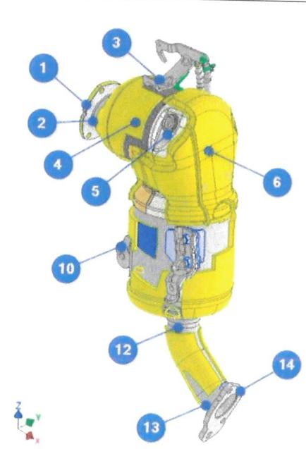

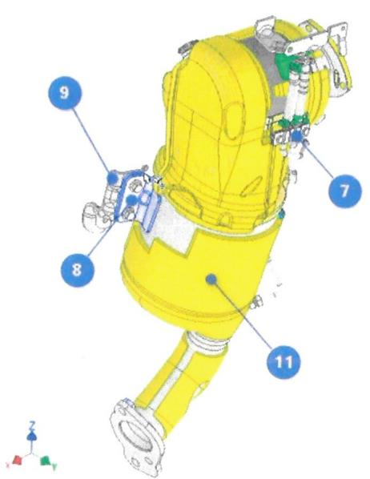

<table><tr><td>Part No.</td><td>components</td><td>No failure</td><td>Failure</td><td>Figure</td></tr><tr><td>1</td><td>DOC inlet flange</td><td>×</td><td></td><td>Fig.3</td></tr><tr><td>2</td><td>DOC inlet flange welding seam</td><td>×</td><td></td><td>Fig.4-5</td></tr><tr><td>3</td><td>ΔP sensor bracket and welding seams</td><td>×</td><td></td><td>Fig.6-7</td></tr><tr><td>4</td><td>DoC catalyst</td><td>×</td><td></td><td>Fig.9-10</td></tr></table>

Department RBCW/ENG-CV1

Prepared by XURUN

Phone +86-510-80550339

Fax 0086-510-85335148

Wuxi 10.13.2025

Page 3 of11   
Tere25\_029

<table><tr><td rowspan=1 colspan=1></td><td rowspan=1 colspan=5></td></tr><tr><td rowspan=1 colspan=1>5</td><td rowspan=1 colspan=1>DM flange</td><td rowspan=1 colspan=1>×</td><td rowspan=1 colspan=1></td><td rowspan=1 colspan=1>Fig.21-22</td><td rowspan=9 colspan=1></td></tr><tr><td rowspan=1 colspan=1>6</td><td rowspan=1 colspan=1>Mixer plate</td><td rowspan=1 colspan=1>×</td><td rowspan=1 colspan=1></td><td rowspan=1 colspan=1>Fig.11-12</td></tr><tr><td rowspan=1 colspan=1>7</td><td rowspan=1 colspan=1>∆P pipe bracket and welding seams</td><td rowspan=1 colspan=1>×</td><td rowspan=1 colspan=1></td><td rowspan=1 colspan=1>Fig.8</td></tr><tr><td rowspan=1 colspan=1>∞</td><td rowspan=1 colspan=1>DPF left mounting bracket 1</td><td rowspan=1 colspan=1>×</td><td rowspan=1 colspan=1></td><td rowspan=1 colspan=1>Fig.13-14</td></tr><tr><td rowspan=1 colspan=1>9</td><td rowspan=1 colspan=1>DPF left mounting bracket 2</td><td rowspan=1 colspan=1></td><td rowspan=1 colspan=1></td><td rowspan=1 colspan=1></td></tr><tr><td rowspan=1 colspan=1>10</td><td rowspan=1 colspan=1>DPF right mounting bracket</td><td rowspan=1 colspan=1>×</td><td rowspan=1 colspan=1></td><td rowspan=1 colspan=1>Fig.15-16</td></tr><tr><td rowspan=1 colspan=1>11</td><td rowspan=1 colspan=1>DPF catalyst</td><td rowspan=1 colspan=1>×</td><td rowspan=1 colspan=1></td><td rowspan=1 colspan=1>Fig.17</td></tr><tr><td rowspan=1 colspan=1>12</td><td rowspan=1 colspan=1>DOC outlet flange welding seam</td><td rowspan=1 colspan=1>×</td><td rowspan=1 colspan=1></td><td rowspan=1 colspan=1>Fig.18-19</td></tr><tr><td rowspan=1 colspan=1>13</td><td rowspan=1 colspan=1>DOC outlet flange</td><td rowspan=1 colspan=1>×</td><td rowspan=1 colspan=1></td><td rowspan=1 colspan=1>Fig.20</td></tr></table>

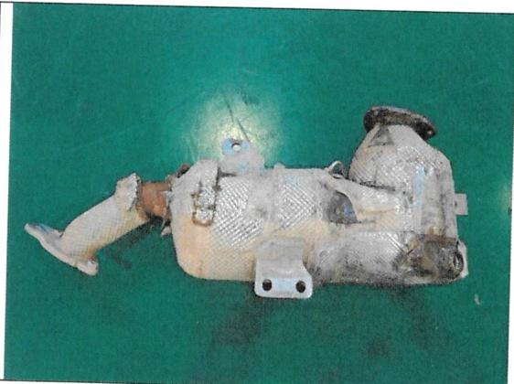  
Fig.1 DOC+DPF overview

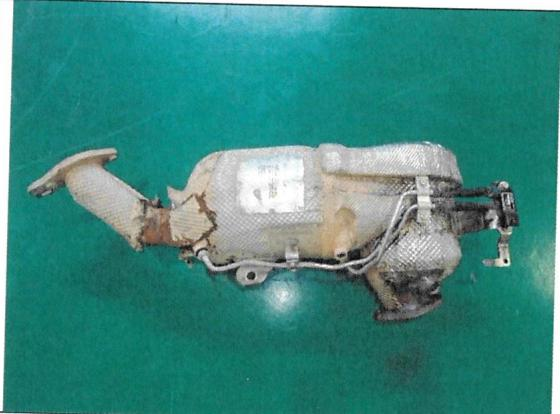  
Fig.2 DOC+DPF overview

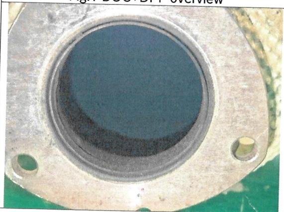  
Fig.3 DOC inlet flange

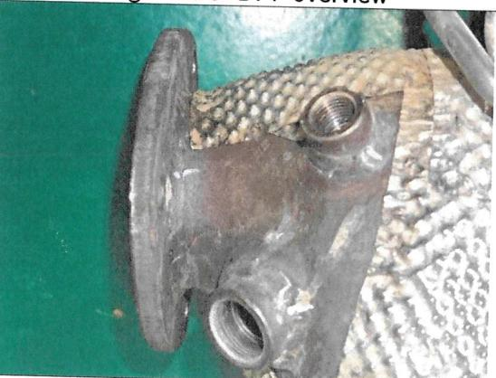  
Fig.4 DOC inlet flange welding seam

Department RBCW/ENG-CV1

Prepared by XU RUN

Phone +86-510-80550339

Fax 0086-510-85335148

## BOSCH

Wuxi 10.13.2025

Page 4of11   
Tere25\_029

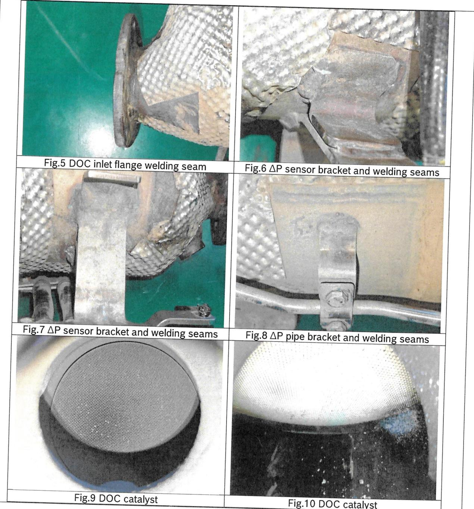

<table><tr><td rowspan=1 colspan=1>Fig. Mixer plate</td><td rowspan=1 colspan=1>Fig.12Mixer plate</td></tr><tr><td rowspan=1 colspan=1>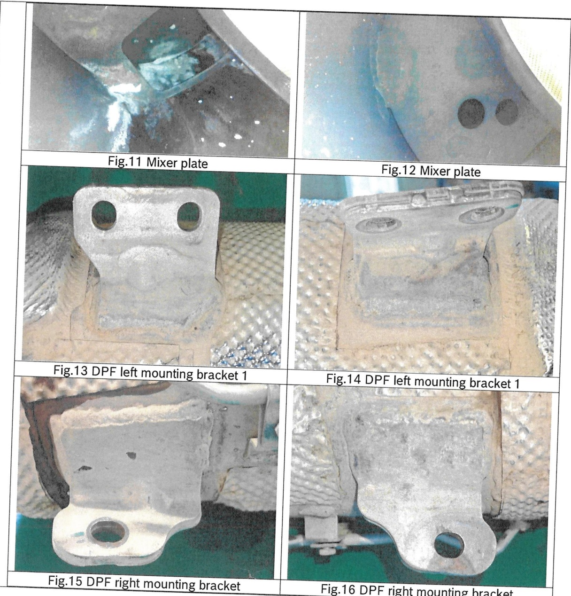</td><td rowspan=1 colspan=1></td></tr><tr><td rowspan=1 colspan=1>Fig.13 DPF left mounting bracket 1</td><td rowspan=1 colspan=1>Fig.14 DPF left mounting bracket 1</td></tr><tr><td rowspan=1 colspan=1></td><td rowspan=1 colspan=1></td></tr><tr><td rowspan=1 colspan=1>Fig.15DPF right mounting bracket</td><td rowspan=1 colspan=1>Fig.16 DPFright mounting bracket</td></tr></table>

## Powertrain Solutions

## BOSCH

<table><tr><td>Department Prepared by Phone RBCW/ENG-CV1 XURUN Fax +86-510-80550339 0086-510-85335148</td></tr><tr><td>Page6of11 Tere25_029</td></tr><tr><td></td></tr><tr><td>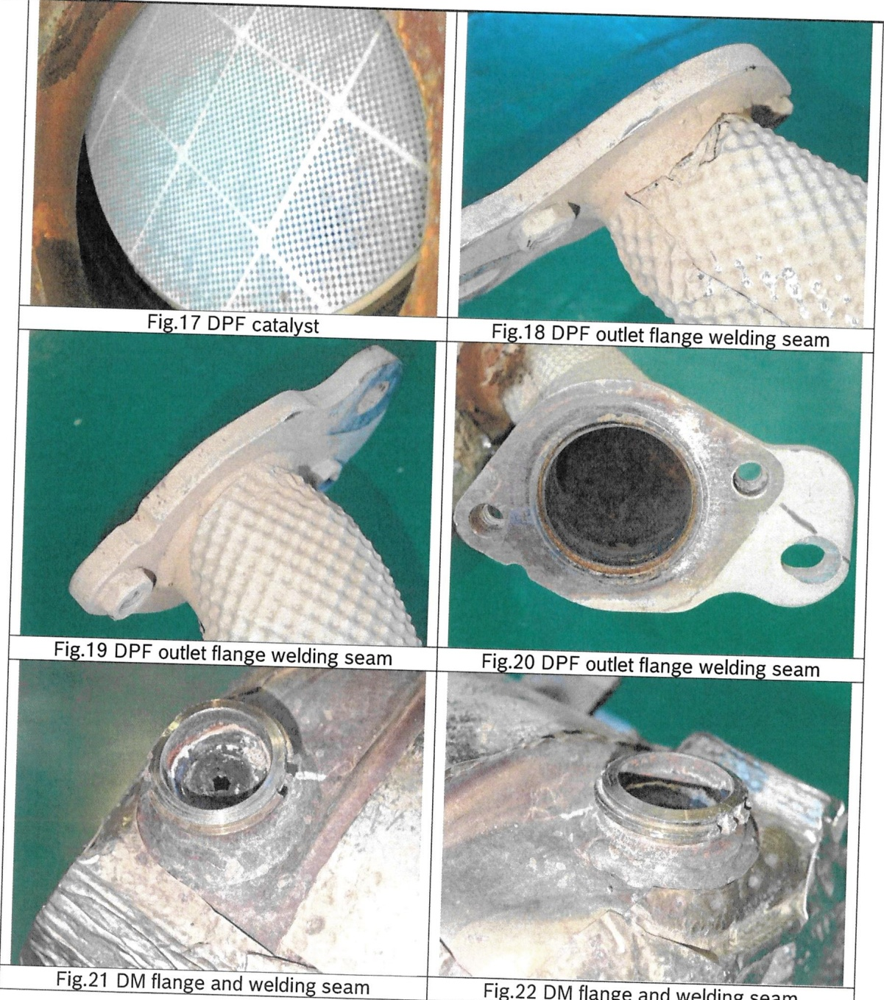</td></tr><tr><td></td></tr><tr><td></td></tr></table>

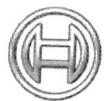

## BOSCH

Fax 0086-510-85335148

Wuxi 10.13.2025

Page7of11   
Tere25\_029

## 3) SCR investigation after test

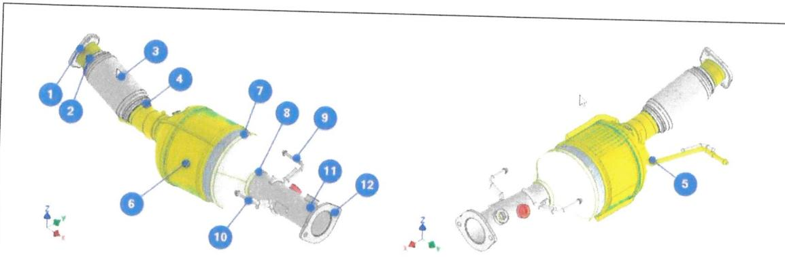

<table><tr><td rowspan=1 colspan=1>Part No.</td><td rowspan=1 colspan=1>components</td><td rowspan=1 colspan=1>No failure</td><td rowspan=1 colspan=1>Failure</td><td rowspan=1 colspan=1>Figure</td></tr><tr><td rowspan=1 colspan=1>1</td><td rowspan=1 colspan=1>SCR inlet flange and welding seams</td><td rowspan=1 colspan=1>×</td><td rowspan=1 colspan=1></td><td rowspan=1 colspan=1>Fig.25-27</td></tr><tr><td rowspan=1 colspan=1>2</td><td rowspan=1 colspan=1>Flexible inlet welding seam</td><td rowspan=1 colspan=1>×</td><td rowspan=1 colspan=1></td><td rowspan=1 colspan=1>Fig.28-29</td></tr><tr><td rowspan=1 colspan=1>3</td><td rowspan=1 colspan=1>Flexible pipe</td><td rowspan=1 colspan=1>×</td><td rowspan=1 colspan=1></td><td rowspan=1 colspan=1>Fig.28-29</td></tr><tr><td rowspan=1 colspan=1>4</td><td rowspan=1 colspan=1>Flexible pipe outlet welding seam</td><td rowspan=1 colspan=1>×</td><td rowspan=1 colspan=1></td><td rowspan=1 colspan=1>Fig.28-29</td></tr><tr><td rowspan=1 colspan=1>5</td><td rowspan=1 colspan=1>Front hook and welding seam</td><td rowspan=1 colspan=1>×</td><td rowspan=1 colspan=1></td><td rowspan=1 colspan=1>Fig.30-32</td></tr><tr><td rowspan=1 colspan=1>6</td><td rowspan=1 colspan=1>SCR catalyst</td><td rowspan=1 colspan=1>×</td><td rowspan=1 colspan=1></td><td rowspan=1 colspan=1>Fig.33-34</td></tr><tr><td rowspan=1 colspan=1>7</td><td rowspan=1 colspan=1>SCR sleeve welding seam</td><td rowspan=1 colspan=1>×</td><td rowspan=1 colspan=1></td><td rowspan=1 colspan=1>Fig.23-24</td></tr><tr><td rowspan=1 colspan=1>8</td><td rowspan=1 colspan=1>SCR outlet pipe welding seam</td><td rowspan=1 colspan=1>×</td><td rowspan=1 colspan=1></td><td rowspan=1 colspan=1>Fig.35-36</td></tr><tr><td rowspan=1 colspan=1>9</td><td rowspan=1 colspan=1>Right rear hook and welding seam</td><td rowspan=1 colspan=1>×</td><td rowspan=1 colspan=1></td><td rowspan=1 colspan=1>Fig.37-38</td></tr><tr><td rowspan=1 colspan=1>10</td><td rowspan=1 colspan=1>Left rear hook and welding seam</td><td rowspan=1 colspan=1>×</td><td rowspan=1 colspan=1></td><td rowspan=1 colspan=1>Fig.39-40</td></tr><tr><td rowspan=1 colspan=1>11</td><td rowspan=1 colspan=1>SCR outletflange welding seam</td><td rowspan=1 colspan=1>×</td><td rowspan=1 colspan=1></td><td rowspan=1 colspan=1>Fig.41-42</td></tr><tr><td rowspan=1 colspan=1>12</td><td rowspan=1 colspan=1>SCR outlet flange</td><td rowspan=1 colspan=1>×</td><td rowspan=1 colspan=1></td><td rowspan=1 colspan=1>Fig.43</td></tr></table>

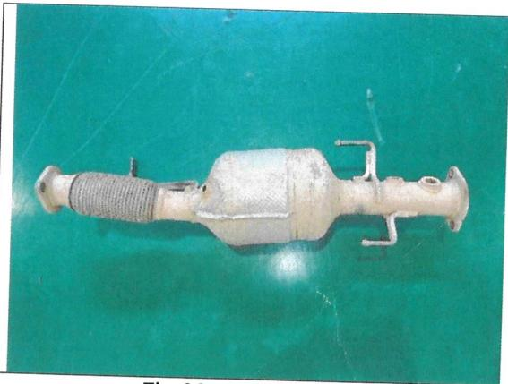  
Fig.23 SCR overview

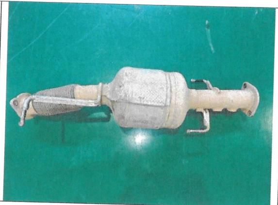  
Fig.24 SCR inlet flange

Department RBCW/ENG-CV1

Prepared by XU RUN

Phone +86-510-80550339

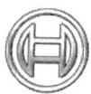

Fax 0086-510-85335148

## BOSCH

Wuxi 10.13.2025

Page 8 of11   
Tere25\_029

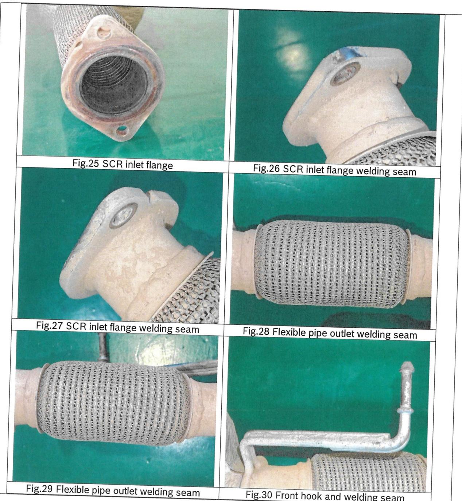

Department RBCW/ENG-CV1

Prepared by XU RUN

Phone +86-510-80550339

Fax 0086-510-85335148

## BOSCH

Wuxi 10.13.2025

Page 9 of11   
Tere25\_029

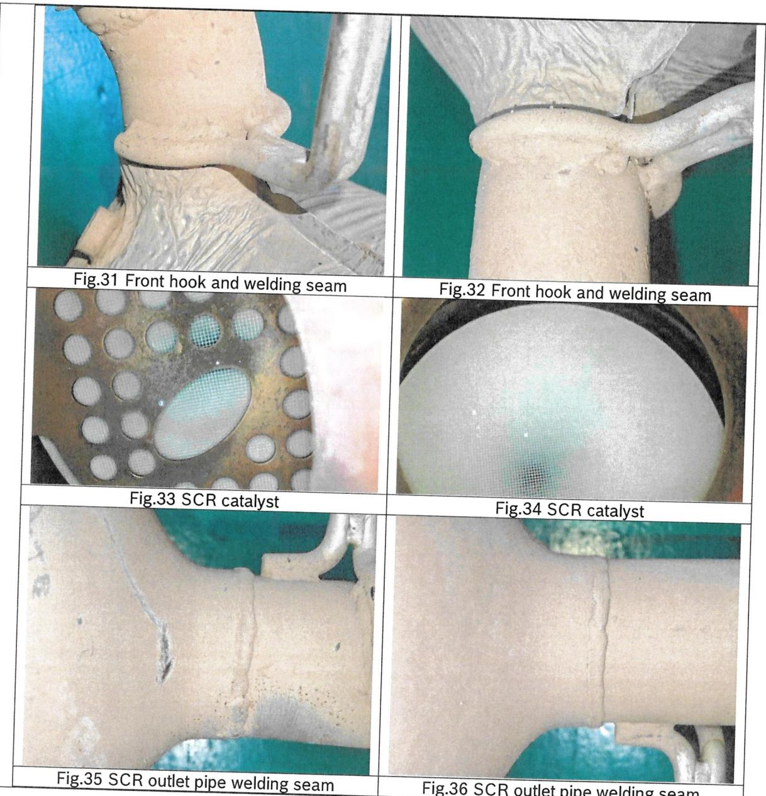

## Powertrain Solutions

Department RBCW/ENG-CV1

Prepared by XURUN

Phone +86-510-80550339

Fax 0086-510-85335148

## BOSCH

Wuxi 10.13.2025

Page 10of11   
Tere25\_029

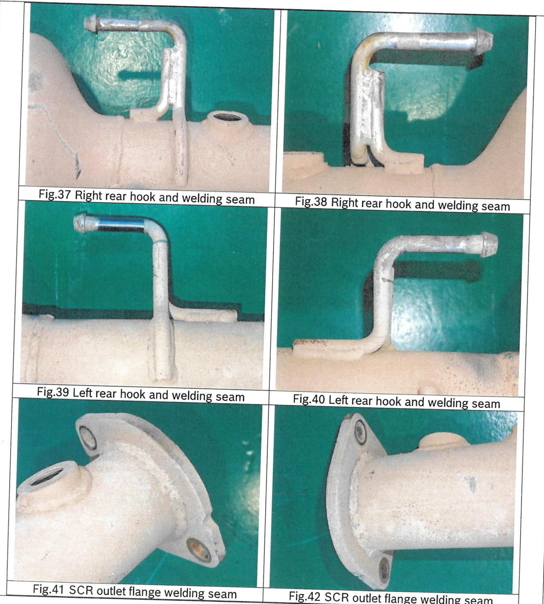

## Powertrain Solutions

Department RBCW/ENG-CV1

Prepared by XU RUN

Phone +86-510-80550339

Fax 0086-510-85335148

## BOSCH

Wuxi 10.13.2025

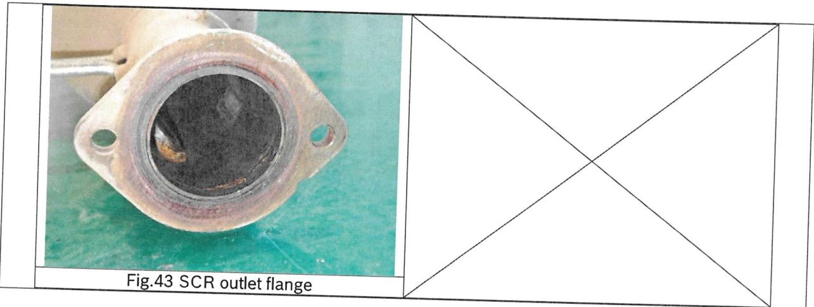

Page 11 of11   
Tere25\_029