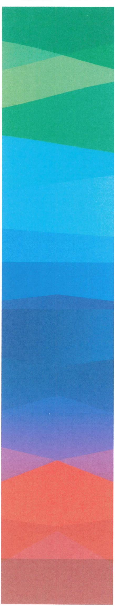
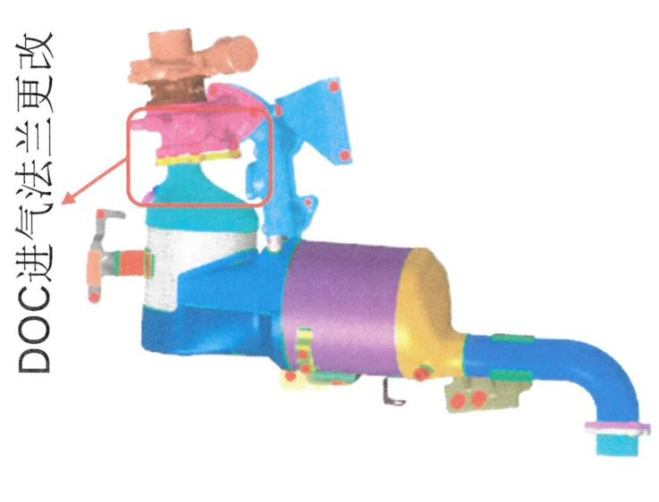
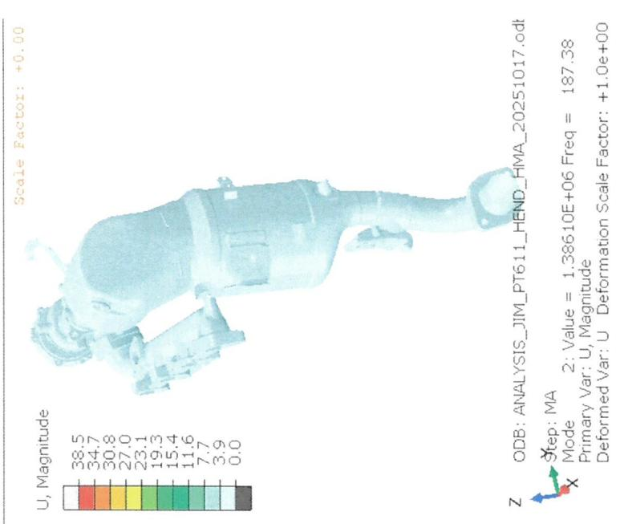
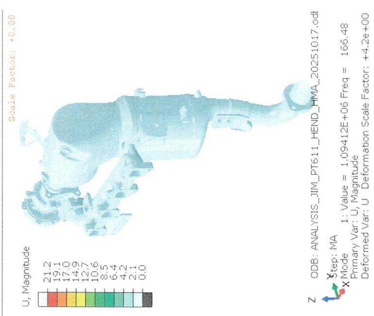
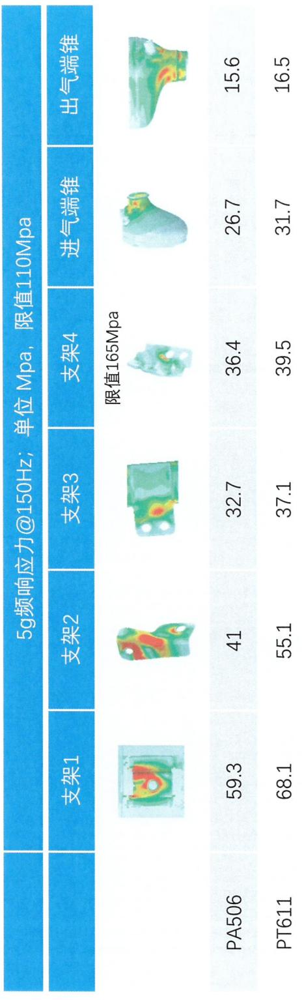

<table><tr><td rowspan=1 colspan=2>C Sample Drawing Release Pre-condition Checklist</td><td rowspan=1 colspan=1>ResultyReport</td><td rowspan=1 colspan=1>Status</td><td rowspan=1 colspan=1>Resp.</td><td rowspan=1 colspan=1>Date</td></tr><tr><td rowspan=7 colspan=1>Design</td><td rowspan=1 colspan=1>1.C Sample 3D model confirmed by customer?</td><td rowspan=1 colspan=1></td><td rowspan=1 colspan=1></td><td rowspan=1 colspan=1></td><td rowspan=1 colspan=1></td></tr><tr><td rowspan=1 colspan=1>2.C Sample offer drawing check with manufacturing drawing?</td><td rowspan=1 colspan=1></td><td rowspan=1 colspan=1>50k</td><td rowspan=1 colspan=1>占青松</td><td rowspan=1 colspan=1>2026.3.9</td></tr><tr><td rowspan=1 colspan=1>3.C Sample Nameplate confirmed by customer? Email or drawing confirm?</td><td rowspan=1 colspan=1></td><td rowspan=1 colspan=1></td><td rowspan=1 colspan=1></td><td rowspan=1 colspan=1></td></tr><tr><td rowspan=1 colspan=1>4.D-FMEA first version finished?</td><td rowspan=1 colspan=1></td><td rowspan=1 colspan=1>cd:)</td><td rowspan=1 colspan=1></td><td rowspan=1 colspan=1></td></tr><tr><td rowspan=1 colspan=1>5.I-FMEAfirst version finished?</td><td rowspan=1 colspan=1></td><td rowspan=1 colspan=1>Covered by 493</td><td rowspan=1 colspan=1>清松</td><td rowspan=1 colspan=1>2026.3.9</td></tr><tr><td rowspan=1 colspan=1>6. Installation guideline finished?</td><td rowspan=1 colspan=1></td><td rowspan=1 colspan=1></td><td rowspan=1 colspan=1></td><td rowspan=1 colspan=1></td></tr><tr><td rowspan=1 colspan=1>7.PSC/cC list finished for CMK summary?</td><td rowspan=1 colspan=1></td><td rowspan=1 colspan=1>已有初版</td><td rowspan=1 colspan=1>情坛</td><td rowspan=1 colspan=1>2026.3.9</td></tr><tr><td rowspan=3 colspan=1>PUR/MOE</td><td rowspan=1 colspan=1>1.C Sample Make and Buy confirmed?</td><td rowspan=1 colspan=1></td><td rowspan=1 colspan=1></td><td rowspan=1 colspan=1></td><td rowspan=1 colspan=1></td></tr><tr><td rowspan=1 colspan=1>2.C sample DFMA welding process confirmed with MOE? Flow chart?</td><td rowspan=1 colspan=1></td><td rowspan=1 colspan=1></td><td rowspan=1 colspan=1></td><td rowspan=1 colspan=1></td></tr><tr><td rowspan=1 colspan=1>3.P-FMEA first version plan?</td><td rowspan=1 colspan=1></td><td rowspan=1 colspan=1>0</td><td rowspan=1 colspan=1></td><td rowspan=1 colspan=1></td></tr><tr><td rowspan=2 colspan=1>DVValidation</td><td rowspan=1 colspan=1>1.Canning validation finished?repor?</td><td rowspan=1 colspan=1></td><td rowspan=1 colspan=1>于PEA风险较</td><td rowspan=1 colspan=1></td><td rowspan=1 colspan=1>2026.0310</td></tr><tr><td rowspan=1 colspan=1>2.ATS DV validation finished?report?</td><td rowspan=1 colspan=1></td><td rowspan=1 colspan=1>(overed by s.</td><td rowspan=1 colspan=1></td><td rowspan=1 colspan=1></td></tr><tr><td rowspan=2 colspan=1>System</td><td rowspan=1 colspan=1>1.TCD status?</td><td rowspan=1 colspan=1></td><td rowspan=1 colspan=1>coerd6y 493</td><td rowspan=1 colspan=1></td><td rowspan=1 colspan=1></td></tr><tr><td rowspan=1 colspan=1>2.POC result &amp; report?</td><td rowspan=1 colspan=1></td><td rowspan=1 colspan=1></td><td rowspan=1 colspan=1></td><td rowspan=1 colspan=1></td></tr></table>

<table><tr><td rowspan=2 colspan=1>BOSCH博世Confidential</td><td rowspan=2 colspan=5>Product Development Design Change Request产品开发设计变更请求</td><td rowspan=1 colspan=1>Version 15Effective date:2026-01-14th</td></tr><tr><td rowspan=1 colspan=1>26_001</td></tr><tr><td rowspan=1 colspan=4>Customer project Name/客户项目名称：            JIM-PT611</td><td rowspan=1 colspan=3>MCR No./ MCR号:</td></tr><tr><td rowspan=1 colspan=7>Sample status / 样件状态：       A Sample     B Sample  C Sample     D Sample</td></tr><tr><td rowspan=1 colspan=7>Change part&amp;product Name/更改零部件产品的名称(简要描述)</td></tr><tr><td rowspan=1 colspan=7>DOC+SDPFUNIT:F01ZH003RX-02 SCRUNIT:F01ZH003VH-00 BRACKET:F01Z5103J8-00</td></tr><tr><td rowspan=1 colspan=7>Reason of changes/更改理由(简要描述)：</td></tr><tr><td rowspan=1 colspan=7>按客户要求释放JIEPT611B样件；</td></tr><tr><td rowspan=1 colspan=2>Change from/变更来源：</td><td rowspan=1 colspan=5></td></tr><tr><td rowspan=1 colspan=2>Customer request/客户要求√</td><td rowspan=1 colspan=1></td><td rowspan=1 colspan=4>Supplier request /供应商请求                  Design optimization /设计优化</td></tr><tr><td rowspan=1 colspan=2>Correction/更正(错误)</td><td rowspan=1 colspan=1></td><td rowspan=1 colspan=4>Other/其他   □(</td></tr><tr><td rowspan=1 colspan=2>Change inform to/变更通知人：</td><td rowspan=1 colspan=5>Zhang Shengchang,Zhang Hanquan, Shen Weibo, LiYicen, Ge Jilong</td></tr><tr><td rowspan=1 colspan=7>Yang Guangtuo,Jia Kebin， Luo jing， Lu Qingsong， Min Lingyun</td></tr><tr><td rowspan=1 colspan=7>Whether this change impact others component or product 此变更是否影响到其他部件和产品：       yes/是    no/否</td></tr><tr><td rowspan=1 colspan=7>ifimpact others product， Whether others projects&amp;product change or not？如果影响，别的部件和产品是否也需要同时变更？</td></tr><tr><td rowspan=1 colspan=7></td></tr><tr><td rowspan=1 colspan=2>Design/设计工程师</td><td rowspan=2 colspan=3>卢坛</td><td rowspan=2 colspan=1>Date/日期：</td><td rowspan=2 colspan=1>2026.3,10</td></tr><tr><td rowspan=1 colspan=2>Signature/签名：</td></tr><tr><td rowspan=1 colspan=2>Check/校对工程师</td><td rowspan=2 colspan=3>杨拓</td><td rowspan=2 colspan=1>Date/日期:</td><td rowspan=2 colspan=1>2026.03.25</td></tr><tr><td rowspan=1 colspan=2>Signature /签名:</td></tr><tr><td rowspan=1 colspan=7>Description of Change/更改描述：(下面空白处请列出详细的变更前后对比)</td></tr></table>

<table><tr><td rowspan="2">BOSCH 0 博世 Confidential</td><td rowspan="2"></td><td rowspan="2">Design Change Review Sheet 设计变更评审表</td><td rowspan="2"></td><td colspan="2">Version 13 Effective date:2026-01-14</td></tr><tr><td>Design Change Request No.</td><td>26_001</td></tr><tr><td>If Yes, System impaction evaluation?</td><td colspan="5">1.Function&amp;Performance willbe influenced?/系统性能影响？ yes/是</td></tr><tr><td>如果是，系统影响评估？</td><td>(如果是初次样件放行，空白处请说明样件目的)</td><td colspan="3"></td><td>沈伟波(3张汉泉</td><td></td></tr><tr><td>Whether need sample to test? Plan? 是否需要样件进行验证？计划？</td><td></td><td colspan="3"></td><td>System/签名</td><td>代签</td></tr><tr><td>Whether the catalyst information is confirmed? 催化剂信息是否确认？（物料号、图纸、SPEC）</td><td></td><td colspan="3"></td><td>catls名</td><td></td></tr><tr><td></td><td></td><td colspan="3">2.Interface&amp;boundary (internal and customer) will be influenced?/接口&amp;边界(内部和客户)影响？</td><td>yes/是</td><td>no/否</td></tr><tr><td>If impact custmer,whether getconfirm from customer side?</td><td></td><td colspan="3"></td><td></td><td>Des12 </td></tr><tr><td>请说明影响和是否得到客户的确认？</td><td></td><td colspan="3"></td><td>yes/是</td><td>no/否</td></tr><tr><td>3. Mechanical strength&amp;Durability will be influenced?/机械强度&amp;可靠性影响？ If Yes, How to evaluate? Plan?</td><td></td><td colspan="3">结构强存低</td><td></td><td>为</td></tr><tr><td>如果是，请说明影响和如何评估，计划？ (例如：仿真分析等) Whether need sample to test? Plan?</td><td></td><td colspan="3"></td><td></td><td></td></tr><tr><td></td><td>是否需要样件进行验证？计划？ 4. Product document infuenced?</td><td></td><td></td><td></td><td>Validation/签名</td><td>-</td></tr><tr><td></td><td></td><td></td><td></td><td></td><td></td><td></td></tr><tr><td>4.1 Interface FMEA-relevant /IFMEA: 4.2.Product FMEA-relevant/DFMEA:</td><td></td><td>no否</td><td>yes/是Note</td><td></td><td></td><td></td></tr><tr><td>4.3.Special Charecteristics /PSC:(针对C Sample)</td><td></td><td>no否 no香</td><td>yes/是Note Note</td><td></td><td></td><td></td></tr><tr><td>4.4.IMDS relevant： (针对C Sample)</td><td></td><td>no/否</td><td>yes/是 yes/是</td><td>Note</td><td></td><td></td></tr><tr><td></td><td></td><td></td><td>Note yes/是</td><td></td><td></td><td></td></tr><tr><td>4.5 Offer drawing relevant(针对c Sample) 4.6.TCD relevant:</td><td></td><td>no/否 no/否</td><td>yes/是Note</td><td></td><td></td><td></td></tr><tr><td></td><td></td><td>5.Changed parts Stock&amp; treatment/需要变更零件的库存统计和处理？</td><td></td><td>NA.(新零件放行,不涉及库存）</td><td></td><td></td></tr><tr><td>（只针对涉及到已经生产过的零件变更，新放行零件和本条不相关）</td><td></td><td></td><td></td><td></td><td>涉及到已经生产过的零件变更</td><td></td></tr><tr><td>RBCW RDC（外库)和RBCW仓库，是否有库存，</td><td></td><td>无库存</td><td>□有库存，库存数量</td><td></td><td></td><td></td></tr><tr><td>供应商处(已做好，未发货)是否有库存，</td><td></td><td></td><td>无库存 □有库存，库存数量</td><td></td><td></td><td>5岑</td></tr><tr><td>LPN厂是否有库存，</td><td></td><td></td><td>无库存</td><td>□有库存，库存数量</td><td></td><td></td></tr><tr><td>在途，运输中是否有库存</td><td></td><td></td><td>无库存</td><td>□有库存，库存数量</td><td></td><td></td></tr><tr><td>被影响到的实物库存处理指示： （设计工程师组织会议讨论）</td><td></td><td>□可以继续使用完</td><td></td><td>□改制后使用 □报废</td><td>Design/签名_</td><td></td></tr><tr><td></td><td></td><td>报反成本</td><td>改制费用</td><td></td><td>PPS/签名</td><td></td></tr><tr><td>已装车件处理方法（发客户或标定车等） (SMP组织会议讨论）</td><td></td><td>其(单独说明）：</td><td>改制</td><td>更换</td><td>PM/签名</td><td></td></tr><tr><td>6. Influence on supplier part? Was this change confirmed with Purchasing (Supplier) for feasibility? Feedback from Supplier?</td><td></td><td></td><td></td><td></td><td></td><td></td></tr><tr><td></td><td>变更后的零件，生产可行性供应商是否确认？反馈？ 工装更改，检更政</td><td></td><td></td><td></td><td></td><td rowspan="5"></td></tr><tr><td>Infuence on purchasing part delivery time？对采购件交货时间的影响？</td><td></td><td></td><td></td><td></td><td></td></tr><tr><td></td><td></td><td></td><td></td><td></td><td></td></tr><tr><td>涉及到变更的零件，博世已出PR，供应商还未来得及生产的订单，是否已经通知供应商取消. Does the change influence on pufchasing cost？变更对采购成本的影响？</td><td></td><td></td><td></td><td>□no/否□yes/是</td><td></td></tr><tr><td colspan="4">□increase/增加，金额 □decrease/降低，金额</td><td></td><td>no change/不变</td></tr><tr><td>必要时附加DFMA文件</td><td>7. DFMA &amp; Sample prodcution OPL?</td><td></td><td></td><td></td><td></td><td></td></tr><tr><td colspan="8"></td></tr><tr><td>EA DFMA</td><td colspan="2">8. Influence on product manufacturing &amp; assembly process?</td><td></td><td></td><td>0o82</td><td></td></tr><tr><td>Feedback from manufacturing engineer？生产制造装配是否影响，反馈？</td><td colspan="6"></td></tr><tr><td></td><td colspan="2">张天收</td><td></td><td>15)</td><td></td><td>P</td></tr><tr><td colspan="2">Influenceon project&amp;product delivery time？对项目&amp;产品交货时间的影响？</td><td colspan="2"></td><td>在JIM493226现有价格</td><td>+3</td><td></td></tr><tr><td colspan="2">Infuence on manufacturing cost /对产成本的影响？ increase/增加，金额</td><td colspan="2">]decrease/降低，金额</td><td></td><td>(33C法3C no change/不变 原产说流价S5</td><td></td></tr><tr><td colspan="2">9. PM alignment? (infuence on project Timeline? Cost?); 是否同意对项目时间和成本的影响</td><td colspan="2"></td><td>需求样品订单数量</td><td>4ccN法+150 TCR3</td><td colspan="2"></td></tr><tr><td>ENG-ATS</td><td colspan="2">PPS</td><td>PUQ</td><td>Signature/签名：</td><td>Signature/签名：</td><td rowspan="2"></td></tr><tr><td>Signature/签名Vy</td><td colspan="2">Signature /签名 3</td><td>9</td><td>Touy</td><td></td><td>微2</td></tr></table>

##

<table><tr><td rowspan=2 colspan=1></td><td rowspan=1 colspan=1>零件号</td><td rowspan=1 colspan=1>零件名称</td><td rowspan=1 colspan=2>Project</td><td rowspan=1 colspan=1>样件阶段</td><td rowspan=1 colspan=1>变更来源</td></tr><tr><td rowspan=1 colspan=1>F01Z51039D-02</td><td rowspan=1 colspan=1>INLET FLANGE</td><td rowspan=1 colspan=2>JIM PT611</td><td rowspan=1 colspan=1>BC</td><td rowspan=1 colspan=1>BOSCH/Customer</td></tr><tr><td rowspan=2 colspan=1>变更描述</td><td rowspan=1 colspan=3>变更前</td><td rowspan=1 colspan=3>变更后</td></tr><tr><td rowspan=1 colspan=3>0F01Z51039D-00</td><td rowspan=1 colspan=3>0F01Z51039D-02</td></tr><tr><td rowspan=1 colspan=1>变更原因</td><td rowspan=1 colspan=6>基于客户边界法兰数模调整，改为304材质的铸件法兰;</td></tr><tr><td rowspan=1 colspan=1>风险点（影响）</td><td rowspan=1 colspan=6>凸台强度不足，有断裂风险；</td></tr><tr><td rowspan=1 colspan=1>验证方法</td><td rowspan=1 colspan=6>FEA仿真，仿真报告见附件;</td></tr></table>

1XOM

00 suueisAs
<table><tr><td rowspan=2 colspan=1></td><td rowspan=1 colspan=1>零件号</td><td rowspan=1 colspan=1>零件名称</td><td rowspan=1 colspan=2>Project</td><td rowspan=1 colspan=1>样件阶段</td><td rowspan=1 colspan=1>变更来源</td></tr><tr><td rowspan=1 colspan=1>See blow</td><td rowspan=1 colspan=1>BRACKET</td><td rowspan=1 colspan=2>JIM PT611</td><td rowspan=1 colspan=1>BC$</td><td rowspan=1 colspan=1>BOSCH/Customer</td></tr><tr><td rowspan=1 colspan=1>变更描述</td><td rowspan=1 colspan=3>变更前</td><td rowspan=1 colspan=3>变更后</td></tr><tr><td rowspan=1 colspan=1>变更原因</td><td rowspan=1 colspan=6>为便供应商安装压差管定位，压差管夹改为焊接架;</td></tr><tr><td rowspan=1 colspan=1>风险点 （影响)</td><td rowspan=1 colspan=6>支架强度不有断裂风险；</td></tr><tr><td rowspan=1 colspan=1>验证方法</td><td rowspan=1 colspan=6>FEA仿真，仿真报告见附件;</td></tr></table>

##

<table><tr><td rowspan=2 colspan=1></td><td rowspan=1 colspan=1>零件号</td><td rowspan=1 colspan=1>零件名称</td><td rowspan=1 colspan=2>Project</td><td rowspan=1 colspan=1>样件阶段</td><td rowspan=1 colspan=1>变更来源</td></tr><tr><td rowspan=1 colspan=1>See blow</td><td rowspan=1 colspan=1>FLANGE</td><td rowspan=1 colspan=2>JIM PT611</td><td rowspan=1 colspan=1>BC</td><td rowspan=1 colspan=1>BOSCH/Customer</td></tr><tr><td rowspan=2 colspan=1>变更描述</td><td rowspan=1 colspan=3>变更前</td><td rowspan=1 colspan=3>变更后</td></tr><tr><td rowspan=1 colspan=3>0FLANGE:F01Z5017XSFLANGE:F01Z5102ETNUT:F01Z500753</td><td rowspan=1 colspan=3>0FLANGE:F01Z50199H-00FLANGE:F01Z5101DLNUT:F01Z5103AE-00</td></tr><tr><td rowspan=1 colspan=1>变更原因</td><td rowspan=1 colspan=6>PT611与493和高扭中兴主项目统，DPF出气法兰;</td></tr><tr><td rowspan=1 colspan=1>风险点（影响）</td><td rowspan=2 colspan=6>支架强度不足有断裂风险；FEA仿真，仿真报告见附件；</td></tr><tr><td rowspan=1 colspan=1>验证方法</td></tr></table>

Aue 8707
<table><tr><td rowspan=2 colspan=1></td><td rowspan=1 colspan=1>零件号</td><td rowspan=1 colspan=1>零件名称</td><td rowspan=1 colspan=2>Project</td><td rowspan=1 colspan=1>样件阶段</td><td rowspan=1 colspan=1>变更来源</td></tr><tr><td rowspan=1 colspan=1>F01Z50197F-01</td><td rowspan=1 colspan=1>DOC+SDPFWELDING</td><td rowspan=1 colspan=2>JIMPT611</td><td rowspan=1 colspan=1>BC</td><td rowspan=1 colspan=1>BOSCH/Customer</td></tr><tr><td rowspan=2 colspan=1>变更描述</td><td rowspan=1 colspan=3>变更前</td><td rowspan=1 colspan=3>变更后</td></tr><tr><td rowspan=1 colspan=3>F01Z50197F-00</td><td rowspan=1 colspan=3>F01Z50197F-01</td></tr><tr><td rowspan=1 colspan=1>变更原因</td><td rowspan=3 colspan=6>变更原因                                                                        上述变更后DOC+SDPF焊接总成随之改变;风险点（影响）                                                                                             无无</td></tr><tr><td rowspan=1 colspan=1>风险点（影响)</td></tr><tr><td rowspan=1 colspan=1>验证方法</td></tr></table>

<table><tr><td rowspan=2 colspan=1></td><td rowspan=1 colspan=1>零件号</td><td rowspan=1 colspan=1>零件名称</td><td rowspan=1 colspan=2>Project</td><td rowspan=1 colspan=1>样件阶段</td><td rowspan=1 colspan=1>变更来源</td></tr><tr><td rowspan=1 colspan=1>See blow</td><td rowspan=1 colspan=1>DP tube inlet</td><td rowspan=1 colspan=2>JIM PT611</td><td rowspan=1 colspan=1>图C</td><td rowspan=1 colspan=1>BOSCH/Customer</td></tr><tr><td rowspan=2 colspan=1>变更描述</td><td rowspan=1 colspan=3>变更前</td><td rowspan=1 colspan=3>变更后</td></tr><tr><td rowspan=1 colspan=3>-0m                                      dnoDPtubeinlet:F01Z5017W8DPtube inlet:F01Z5017YKDP tube inlet:F01Z5102D5RUBBERHOSEINLET: F01Z5102SV</td><td rowspan=1 colspan=3>3                                   DPtubeinlet:F01Z5019BS-00DPtubeinlet:F01Z5019BT-00DPtubeinlet:F01Z5103J3-00RUBBERHOSEINLET:F01Z5103J4-00</td></tr><tr><td rowspan=1 colspan=1>变更原因</td><td rowspan=1 colspan=6>压差管夹改为焊接架后，压差硬管加长15mm，压差软管减短15mm;</td></tr><tr><td rowspan=1 colspan=1>风险点（影响）</td><td rowspan=2 colspan=6>无无</td></tr><tr><td rowspan=1 colspan=1>验证方法</td></tr></table>

##

<table><tr><td rowspan=2 colspan=1></td><td rowspan=1 colspan=1>零件号</td><td rowspan=1 colspan=1>零件名称</td><td rowspan=1 colspan=2>Project</td><td rowspan=1 colspan=1>样件阶段</td><td rowspan=1 colspan=1>变更来源</td></tr><tr><td rowspan=1 colspan=1>See blow</td><td rowspan=1 colspan=1>DP tube inlet</td><td rowspan=1 colspan=2>JIMPT611</td><td rowspan=1 colspan=1>sC$</td><td rowspan=1 colspan=1>BOSCH/Customer</td></tr><tr><td rowspan=2 colspan=1>变更描述</td><td rowspan=1 colspan=3>变更前</td><td rowspan=1 colspan=3>变更后</td></tr><tr><td rowspan=1 colspan=3>oo2DPtubeinlet:F01Z5017W7DPtube inlet:F01Z5017YJDPtube inlet:F01Z5102D4RUBBERHOSEINLET:F01Z5102SW</td><td rowspan=1 colspan=3>CDPtubeinlet:F01Z5019BU-00DPtubeinlet:F01Z5019BV-00DP tube inlet:F01Z5103J5-00RUBBERHOSEINLET:F01Z5103J6-00</td></tr><tr><td rowspan=1 colspan=1>变更原因</td><td rowspan=1 colspan=6>压差管夹改为焊接架后，压差硬管加15mm，压差软管减短15mm;</td></tr><tr><td rowspan=1 colspan=1>风险点（影响）</td><td rowspan=1 colspan=6>无</td></tr><tr><td rowspan=1 colspan=7>无</td></tr></table>

<table><tr><td rowspan=2 colspan=1></td><td rowspan=1 colspan=1>零件号</td><td rowspan=1 colspan=1>零件名称</td><td rowspan=1 colspan=2>Project</td><td rowspan=1 colspan=1>样件阶段</td><td rowspan=1 colspan=1>变更来源</td></tr><tr><td rowspan=1 colspan=1>See blow</td><td rowspan=1 colspan=1>MIXER INSULATION 02</td><td rowspan=1 colspan=2>JIMPT611</td><td rowspan=1 colspan=1>BC$</td><td rowspan=1 colspan=1>BOSCH/Customer</td></tr><tr><td rowspan=2 colspan=1>变更描述</td><td rowspan=1 colspan=3>变更前</td><td rowspan=1 colspan=3>变更后</td></tr><tr><td rowspan=1 colspan=3>INSULATION:F01Z5018AYFOIL:F01Z5017NUMAT:F01Z5102RMMAT:F01Z5102RN</td><td rowspan=1 colspan=3>INSULATION:F01Z5019BX-00FOIL:F01Z5103J9-00MAT:F01Z5102RMMAT:F01Z5102RN</td></tr><tr><td rowspan=3 colspan=7>压差支架改焊接后，保温壳增加避让区域;无无</td></tr><tr><td rowspan=1 colspan=1>风险点(影响)</td></tr><tr><td rowspan=1 colspan=1>验证方法</td></tr></table>

<table><tr><td rowspan="2"></td><td>零件号</td><td>零件名称</td><td>Project</td><td colspan="2">样件阶段</td><td>变更来源</td></tr><tr><td>See blow</td><td>INSULATION</td><td>JIMPT611</td><td>BC$</td><td></td><td>BOSCH/Customer</td></tr><tr><td rowspan="6">变更描述</td><td colspan="3">变更前</td><td colspan="3">变更后</td></tr><tr><td colspan="3"></td><td colspan="3"></td></tr><tr><td>BOSCH C5O DOC封装：博世汽车系统（无锡）有限公司 DOC载体：NGK（苏州）环保陶瓷有限公司 DOC涂层：庄信方丰（上海）化工有限公司 E415 CA100293730AP F01ZH003RX-01 Made in China</td><td colspan="2">BOSCH C5O SDPP封装：博世汽车系统（无锡）有限公司 SDPF载体：NGK（苏州）环保陶瓷有限公司 SDPF涂层：庄信万车（上海）化工有限公司 E415 CA100293730AP F01ZH003RX-01 Made in China</td><td>BOSCH 05O DOC封装：博世汽车系统（无锡）有限公司 DOC载体：NGK（苏州）环保陶资有限公司 DOC涂层：庄信万丰（上海）化工有限公司 E415 CA100293730AP F01ZH003RX-02 Made In China</td><td colspan="2">BOSCH CO SDPF封装：博世汽车系统（无锡）有限公司 SDPF载体：NGK（苏州）环保陶瓷有限公司 SDPF涂层：庄信万车（上海）化工有限公司 E415 CA100293730AP F01ZH003RX-02 Made in China</td></tr><tr><td>INSULATION:F01Z50197G-00 FOIL:F01Z5102RH MAT:F01Z5102RJ</td><td colspan="2">INSULATION:F01Z50197H-00 FOIL：F01Z5102DD MAT:F01Z5102RP MAT:F01Z5102RR</td><td>INSULATION:F01Z50197G-00 FOIL:F01Z5102RH MAT:F01Z5102RJ</td><td colspan="2">INSULATION:F01Z50197H-01 FOIL:F01Z5102DD MAT:F01Z5102RP MAT:F01Z5102RR</td></tr><tr><td>变更原因</td><td colspan="5">上述更改后，保温铭牌信息随之更改;</td></tr><tr><td colspan="2"></td><td colspan="4">无</td></tr><tr><td>风险点（影响） 验证方法</td><td colspan="5">无</td></tr></table>

##

<table><tr><td rowspan=2 colspan=1></td><td rowspan=1 colspan=1>零件号</td><td rowspan=1 colspan=1>零件名称</td><td rowspan=1 colspan=2>Project</td><td rowspan=1 colspan=1>样件阶段</td><td rowspan=1 colspan=1>变更来源</td></tr><tr><td rowspan=1 colspan=1>F01ZH003RX-02</td><td rowspan=1 colspan=1>DOC+SDPF UNIT</td><td rowspan=1 colspan=2>JIMPT611</td><td rowspan=1 colspan=1>BC</td><td rowspan=1 colspan=1>BOSCH/Customer</td></tr><tr><td rowspan=2 colspan=1>变更描述</td><td rowspan=1 colspan=3>变更前</td><td rowspan=1 colspan=3>变更后</td></tr><tr><td rowspan=1 colspan=3>F01ZH003RX-01</td><td rowspan=1 colspan=3>LATE FLATE                                                富，F01ZH003RX-02</td></tr><tr><td rowspan=1 colspan=1>变更原因</td><td rowspan=4 colspan=6>1.添加纸质标签；2.上述更改后，DOC+SDPF总成随之更改；无无</td></tr><tr><td rowspan=1 colspan=1>风险点 （影响）</td></tr><tr><td rowspan=1 colspan=1>验证方法</td></tr><tr><td rowspan=1 colspan=1></td></tr></table>

<table><tr><td rowspan=2 colspan=1></td><td rowspan=1 colspan=1>零件号</td><td rowspan=1 colspan=1>零件名称</td><td rowspan=1 colspan=2>Project</td><td rowspan=1 colspan=1>样件阶段</td><td rowspan=1 colspan=1>变更来源</td></tr><tr><td rowspan=1 colspan=1>F01Z5103J8-00</td><td rowspan=1 colspan=1>BRACKET</td><td rowspan=1 colspan=2>JIM PT611</td><td rowspan=1 colspan=1>BC</td><td rowspan=1 colspan=1>BOSCH/Customer</td></tr><tr><td rowspan=2 colspan=1>变更描述</td><td rowspan=1 colspan=3>变更前</td><td rowspan=1 colspan=3>变更后</td></tr><tr><td rowspan=1 colspan=3>F01Z5102EU</td><td rowspan=1 colspan=3>F01Z5103J8-00</td></tr><tr><td rowspan=3 colspan=7>客户边界更改后，支架的形状及安装孔位随之更改;无无</td></tr><tr><td rowspan=1 colspan=1>风险点（影响)</td></tr><tr><td rowspan=1 colspan=1>验证方法</td></tr></table>

<table><tr><td rowspan=2 colspan=1></td><td rowspan=1 colspan=1>零件号</td><td rowspan=1 colspan=1>零件名称</td><td rowspan=1 colspan=2>Project</td><td rowspan=1 colspan=1>样件阶段</td><td rowspan=1 colspan=1>变更来源</td></tr><tr><td rowspan=1 colspan=1>F01Z5103J7-00</td><td rowspan=1 colspan=1>OUTLET PIPE</td><td rowspan=1 colspan=2>JIM PT611</td><td rowspan=1 colspan=1>BC</td><td rowspan=1 colspan=1>BOSCH/Customer</td></tr><tr><td rowspan=1 colspan=1>变更描述</td><td rowspan=1 colspan=3>变更前</td><td rowspan=1 colspan=3>变更后</td></tr><tr><td rowspan=1 colspan=1>变更原因</td><td rowspan=3 colspan=6>客户要求NOX座向下旋转15°，SCR尾管NOX座孔位随之更改；无无</td></tr><tr><td rowspan=1 colspan=1>风险点（影响)</td></tr><tr><td rowspan=1 colspan=1>验证方法</td></tr></table>

<table><tr><td rowspan=2 colspan=1></td><td rowspan=1 colspan=1>零件号</td><td rowspan=1 colspan=1>零件名称</td><td rowspan=1 colspan=2>Project</td><td rowspan=1 colspan=1>样件阶段</td><td rowspan=1 colspan=1>变更来源</td></tr><tr><td rowspan=1 colspan=1>F01Z5019BW-00</td><td rowspan=1 colspan=1>SCR WELDING</td><td rowspan=1 colspan=2>JIM PT611</td><td rowspan=1 colspan=1>BC</td><td rowspan=1 colspan=1>BOSCH/Customer</td></tr><tr><td rowspan=1 colspan=1>变更描述</td><td rowspan=1 colspan=3>变更前</td><td rowspan=1 colspan=3>变更后</td></tr><tr><td rowspan=1 colspan=1>变更原因</td><td rowspan=3 colspan=6>客户要求NOX座向下旋转15°，SCR尾管NOX座孔位随之更改;无无</td></tr><tr><td rowspan=1 colspan=1>风险点（影响）</td></tr><tr><td rowspan=1 colspan=1>验证方法</td></tr></table>

Aue Supiesen
<table><tr><td rowspan="2"></td><td>零件号</td><td>零件名称</td><td colspan="2">Project</td><td>样件阶段</td><td>变更来源</td></tr><tr><td>See blow</td><td colspan="2">INSULATION</td><td>BC$</td><td>BOSCH/Customer</td></tr><tr><td>变更描述</td><td colspan="3">变更前 BOSCH 050 SCR（含ASC）封装：博世汽车系统（无锡）有限公司</td><td colspan="2">变更后 BOSCH 05O</td></tr><tr><td></td><td colspan="2">SCR（含ASC）封装：博世汽车系统（无锡）有限公司 SCR（含ASC）载体：NGK（苏州）环保陶瓷有限公司 SCR（含ASC）涂层：庄信万丰（上海）化工有限公司 E415 CA100271870 FO1ZH003FV Made in China</td><td colspan="2">SCR（含ASC）载体：NGK（苏州）环保陶瓷有限公司 SCR（含ASC）涂层：庄信万丰（上海）化工有限公司 E415 CA100271871 F01ZHO03VH-0O Made in China</td></tr><tr><td></td><td colspan="5">INSULATION：F01Z5018C0 INSULATION:F01Z5019BY-00 FOIL:F01Z5102T8 FOIL:F01Z5102T8 MAT:F01Z51018D MAT:F01Z51018D</td></tr><tr><td>变更原因</td><td colspan="5">上述更改后，SCR保温铭牌信息随之更改；</td></tr><tr><td>风险点 （影响)</td><td colspan="5"></td></tr><tr><td>验证方法</td><td colspan="5">无</td></tr><tr><td colspan="1" rowspan="1">变更描述</td><td colspan="3" rowspan="1">变更前</td><td colspan="3" rowspan="1">变更后</td></tr><tr><td colspan="1" rowspan="1">变更原因</td><td colspan="6" rowspan="3">1.添加纸质标签；2.上述更改后，SCR总成随之更改;无无</td></tr><tr><td colspan="1" rowspan="1">风险点（影响）</td></tr><tr><td colspan="1" rowspan="1">验证方法</td></tr></table>

##

##

##

e= N:d